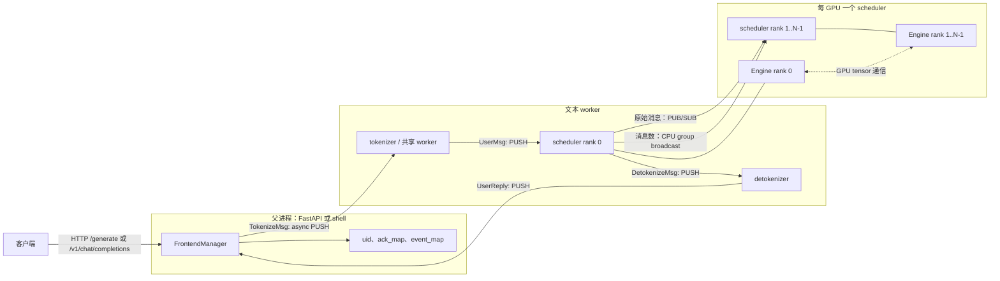

# 第 01 章：入口、API 与进程拓扑

## 本章目标与先修知识

本章回答一个看似简单、实际上决定服务边界的问题：一段 HTTP 文本怎样抵达 GPU 调度器，又怎样作为安全的增量文本回到客户端？

读完后，你应能沿着源码指出在线 HTTP、交互 shell 与离线 Python `LLM` 三个入口。

你也应能画出父进程、tokenizer、detokenizer、每个 tensor-parallel（TP）rank 的 scheduler 之间的职责边界。

最后，你应能解释为什么本仓库让 rank 0 成为前端 I/O 边界，以及为什么服务必须在 worker 确认就绪后才接收流量。

这里的“入口”不等于某个命令行字符串。

它是用户请求第一次被赋予身份、进入跨进程协议，并最终被调度核心接受的一组边界。

本章面向会读 Python 的工程师。

你需要知道 token 是模型输入输出的离散 ID，知道 GPU 是独立的计算设备，也知道进程不能直接共享普通 Python 对象。

了解 `asyncio`、队列、socket 和 CUDA 会有帮助，但不是前提。

不要求你现在理解 attention、KV cache、CUDA Graph 或 NCCL 的实现细节。

它们会在后续章节接手本章末端产生的 `UserMsg`、请求状态和 batch。

本文的“代码事实”仅指当前仓库可由路径和符号验证的行为。

“建议实验”与“推理题”是学习活动，不是仓库已经提供的生产接口或硬件承诺。

## 具体问题：为什么不能把 `model.forward()` 包进一个路由

设想你写了一个 `POST /generate` 路由。

路由收到了字符串，调用 tokenizer，调用 `model.forward()`，把文本返回给浏览器。

单次脚本推理可以这样开始，但一个服务很快会遇到三个矛盾。

第一，HTTP handler 运行在面向网络连接的事件循环里，而 GPU 计算需要批处理、显存管理和持续的调度状态。

第二，模型每次只产生一个或少数 token，但用户希望尽快看见连续文本，而不是等完整答案结束。

第三，多 GPU 的 tensor parallel 不是“每张卡各接一半 HTTP 请求”。

同一模型请求在各 TP rank 上需要一致的调度输入和计算顺序，最后只能有一个对外回复者。

如果把这些责任塞进路由函数，连接断开、token 化耗时、GPU 忙碌、跨卡同步和文本增量显示会互相阻塞。

mini-sglang 因此把工作拆成控制面与计算面。

控制面传递可序列化的消息、请求身份和采样参数。

计算面由 scheduler 与 engine 在 GPU 上形成并执行 batch。

本章只走到控制面把 token ID 交给 scheduler 的位置，并在回程跟踪已经采样出的 token 如何重新成为文本。

一个重要边界是：收到 HTTP 请求不表示已经开始 GPU `forward`。

请求先被 token 化并变成 `UserMsg`，再由后续章节中的 prefill/decode 调度器决定何时进入 batch。

## 一个贯穿全章的请求故事

假设浏览器向 `POST /v1/chat/completions` 发送一个流式请求。

请求的 `messages` 包含一轮用户问题，`stream` 为真。

FastAPI 路由会把每个消息对象转换为字典列表，而不是在此处自己拼接聊天模板。

它调用 `FrontendManager.new_user()` 取得递增的 `uid`。

这个 `uid` 是后续所有消息将回复归还给原连接的钥匙。

路由构造 `TokenizeMsg(uid, text, sampling_params)`。

其中 `text` 可以是字符串，也可以是消息字典列表。

`FrontendManager.send_one()` 经异步 ZMQ PUSH 将这条消息交给 tokenizer 侧。

tokenizer worker 若收到列表，会调用 tokenizer 的 `apply_chat_template(..., add_generation_prompt=True)`。

随后它编码得到 CPU 上的一维 `int32` token tensor，并构造 `UserMsg`。

scheduler rank 0 从后端 IPC 地址取到该消息。

若 TP size 大于一，rank 0 将原始消息发布给其他 rank，并通过 CPU process group 广播本轮消息数。

于是每个 scheduler 都能按同一顺序处理同一份输入。

后续调度与 engine 产生下一个 token 后，只有 rank 0 将 `DetokenizeMsg` 发向 detokenizer。

detokenizer 维护该 `uid` 的解码状态，返回 `UserReply(uid, incremental_output, finished)` 给前端。

`FrontendManager.listen()` 将该回复放进 `ack_map[uid]` 并唤醒相应的 `asyncio.Event`。

路由的流式生成器从事件中取出回复，写成 SSE chunk。

故事的关键不是“消息经过了很多层”。

关键是每一层只承担一种转换：HTTP 对象变消息，文本变 token，token 变调度输入，采样 token 变安全文本，安全文本变网络流。

这使得慢操作和不同资源的生命周期不必混在一个 call stack 中。

## 核心心智模型：三种表面，两个边界，一个调度核

先把系统看作三种用户表面，而不是三套推理实现。

在线 HTTP 的入口是 `python -m minisgl`。

交互 shell 的模块入口是 `python -m minisgl.shell`，它调用同一个启动器但选择 shell 前端。

离线 Python 的入口是 `from minisgl.llm import LLM` 后调用 `LLM.generate(...)`。

在线 HTTP 和 shell 都经过 `launch_server()`，因此共享启动 worker 的进程拓扑。

离线 `LLM` 不启动 ZMQ worker，却继承 `Scheduler` 并把 I/O 方法替换为进程内实现。

所以更准确的表述是“入口不同，调度核复用”。

第一个边界是前端边界。

HTTP 或 shell 只负责把用户意图交给 `FrontendManager`，并把回复转换成流或终端输出。

第二个边界是 scheduler I/O 边界。

在线模式借助 ZMQ 把 token 化结果交给 primary scheduler；离线模式用内存中的待处理列表产生同类 `UserMsg`。

中间的 scheduler/engine 才是后续统一的推理核心。

把这个模型画成一句话：前端管理连接，worker 管理文本/token 转换，scheduler 管理请求，engine 管理 GPU 执行。

这句话不是性能模型。

它是阅读代码时判断“一个功能应该放在哪里”的所有权模型。

例如，增加 HTTP 字段要先问它是否应当成为 `SamplingParams`，而不是直接让路由触碰 GPU 对象。

又如，增加新的流式文本规则应先检查 detokenizer，而不是改 scheduler 的 token 采样逻辑。

## 术语表

**在线模式（online mode）** 是父进程、ZMQ、tokenizer worker 和 scheduler worker 共同提供的服务模式。

**离线模式（offline mode）** 是 `LLM` 在单个进程中复用 `Scheduler` 的模式，并不创建在线 ZMQ 收发器。

**前端（frontend）** 指 `FrontendManager` 与 FastAPI/shell 周围的连接管理层，不是模型前向网络中的“前端层”。

**primary rank** 是 `DistributedInfo.is_primary()` 返回真的 rank，即 rank 0。

**TP（tensor parallel）** 是同一次模型计算分布到多个 rank 的方式；在本仓库的在线 I/O 路径中，rank 0 接收外部调度消息并对外发送结果。

**tokenizer** 将字符串或聊天消息编码为 token ID。

**detokenizer** 将逐步产生的 token ID 还原为适合流式呈现的文本片段。

**`uid`** 是前端创建的整数请求标识，用于把异步回复路由回正确的等待者。

**ZMQ IPC 地址** 是本机进程之间的消息端点，例如 `ipc:///tmp/minisgl_0.pid=...`。

**PUSH/PULL** 是此处用于点对点消息传递的 ZMQ socket 角色。

**PUB/SUB** 是 rank 0 向其他 scheduler rank 广播原始后端消息的 socket 角色。

**ack** 在本章有两种语境。

启动 ack 是 worker 写入 `ack_queue` 的“我已就绪”确认。

前端的 `ack_map` 则缓存 `UserReply`，它不是网络协议层的 TCP acknowledgement。

**SSE（Server-Sent Events）** 是 HTTP 流式响应的文本帧格式；这里 `/v1/chat/completions` 使用 `data: <json>\n\n` 以及最终 `[DONE]`。

**控制面** 指消息、计数、状态与路由信息。

**数据面** 在本章语境中主要指之后的 GPU 计算与 TP tensor 通信；它不经 HTTP 路由直接承载。

## 架构图：在线请求的进程和消息拓扑

下图描述当前代码的在线路径。

实线箭头表示本章直接可在源码中追踪的消息方向。

GPU 的 all-reduce/all-gather 只作为后续计算阶段的提示，不能误读为 ZMQ 消息。



当 `num_tokenizer == 0` 时，图里的 tokenizer 与 detokenizer 不是两个进程。

启动器仍只创建一个名为 `minisgl-detokenizer-0` 的 worker，它同时处理 `TokenizeMsg` 与 `DetokenizeMsg`。

当 `num_tokenizer > 0` 时，启动器额外创建相应数量的 tokenizer worker，并保留一个独立 detokenizer。

不要从图推断 worker 数量等于 GPU 数量。

scheduler 数量等于 `tp_info.size`，而 tokenizer 数量由 `num_tokenizer` 决定。

## 源码导览（一）：命令行与配置决定连接边界

从 `python/minisgl/__main__.py` 开始。

该文件导入 `launch_server`，断言它被作为模块执行，然后调用它。

因此在线服务器的实际启动入口是 `python/minisgl/server/launch.py:launch_server`。

`python/minisgl/shell.py` 也导入同一函数，但以 `run_shell=True` 调用。

当前参数解析器注册的开关是 `--shell-mode`，位置在 `python/minisgl/server/args.py:parse_args`。

不要把 README 中可能出现的 `--shell` 示例当成当前解析器已实现的 API。

`parse_args(args, run_shell=False)` 返回二元组 `(ServerArgs, run_shell)`。

它读取 `--model-path`/`--model`、`--tensor-parallel-size`/`--tp-size`、`--num-tokenizer`、host 和 port 等参数。

它将 TP 大小转换为 `DistributedInfo(0, tensor_parallel_size)`，并把这个对象放到 `ServerArgs.tp_info`。

这时 rank 暂时是 0，只是父进程持有的基础配置。

真正的每 rank 配置在启动器循环中由 `dataclasses.replace` 产生。

`ServerArgs` 是 frozen dataclass，并继承 `SchedulerConfig`。

这意味着它既保存服务参数，也继承了 scheduler 和 engine 所需的配置字段。

`ServerArgs.share_tokenizer` 的定义非常直接：`num_tokenizer == 0`。

当它为真，`zmq_tokenizer_addr` 返回 `zmq_detokenizer_addr`。

这是“共享 tokenizer”实际含义：同一 worker 的同一监听地址接收两类消息，而不是取消 token 化。

当它为假，tokenizer 使用单独的 `ipc:///tmp/minisgl_4...` 地址。

基础的后端、detokenizer 和 scheduler 广播地址来自 `python/minisgl/scheduler/config.py:SchedulerConfig`。

它们分别以 `ipc:///tmp/minisgl_0`、`_1`、`_2` 开头。

`ServerArgs` 继续定义前端 `_3` 与分离 tokenizer `_4`。

这些地址携带 `_unique_suffix`。

默认 suffix 是构造配置时的父进程 PID，例如 `.pid=12345`。

由于 scheduler 子进程只替换 `tp_info`，它们继承同一个配置 suffix。

从代码可推知：同一次服务启动的 worker 因此会指向同一组 IPC 端点。

这是一条源码推论，不是关于跨主机部署或端点清理策略的承诺。

`ServerArgs.distributed_addr` 则是 `tcp://127.0.0.1:{server_port + 1}`。

它服务于分布式初始化，与本机 IPC 消息地址是两类连接。

## 源码导览（二）：父进程如何启动，并为何等待

阅读 `python/minisgl/server/launch.py:launch_server`。

它先调用 `parse_args`，随后定义内部函数 `start_subprocess`，最后把它交给 `run_api_server`。

`run_api_server` 会先建立 `FrontendManager` 的异步 socket，再调用这个回调。

这个顺序让 worker 可以连接到前端已经 bind 的回复端点。

`start_subprocess` 显式执行 `mp.set_start_method("spawn", force=True)`。

`spawn` 的因果意义是子进程从新的 Python 解释器启动，而非继承父进程的既有进程状态。

在带 CUDA 的程序中，清晰的初始化边界通常尤其重要。

本章只陈述代码选择了 `spawn`；不把它夸大为该实现中所有 CUDA 生命周期问题的充分解法。

接着，启动器从 `server_args.tp_info.size` 得到 `world_size`。

它对每个 `i` 创建 `DistributedInfo(i, world_size)`，并启动名为 `minisgl-TP{i}-scheduler` 的非 daemon `mp.Process`。

每个进程的目标函数是 `_run_scheduler(args, ack_queue)`。

该函数在 `torch.inference_mode()` 中构造 `Scheduler`，然后调用 `scheduler.sync_all_ranks()`。

只有 `args.tp_info.is_primary()` 为真的 scheduler 向 `ack_queue` 放入 `"Scheduler is ready"`。

这正是等待数量不随 TP size 线性增加的原因。

rank 0 的 ack 位于 `sync_all_ranks()` 之后，所以拿到它意味着所有 scheduler rank 已跨过这一同步点。

启动器还总会创建一个 `minisgl-detokenizer-0` 进程。

它的目标同样是 `tokenize_worker`，但 `tokenizer_id` 设为 `num_tokenizers`。

随后若 `num_tokenizers` 大于零，循环创建 `minisgl-tokenizer-{i}` 进程。

这解释了为什么一个名叫 `tokenize_worker` 的函数也承担 detokenize 工作。

它不是命名错误，而是该 worker 同时实例化 `TokenizeManager` 与 `DetokenizeManager`。

最后，启动器执行 `for _ in range(num_tokenizers + 2): ack_queue.get()`。

两个固定确认来自 primary scheduler 和唯一 detokenizer。

其余确认来自额外的 tokenizer worker。

如果某 worker 在发送 ack 前崩溃，父进程会阻塞在 `ack_queue.get()`，而不会开始 uvicorn 或 shell。

这是一个有价值的可观测失败边界：它避免“端口已开但后端未好”的假就绪，但当前代码没有在这里展示 timeout、退出码聚合或诊断重试。

## 源码导览（三）：`FrontendManager` 是 HTTP 与消息系统的桥

打开 `python/minisgl/server/api_server.py`。

全局 `app` 是 FastAPI 实例，`_GLOBAL_STATE` 保存一次运行中的 `FrontendManager`。

`run_api_server(config, start_backend, run_shell)` 负责创建这个 manager。

它建立 `ZmqAsyncPullQueue(config.zmq_frontend_addr, create=True, ...)` 来接收回复。

它建立 `ZmqAsyncPushQueue(config.zmq_tokenizer_addr, create=config.frontend_create_tokenizer_link, ...)` 来发送 tokenizer 消息。

注意 `create` 由配置决定。

共享 tokenizer 时，tokenizer worker 负责 bind 共享地址，因此前端只连接。

分离 tokenizer 时，前端负责创建 tokenizer 链路，因此它 bind，worker 连接。

这种差异来自进程拓扑，不是请求级别的开关。

`FrontendManager.new_user` 返回当前 `uid_counter`，递增计数器，并创建空的 `ack_map[uid]` 和 `event_map[uid]`。

`ack_map` 保存已经到达但尚未被生成器消费的 `UserReply`。

`event_map` 允许等待者在没有回复时让出事件循环，而不是轮询 socket。

`send_one` 首次发送前通过 `_create_listener_once` 启动后台 `listen()` task。

`listen` 无限读取前端回复队列。

对于仍存在于 `ack_map` 的 `uid`，它追加回复并设置对应 event。

若回复属于已被删除的 uid，代码直接跳过它。

这一行为使断开连接后的迟到回复不会重新创建前端状态。

`wait_for_ack(uid)` 是异步生成器。

它等待 event、清空 event、取走当前 pending reply 列表并逐个 yield。

上层流式或非流式调用者根据每条 `UserReply.finished` 决定结束消费。

因此 `uid` 和 finished 位共同组成“把一串异步片段还原为一次用户请求”的协议。

## 源码导览（四）：HTTP API 真实暴露了什么

`GenerateRequest` 定义了 `/generate` 的请求字段：`prompt`、`max_tokens` 和 `ignore_eos`。

路由 `generate` 创建 uid，发送 `TokenizeMsg`，并返回 `StreamingResponse`。

它的生成器格式为 `data: <incremental_output>\n`，末尾追加 `data: [DONE]\n`。

`OpenAICompletionRequest` 是 `/v1/chat/completions` 使用的 Pydantic 模型。

它允许 `prompt` 或 `messages`，并定义 `max_tokens`、`temperature`、`top_k`、`top_p` 等字段。

当 `messages` 存在时，路由使用 `msg.model_dump()` 的字典列表。

当 `messages` 缺失时，它断言 `prompt` 非空。

路由向 `SamplingParams` 实际转发的是 `ignore_eos`、`max_tokens`、`temperature`、`top_k`、`top_p`。

`n`、`stop`、`presence_penalty` 和 `frequency_penalty` 虽定义在请求模型中，但该路由旁有 `TODO`，当前没有把它们转发。

因此“字段被 Pydantic 接受”不等于“该字段已改变模型采样行为”。

这也是阅读 API 时必须区分 schema 与 dataflow 的原因。

当 `stream=True`，`stream_chat_completions` 先在首 chunk 放入 `delta.role = "assistant"`。

每个 chunk 以 JSON 形式输出为 `data: ...\n\n`。

结束时它输出带 `finish_reason: "stop"` 的 chunk 和 `data: [DONE]\n\n`。

当 `stream=False`，路由累积各回复的 `incremental_output`，返回一次 JSON。

当前返回中的 `usage` token 计数固定为零。

`GET /v1/models` 返回当前 `model_path` 作为唯一 `ModelCard` 的 `id` 与 `root`。

`/v1` 的 GET、POST、HEAD、OPTIONS 返回 `{ "status": "ok" }`。

本章不声称存在 `/v1/completions` 路由，因为当前文件没有定义它。

也不把 `/v1/chat/completions` 描述为完整 OpenAI API 的逐字段兼容实现。

`stream_with_cancellation` 在每个输出 chunk 前检查 `request.is_disconnected()`。

检测到断开时，它安排 `abort_user(uid)` 并抛出 `asyncio.CancelledError`。

`abort_user` 先短暂等待，再删除前端映射，并发送 `AbortMsg(uid)`。

这是一条取消意图的控制面消息。

它不等价于已经中断正在 GPU 上执行的 forward；后者受 batch、stream 和后续 scheduler 状态约束。

## 源码导览（五）：文本如何变成 `UserMsg`

关键 worker 在 `python/minisgl/tokenizer/server.py:tokenize_worker`。

它创建到 backend 的 `ZmqPushQueue`、到 frontend 的 `ZmqPushQueue`，以及监听自身地址的 `ZmqPullQueue`。

它加载 Hugging Face tokenizer，并创建 `TokenizeManager` 与 `DetokenizeManager`。

完成初始化后，它将 `"Tokenize server {tokenizer_id} is ready"` 放进 ack queue。

这条文本对 detokenizer worker 也成立，因为两个角色使用同一个函数。

worker 每轮从监听器取得一个 `BaseTokenizerMsg` 或 `BatchTokenizerMsg`。

`_unwrap_msg` 将批包装展开为列表。

随后 worker 尽量在 `local_bs` 上限内继续读取已到达消息。

它按类型划分为 `DetokenizeMsg`、`TokenizeMsg` 与 `AbortMsg`。

这个分类是消息边界的一个防御：三类长度总和必须等于 pending 长度。

对 `TokenizeMsg`，`TokenizeManager.tokenize` 位于 `python/minisgl/tokenizer/tokenize.py`。

若 `msg.text` 是聊天字典列表，它调用 `apply_chat_template` 并要求返回字符串。

若是普通字符串，它直接使用该字符串。

然后 `tokenizer.encode(..., return_tensors="pt")` 的结果被展平并转为 `torch.int32`。

worker 为每个结果构造 `UserMsg(uid, input_ids, sampling_params)`。

`UserMsg.input_ids` 的注释明确标为 CPU 的一维 int32 tensor。

这条注释提醒我们：tokenizer worker 的职责是产生调度输入，不是在此处迁移模型张量或执行 GPU forward。

一个元素时 worker 直接发送该消息。

多个元素时它用 `BatchBackendMsg(data=...)` 包装后发送。

`python/minisgl/message/backend.py` 是这些类型的精确契约：`UserMsg`、`AbortBackendMsg`、`ExitMsg` 与 `BatchBackendMsg`。

它们和 tokenizer/frontend 消息都通过 `message/utils.py` 所接入的自定义序列化途径传输。

## 源码导览（六）：为什么 rank 0 是 I/O 边界

打开 `python/minisgl/scheduler/io.py:SchedulerIOMixin.__init__`。

如果 `config.offline_mode` 为真，它把 `receive_msg` 和 `send_result` 替换成实例的离线方法并立即返回。

这就是在线与离线复用 scheduler 的具体接缝。

若在线且该 rank 为 primary，它创建 `_recv_from_tokenizer` 的 PULL 队列。

同一 primary rank 还创建 `_send_into_tokenizer` 的 PUSH 队列，以便将结果发向 detokenizer 地址。

非 primary rank 不创建这些前端 I/O socket。

TP size 为一时，`receive_msg` 指向 `_recv_msg_single_rank`，`send_result` 指向 `_reply_tokenizer_rank0`。

TP size 大于一时，rank 0 将 receive 方法替换为 `_recv_msg_multi_rank0`。

它绑定 PUB 队列 `_send_into_ranks`。

其他 rank 连接 SUB 队列 `_recv_from_rank0`，并使用 `_recv_msg_multi_rank1`。

rank 0 的多 rank 接收路径先从 tokenizer PULL 取得原始 bytes。

它将相同 raw bytes PUB 给其他 rank，再在本地 decode 成后端消息。

对于非阻塞排空部分，它收集消息后把数量放进 CPU tensor，并经 `tp_cpu_group.broadcast(..., root=0)` 广播。

非 primary rank 先接收这个数量，然后恰好从 SUB 队列读取相同数量的消息。

原始 payload 广播和消息计数广播缺一不可。

若只有 payload 而没有计数，非 primary rank 无从知道这一调度周期应读多少条。

若只有计数而没有 payload，各 rank 会有相同循环次数却没有相同请求内容。

这套设计的正确性目标是：进入各 scheduler 的消息顺序与数量一致。

这不是在说 ZMQ PUB/SUB 本身能替代所有分布式计算同步。

模型执行中的 GPU tensor 通信属于 engine/分布式层，是另一个边界。

`_reply_tokenizer_rank0` 发送一个或一批 `DetokenizeMsg`。

`_reply_tokenizer_rank1` 则显式忽略 reply。

因此，当前实现中 rank 0 是对 tokenizer/detokenizer 的唯一回复出口。

这正是“rank 0 是前端 I/O 边界”的代码含义。

它不表示只有 rank 0 执行模型计算。

## 源码导览（七）：回程 token 如何变成适合用户的文本

`python/minisgl/message/tokenizer.py` 定义 `DetokenizeMsg(uid, next_token, finished)`。

后续 scheduler 为每个真实请求产生这类消息。

worker 收到后调用 `DetokenizeManager.detokenize`。

该类位于 `python/minisgl/tokenizer/detokenize.py`。

它以 uid 为键维护 `DecodeStatus`。

状态包含已解码 ID、累积字符串、读取偏移、surrogate 偏移和已发送字符偏移。

若结束 token 正好是 tokenizer 的 EOS，该 token 不被加入已解码 ID。

随后它批量 decode 新的 ID 区间和 surrogate 区间。

如果新文本非空且不以替换字符 `�` 结尾，状态会推进读取偏移。

否则，`find_printable_text` 尝试只输出完整词边界，或针对 CJK 字符采用特殊规则。

这样做的因果目标是防止流中出现不完整 Unicode 或过早输出将被后续 token 改写的词片段。

它不能保证自然语言语义上“一个完整句子”才发送。

它只提供基于 token decode 结果的可打印增量启发式。

detokenizer 将结果包成 `UserReply(uid, incremental_output, finished)`。

`python/minisgl/message/frontend.py` 给出这个类型的准确字段。

然后 worker PUSH 到 `zmq_frontend_addr`。

前端 listener 按 uid 放回 `ack_map`，SSE 生成器最终将 `incremental_output` 暴露给客户端。

因此“流式输出”至少跨越三个状态机：scheduler 的 token 进度、detokenizer 的字符安全状态、frontend 的连接等待状态。

不要把任何一个单独的 yield 当作完整流式协议。

## 源码导览（八）：离线 `LLM` 不是另一套 engine

阅读 `python/minisgl/llm/llm.py:LLM`。

`LLM` 直接继承 `Scheduler`。

其构造函数创建 `SchedulerConfig`，固定 `tp_info=DistributedInfo(0, 1)` 并设 `offline_mode=True`。

然后它调用 `super().__init__(config)`，因此仍会构造 scheduler 的 engine、缓存管理器、表管理器和调度管理器。

区别发生在前述 `SchedulerIOMixin` 的离线分支。

`offline_receive_msg` 不读 ZMQ。

它从 `self.pending_requests` 取 prompt 与 `SamplingParams`，受 `prefill_budget` 限制地 token 化，并生成 `UserMsg` 列表。

当阻塞接收且没有待处理请求时，它抛出 `RequestAllFinished`。

`generate` 捕获该异常，把它当作批次处理完成的终止信号。

`offline_send_result` 不发送 `DetokenizeMsg` 到另一个进程。

它把非 EOS 的输出 token 加进 `RequestStatus.output_ids`。

`generate` 结束后用 `self.tokenizer.decode(status.output_ids)` 一次性得到文本。

所以离线模式没有在线的增量 detokenizer/SSE 回程。

但它在 scheduler 之后的请求调度和 engine 路径上复用同一核心。

这是一项设计权衡。

它让基准与 Python 调用避免 ZMQ、worker 和网络连接的开销。

它也意味着不能把离线 `generate` 的行为自动等同于在线 API 的流式体验或 TP 拓扑。

## 引导实验：不需要模型或 GPU 的拓扑审计

本实验是“可检查”实验。

它只读取源码和 Python 语法，不下载模型、不创建 CUDA context、不启动服务。

目标是验证你对 `num_tokenizer`、ack 数量、rank 0 I/O 边界和 API 字段转发的理解。

在仓库根目录执行下列命令：

```bash
python -m compileall -q python/minisgl/server python/minisgl/tokenizer python/minisgl/llm
rg -n "num_tokenizers \+ 2|is_primary\(\)|offline_mode|TODO: support more sampling" \
  python/minisgl/server/launch.py \
  python/minisgl/scheduler/io.py \
  python/minisgl/server/api_server.py \
  python/minisgl/llm/llm.py
```

第一条命令只检查这些 Python 文件是否可编译。

它不验证 CUDA、模型权重、外部 Python 依赖是否均已安装，也不执行推理。

第二条命令应让你找到 `num_tokenizers + 2` 的等待循环、`is_primary()` 分支、离线 I/O 替换和采样参数 TODO。

接着在纸上或文本编辑器中填下面的表。

| 配置 | scheduler 进程数 | detokenizer 进程数 | 额外 tokenizer 进程数 | 父进程等待 ack 数 |
| --- | ---: | ---: | ---: | ---: |
| `tp_info.size=1`, `num_tokenizer=0` | 1 | 1 | 0 | 2 |
| `tp_info.size=4`, `num_tokenizer=0` | 4 | 1 | 0 | 2 |
| `tp_info.size=4`, `num_tokenizer=2` | 4 | 1 | 2 | 4 |

表中第二行是最容易误答的一行。

虽然有四个 scheduler 进程，但只有 primary scheduler 写启动 ack；此前它已经在 `sync_all_ranks()` 后确认所有 rank 到达同步点。

然后用以下问题检查你的图。

从浏览器到 scheduler rank 0，跨越的文本 worker 是哪个角色？

答案是 tokenizer；共享配置下它与 detokenizer 是同一个 worker 进程，但仍先执行 token 化分支。

从 scheduler rank 0 回到浏览器，跨越的是哪个角色？

答案是 detokenizer；它把 token ID 转成 `UserReply` 的增量文本。

建议的可选静态检查是阅读 `parse_args`，确认实际开关名为 `--shell-mode`。

不要为验证这一点执行会加载模型的完整 shell 命令。

若你在有合适 Linux/CUDA 环境、依赖和本地模型时想扩展实验，可以按 README 的服务命令运行。

那是建议实验，不是本章的可移植验收步骤。

启动前应特别核对模型路径、GPU、CUDA 和依赖版本。

## 正确性不变量、性能动机与失败模式

### 不变量一：一个在线请求在前端有唯一且仍存活的 `uid`

`new_user` 同时初始化 `ack_map[uid]` 与 `event_map[uid]`。

所有回程 `UserReply` 都以 uid 选择等待者。

如果回复到达时 uid 已不在 `ack_map`，listener 忽略它。

因果关系是明确的：删除映射会阻止迟到回复污染已结束或已取消的连接状态。

失败模式是错误复用 uid 或手工绕过 `new_user`。

那会把不同请求的文本混入同一个事件流，或使一个请求永远等不到回复。

性能上，event 驱动等待避免每个连接忙轮询回复队列。

### 不变量二：TP 各 rank 获得同序、同数的调度消息

rank 0 广播 raw payload，也广播本轮 pending raw message 的数量。

非 primary rank 据此读取精确数量的 SUB 消息。

因果关系是 scheduler 的后续 batch 与 TP 通信要求各 rank 对同一批请求有一致看法。

失败模式是让非 primary rank 独立从前端拉取，或者只传输一部分消息。

这会导致请求状态漂移；随后可能在更深层表现为不同 batch shape、卡住的通信或错误输出。

性能取舍是把所有外部 I/O 集中在 rank 0，减少客户端侧协调复杂度。

代价是 rank 0 承担控制面汇聚，而不是每卡直接服务独立 HTTP 连接。

### 不变量三：服务在接受流量前等待文本 worker 与 TP 同步

`start_subprocess` 阻塞读取预期数目的 ack。

primary scheduler 的 ack 发生在 `sync_all_ranks()` 之后。

因此父进程继续到 uvicorn/shell 前，至少已经得到文本 worker 与 TP 同步到达的信号。

失败模式是 worker 在 ack 前崩溃或初始化永久卡住。

可见结果是父进程卡在 `ack_queue.get()`，而不是健康端口错误地接受请求。

当前代码没有 timeout 或更丰富的启动故障汇总，所以运维诊断仍需查看 worker 日志和进程状态。

性能上，这个屏障只发生在启动期，换取运行期更少的“连接了尚未监听的 endpoint”竞态。

### 不变量四：token 与文本转换在各自的 worker 侧完成

`UserMsg.input_ids` 是 CPU int32 tensor。

`DetokenizeManager` 才管理字符、surrogate 与已发送偏移。

因果关系是 scheduler 只需处理 token/request 状态，不需要了解 UTF-8 片段或聊天模板字符串。

失败模式是直接把单个 token decode 的结果当作可显示文本。

这可能出现替换字符、半个英文词或与后续 token 不一致的增量片段。

性能取舍是增加进程间消息与状态管理，换来从 GPU 调度中移除 tokenizer 和文本格式化的阻塞工作。

### 不变量五：取消是协议传播，不是即时 GPU 抢占

前端断连触发 `AbortMsg` 的异步发送。

该消息还需要经过 tokenizer worker、scheduler I/O 与后续调度处理。

已经在 engine stream 上运行的 batch 不会因为浏览器连接关闭而在本章所见代码中立刻停止。

失败模式是把“客户端不再等结果”错误理解为“GPU 工作已经被回收”。

性能与正确性的取舍在于：批处理 GPU 工作通常不能为每个网络断连任意抢占，而服务仍应尽快把后续状态标记为 abort。

## 常见误解与纠正

**误解：每张 GPU 都有自己的 HTTP server。**

纠正：当前代码只在父进程运行 FastAPI，primary scheduler 负责面向 tokenizer/detokenizer 的后端 I/O。

非 primary scheduler 通过 PUB/SUB 与 CPU group 接收同样的后端消息。

**误解：`num_tokenizer=0` 表示系统不进行 token 化。**

纠正：它表示 token 化与 detoken 化共享唯一 worker 和地址；`TokenizeManager` 仍会执行。

**误解：`LLM.generate` 是第二套推理引擎。**

纠正：`LLM` 继承 `Scheduler`，核心区别是 `offline_mode=True` 把 I/O 换成进程内方法。

**误解：请求 schema 里的每个字段都已支持。**

纠正：检查路由到 `SamplingParams` 的赋值；当前 chat 路由明确未转发部分已声明字段。

**误解：SSE chunk 总是一个完整 token 或完整词。**

纠正：chunk 是 detokenizer 输出的“当前安全可发送文本”；它可能为空，也可能合并多个 token 的效果。

**误解：HTTP 断开会立即取消 CUDA kernel。**

纠正：断开只在前端产生 `AbortMsg`；GPU 侧的实际生命周期需要沿调度器和 engine 继续分析。

**误解：`spawn` 加 ack 就保证服务的所有失败都自动恢复。**

纠正：它们提供干净的启动边界与就绪等待；当前启动代码并未展示 supervisor、timeout 或自动重启策略。

**误解：rank 0 的职责意味着其他 rank 不参与计算。**

纠正：rank 0 是该仓库的外部 I/O 边界；TP 的各 rank 仍在后续 engine 路径参与同一模型计算。

## 练习：用路径和因果关系作答

### 练习 1：补全一条在线流式路径

题目：从 `/v1/chat/completions` 的 `messages` 到客户端的第一段文本，写出至少八个按顺序排列的符号或消息类型。

期望推理：答案应包含 `v1_completions`、`new_user`、`TokenizeMsg`、`TokenizeManager.tokenize`、`UserMsg`、rank 0 的接收、后续 `DetokenizeMsg`、`DetokenizeManager.detokenize`、`UserReply` 与 SSE。

不要求在本章展开 `Req`、`Batch` 或 `Engine.forward_batch` 的中间细节。

高质量答案还应指出 `uid` 一直随消息走，`finished` 由回程控制流结束。

### 练习 2：解释为什么 TP 不能让每个 rank 自己从 tokenizer PULL

题目：假设两个 rank 分别独立 PULL 后端消息，说明可能出现的两种不一致。

期望推理：一个 rank 可能先拿到 A 而另一个先拿到 B，导致请求顺序不同。

一个 rank 也可能在一个周期取到的消息数不同，导致后续调度循环次数或 batch 组成不同。

正确答案应引用 `_recv_msg_multi_rank0` 的 raw PUB 与 count broadcast，说明它们共同维持一致输入。

### 练习 3：计算启动 ack，而不是猜进程数

题目：`tp_info.size=8`、`num_tokenizer=3` 时，父进程等待多少 ack？总共启动多少 worker 进程？

期望推理：等待 `3 + 2 = 5` 个 ack。

worker 总数是 8 个 scheduler、1 个 detokenizer、3 个额外 tokenizer，共 12 个。

不要把“每个 scheduler 都 ack”代入公式，因为代码只允许 primary scheduler 写 ack。

### 练习 4：判断一个 API 参数是否真的生效

题目：`OpenAICompletionRequest.stop` 被声明后，为什么不能仅凭字段存在就断言 stop sequence 已支持？

期望推理：需要从 `v1_completions` 跟踪到 `SamplingParams(...)`。

当前构造只传入五个相关字段，且旁边有支持更多采样参数的 TODO。

故应表述为“schema 接受该字段，但当前路由未展示将其传给采样逻辑”。

### 练习 5：设计一个不改代码的故障观察

题目：若启动没有走到“API server is ready”，且怀疑一个 worker 未就绪，先检查哪段控制流？

期望推理：从 `launch.py:start_subprocess` 的 `ack_queue.get()` 循环开始。

再检查 `_run_scheduler` 在 primary rank 且完成同步后才 ack，以及 `tokenize_worker` 初始化 tokenizer 后才 ack。

不要在没有证据时先归咎于 HTTP 路由，因为 uvicorn 启动在 `start_backend()` 返回之后。

## 本章小结

mini-sglang 的入口设计把“让请求进来”和“让 GPU 执行”分开了。

在线 HTTP 与 shell 共享 `launch_server` 和多进程 worker 拓扑。

HTTP 前端用 `FrontendManager` 为请求分配 uid、管理 event 和缓存回复。

tokenizer worker 把字符串或聊天消息转换为 CPU int32 token，并发送 `UserMsg`。

rank 0 接收外部后端消息，在 TP 下将原始 payload 与数量同步给其他 rank。

这使各 rank 在进入后续调度前拥有一致的请求输入。

rank 0 也将采样 token 的回程消息交给 detokenizer。

detokenizer 根据 uid 和字符安全启发式生成 `UserReply`，前端把它编码为 SSE。

离线 `LLM` 的重要意义是它复用 `Scheduler`，只是将在线 I/O 替换为内存中的输入和输出收集。

因此本章的正确问题不是“API 调了哪个模型函数”。

正确问题是“请求在哪个边界改变表示、谁拥有其状态、以及如何保证多进程和多 rank 看见一致的工作”。

下一章将从 `UserMsg` 如何变成 `Req` 开始，讨论 prefill、decode、batch 与 overlap 调度。

## 源码锚点附录

下表是重走本章时的最短阅读路线。

| 路径 | 符号 | 本章可验证的问题 |
| --- | --- | --- |
| `python/minisgl/__main__.py` | 模块级 `launch_server()` | 在线命令入口在哪里？ |
| `python/minisgl/shell.py` | `launch_server(run_shell=True)` | shell 是否复用启动器？ |
| `python/minisgl/server/args.py` | `ServerArgs`、`share_tokenizer`、`parse_args` | 参数、共享 worker 和地址如何派生？ |
| `python/minisgl/scheduler/config.py` | `SchedulerConfig` 地址属性 | IPC 基础端点和 PID suffix 来自哪里？ |
| `python/minisgl/server/launch.py` | `_run_scheduler`、`launch_server` | spawn、每 rank scheduler、ack 屏障如何工作？ |
| `python/minisgl/server/api_server.py` | `FrontendManager`、`v1_completions`、`generate` | uid、HTTP 路由、SSE、断连消息在哪里？ |
| `python/minisgl/message/tokenizer.py` | `TokenizeMsg`、`DetokenizeMsg`、`AbortMsg` | 前端与文本 worker 的消息契约是什么？ |
| `python/minisgl/message/backend.py` | `UserMsg`、`AbortBackendMsg` | tokenizer 到 scheduler 的契约是什么？ |
| `python/minisgl/message/frontend.py` | `UserReply` | detokenizer 到前端的契约是什么？ |
| `python/minisgl/tokenizer/server.py` | `tokenize_worker` | 一个 worker 如何按消息类型兼任两项工作？ |
| `python/minisgl/tokenizer/tokenize.py` | `TokenizeManager.tokenize` | chat template 与 int32 token 在哪里生成？ |
| `python/minisgl/tokenizer/detokenize.py` | `DetokenizeManager.detokenize` | 为什么流式文本需要状态与偏移？ |
| `python/minisgl/scheduler/io.py` | `SchedulerIOMixin`、`_recv_msg_multi_rank0` | rank 0 I/O 和 count broadcast 如何实现？ |
| `python/minisgl/distributed/info.py` | `DistributedInfo.is_primary` | primary rank 的定义是什么？ |
| `python/minisgl/llm/llm.py` | `LLM`、`offline_receive_msg`、`offline_send_result` | 离线 API 怎样复用 scheduler？ |

建议的阅读顺序是入口、配置、启动器、前端、消息类型、文本 worker、scheduler I/O、离线 LLM。

遇到看似矛盾的描述时，优先以当前代码的符号和数据流为准。

## 局限性与阅读边界

本章没有证明模型在任意硬件、模型或依赖组合下能够启动。

README 表明该项目依赖 Linux/CUDA 相关组件；本章的静态实验特意不要求这些条件。

本章也没有把 FastAPI schema 当作完整的 OpenAI 兼容性声明。

字段是否生效必须继续检查从路由到 `SamplingParams`、scheduler 和采样器的实际数据流。

进程图是当前单机 IPC 拓扑的解释，不是多机部署设计。

IPC 地址位于 `/tmp` 且以父 PID 命名；对清理、权限、容器隔离与多机通信的生产策略，本章不作推断。

rank 0 的 I/O 边界是本仓库此版本的实现选择。

它不是所有 LLM serving 系统必须采用的唯一架构。

SSE 格式的说明来自当前路由实现；代理、浏览器和客户端库如何缓冲或重试不在源码范围内。

断连说明只覆盖前端如何发 `AbortMsg`。

请求何时从调度队列、KV cache 或 GPU batch 中释放，需要结合后续调度与缓存章节分析。

最后，本文刻意未深入 `Req`、prefill/decode、CUDA stream、engine forward、KV cache 与 TP tensor 通信。

这些不是不重要，而是为了保持本章的因果边界：先理解请求如何可靠地进入和离开系统，再理解它如何在系统内部被高效执行。
