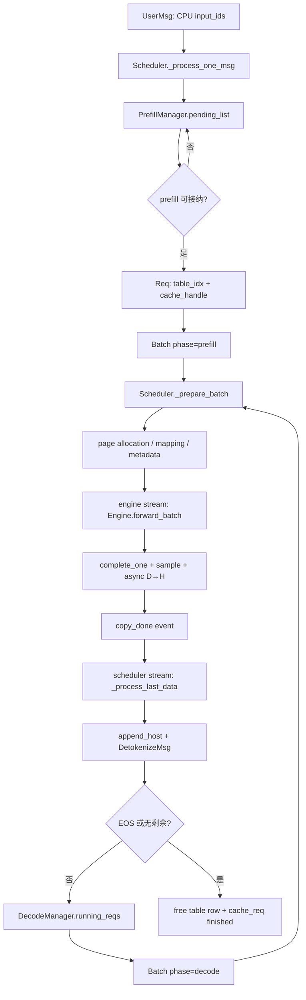
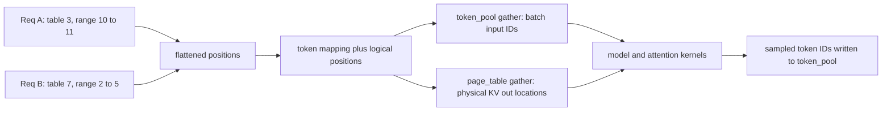
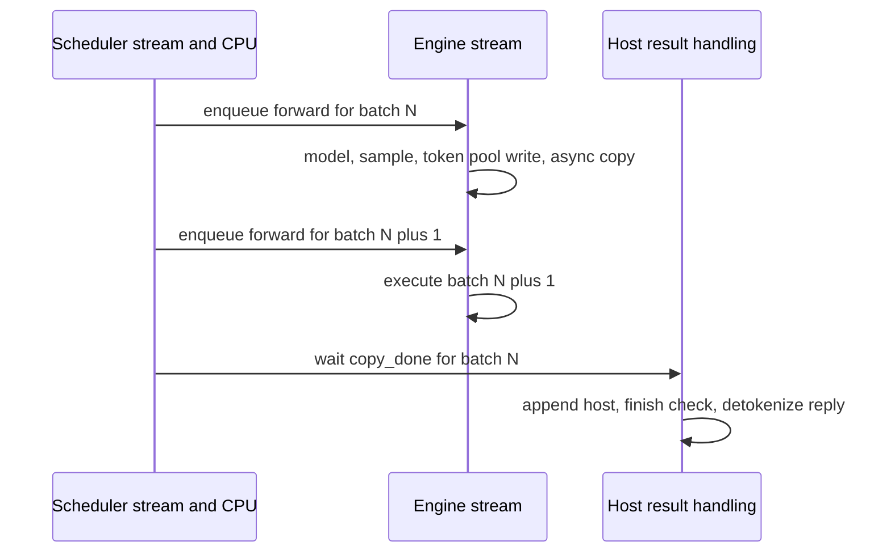

# 第 02 章：Req、Batch、Context 与调度器生命周期

> 读者对象：会读 Python、知道 token 与 Transformer 基本概念，但刚开始接触 LLM serving 的工程师。

> 本章以当前 mini-sglang 源码为依据。

> 文中“代码事实”指能够在给出的路径和符号中核查的行为。

> 文中“建议实验”只是教学活动，不表示仓库提供了相应开关、硬件或生产保证。

## 本章目标与先修知识

读完本章，你应能沿着一个请求说明它为何还没有立刻执行、何时进入一次 forward、何时又能安全地把 token 交给上游。

你应能区分 `Req`、`Batch` 和 `Context` 的所有权。

你应能解释 prefill、chunked prefill 和 decode 不是同一种工作负载。

你应能从两个长度不等式推出一次 batch 至少要计算一个 token。

你应能解释为什么非阻塞 D→H 拷贝之后，CPU 仍要等待 CUDA event。

你应能从调度路径定位 table row、KV page 和 radix-cache handle 的释放位置。

先修知识只要求你知道：token 是整数序列，KV cache 保存已处理 token 的 attention 状态，GPU stream 中的工作按顺序执行。

不要求你预先掌握 CUDA Graph、NCCL 或具体 attention kernel。

建议在阅读时同时打开 `python/minisgl/core.py` 与 `python/minisgl/scheduler/scheduler.py`。

本章不试图把 mini-sglang 描述成完整生产服务。

它是一个紧凑的实现，特别适合学习“请求状态如何跨 CPU、GPU 表项和缓存资源推进”。

## 具体问题：为什么不能直接对每个请求调用 `model.forward()`

一个在线请求不是固定形状的张量。

它带着长度各异的 prompt、不同的生成上限、可能不同的采样参数，以及未知的结束时刻到达。

prompt 处理通常要一次计算多个 token，这一阶段称为 prefill。

生成阶段通常每轮只新增一个 token，这一阶段称为 decode。

二者占用 GPU 的形状、调度频率和可复用前缀都不同。

如果服务把每个请求直接单独 `forward`，GPU 会看到大量小 decode 工作，吞吐通常很差。

如果服务只追求把最多请求塞进一个 batch，又可能耗尽有限的 KV cache。

如果长 prompt 独占一次巨大 prefill，新请求和已经在生成的请求又会等待太久。

因此，调度器需要同时回答四个问题。

第一，当前哪些请求有资格运行。

第二，它们需要多少新 KV 空间。

第三，哪些 token 应由本次 forward 读取和写入。

第四，上一批的 GPU 结果何时可以由 CPU 安全消费。

mini-sglang 的回答不是一个全局最优求解器。

它用一组明确的数据结构和保守的资源检查，把这些决策拆成可读的步骤。

这就是本章要建立的心智模型。

## 一个请求故事：从 `UserMsg` 到下一枚 token

假设用户发送 prompt `“解释分页 KV cache”`，tokenizer 已把它变成 CPU 上的 `input_ids`。

调度器收到的是 `UserMsg`，而不是一个已经占有 GPU 内存的 `Req`。

这是第一个重要分界：到达系统不等于已经被接纳执行。

`Scheduler._process_one_msg` 先检查 prompt 是否已经占满 `engine.max_seq_len`。

如果没有输出余量，该请求会记录 warning 后被丢弃。

如果 `sampling_params.max_tokens` 超过剩余序列空间，代码会把它缩短为可用上限。

通过检查的消息只会进入 `PrefillManager.pending_list`。

此时尚未分配 `table_idx`，也尚未分配新 KV 页。

之后，`PrefillManager.schedule_next_batch` 尝试从等待队列头部接纳请求。

它先查 radix 前缀缓存，可能发现 prompt 的一部分已经有可复用 KV。

随后它估算“未命中 token 加最大输出 token”所需的容量。

只有 table row 和可用 KV 容量都允许时，才锁定 cache handle 并拿到 `table_idx`。

假设本请求短到能在当前 prefill budget 内完成。

调度器会构造普通 `Req`，把 prompt 的新 token 写入 `token_pool` 对应行。

它再将这个 `Req` 放进 `Batch(phase="prefill")`。

`_prepare_batch` 为该请求分配所需页，生成 positions、输入映射和输出映射。

`_forward` 从 `token_pool` gather 本批输入，再调用 `Engine.forward_batch`。

engine 完成模型计算后对真实请求调用 `req.complete_one()`。

它采样一枚 token，并发起 GPU 到 CPU 的非阻塞复制。

此时 GPU 侧已经为下一轮打开一个待处理 token 的位置，但 CPU 的 `input_ids` 还未追加该 token。

在默认 overlap 路径中，调度器可能已开始在另一条 stream 上准备下一批。

只有 `_process_last_data` 等待 `copy_done.synchronize()` 后，CPU 才读取 copied token。

它对普通请求调用 `req.append_host(...)`，使 host token 序列与请求设备长度重新对齐。

若请求未结束，prefill 后的请求会被放入 `DecodeManager.running_reqs`。

下一轮没有可接纳 prefill 时，`DecodeManager` 会把它选入 `Batch(phase="decode")`。

每个 decode batch 再重复“一次 forward、一枚 sampled token、一次安全回收”的节奏。

若采到 EOS，或可生成余量耗尽，调度器把 `DetokenizeMsg(..., finished=True)` 发回上游，并归还资源。

这条故事线的重点不是 HTTP 或模型数学。

重点是一个请求在不同时间有不同的“已知 token 数”“已计算 KV 数”和“已保留资源”。

这里可以先记住两次不同性质的“接纳”。

```text
UserMsg -> PendingReq：请求合法且已排队，但尚未获得资源承诺
PendingReq -> Req：请求已锁定前缀缓存句柄、获得 table row，能够进入 batch
```

第一步刻意轻量；第二步才承担 KV 容量、table row 和缓存锁的责任。把二者混为“请求已经开始执行”，是理解 serving 调度时最常见的误解。

## 核心心智模型：一份请求有四本账

把 `Req` 看作一张跨设备的记账卡，而不是简单的文本对象。

第一本账是 host token 账：`input_ids` 是 CPU tensor。

它保存 prompt 与已经由 CPU 接收、确认过的生成 token。

第二本账是 device 进度账：`device_len` 表示 GPU 侧本轮已经物化到何处，或即将为下一 token 预留到何处。

第三本账是 KV cache 账：`cached_len` 表示已有 KV 的 token 前缀长度。

第四本账是资源定位账：`table_idx` 指向 page table 和 `token_pool` 中的一行，`cache_handle` 指向被锁定的前缀缓存路径。

构造 `Req` 时，`Req.__post_init__` 建立关键不变量：

```text
0 <= cached_len < device_len <= max_device_len
```

其中 `max_device_len = len(input_ids) + output_len`。

其中 `extend_len = device_len - cached_len`，即本次 forward 必须补算 KV 的 token 数。

因此 `cached_len < device_len` 立即推出 `extend_len >= 1`。

这避免了调度器把“没有任何新 token 要处理”的请求送进正常 batch。

`remain_len = max_device_len - device_len` 是理论上还可以生成的 token 数。

`can_decode` 则是 `remain_len > 0`。

一次普通请求的推进可简化成下面的账本变化。

```text
forward 前：cached_len = k，device_len = k + e，host 长度通常是 k + e
执行 forward：模型为 [k, k + e) 写入 KV，并预测下一 token
complete_one：cached_len = k + e，device_len = k + e + 1
等待 D→H：host 长度暂不变，不能读 copied token
append_host：host 长度加一，与新的 device_len 对齐
```

`complete_one()` 并不把 token 追加到 `input_ids`。

`append_host()` 也不替代 GPU 侧的完成记账。

普通请求需要这两个动作各发生一次、且顺序正确。

这份配对关系是阅读 overlap 路径时最值得反复检查的不变量。

### 数值走读：四本账如何在一次 decode 中推进

假设某请求的 prompt 已有 10 个 token，其中前 6 个 token 的 KV 已命中可复用前缀；允许最多再生成 4 个 token。它在某次完整 prefill 开始前可写为：

```text
len(input_ids)  = 10       host 已确认完整 prompt
cached_len      = 6        KV 已有效到位置 6
device_len      = 10       本轮 GPU 将处理到位置 10
max_device_len  = 14       10 个输入加最多 4 个输出
extend_len      = 4        本轮必须补算位置 [6, 10) 的 KV
```

模型处理这 4 个新位置后，`complete_one()` 先推进设备侧账本：

```text
cached_len = 10
device_len = 11
len(input_ids) = 10        CPU 此时仍不能读取异步拷贝的 next token
```

这不是不一致 bug，而是 overlap 所需的合法中间态。GPU 已将 sampled token 写进 `token_pool` 的下一逻辑位置，所以后续 GPU decode 可以继续安排；CPU 仍必须等待 `copy_done`。事件完成后，`append_host(next_token)` 才把 host 长度推进到 11。

因此这四本账并不是四份冗余数据，而是同一请求在 CPU、GPU、KV 与资源管理器中的不同提交视角。

## 术语表

| 术语 | 本章含义 | 源码落点 |
|---|---|---|
| `SamplingParams` | 单请求采样参数，如 temperature、top-k、top-p、EOS 与最大生成数 | `core.py:15` |
| `Req` | 已接纳、拥有 table row 与 cache handle 的请求状态 | `core.py:28` |
| `PendingReq` | 尚在 prefill 等待队列中的轻量请求；可暂存 chunk 进度 | `scheduler/utils.py` |
| `Batch` | 一次模型 forward 的真实请求集合与其元数据 | `core.py:71` |
| prefill | 为 prompt 或 prompt 的一段计算 KV 的 phase | `scheduler/prefill.py` |
| decode | 为运行中请求每轮推进一 token 的 phase | `scheduler/decode.py` |
| chunked prefill | 长 prompt 被分段 prefill；中间段不是 decode | `ChunkedReq` |
| `table_idx` | `page_table` 与 `token_pool` 的行索引 | `scheduler/table.py` |
| page table | 将请求位置映射到 KV 物理位置的表 | `Context.page_table` |
| cache handle | radix 前缀缓存中的句柄；飞行中请求会锁住其路径 | `scheduler/cache.py` |
| `padded_reqs` | 为 CUDA Graph 可捕获尺寸补上的真实请求加 dummy 请求 | `engine/graph.py` |
| `copy_done` | 记录非阻塞 token D→H 拷贝完成的 CUDA event | `engine/engine.py` |
| overlap | engine stream 执行本批时，scheduler stream 处理上批结果 | `scheduler.py` |

“缓存命中”在这里不是把完整请求直接完成。

`CacheManager.match_req` 只匹配 `input_ids[:input_len - 1]`。

最后一个 prompt token 被排除，确保每个接纳请求仍有至少一个 token 会被模型处理。

“页”也不应机械理解为 page id。

`CacheManager.free_slots` 持有页对齐的起始 token 位置，而 `_page_to_token` 在 page size 大于一时把页展开为连续 token location。

## 架构与执行图

下面的图只描述本章关心的控制和执行关系。



默认 overlap 的时间关系也很重要。

```text
时间 ───────────────────────────────────────────────────────────────▶
engine stream:      forward(batch N) ─────────── forward(batch N+1) ─
scheduler stream:   prepare N      | wait/copy process N | prepare N+1
                                      ↑
                                copy_done.synchronize()
```

这不是说两个 stream 可以任意并行访问相同数据。

`overlap_loop` 在 engine stream 执行 forward 前调用 `self.engine.stream.wait_stream(self.stream)`。

它先确保 engine 看到 scheduler stream 已完成的元数据准备。

随后才在 scheduler stream 处理上一批 CPU 结果。

正确性来自显式依赖和 event，同步点没有被“non_blocking”这个参数自动消除。

## 逐步源码导览（一）：状态对象和上下文

### 第一步：从 `SamplingParams` 开始

打开 `python/minisgl/core.py`。

`SamplingParams` 在文件开头定义了 `temperature`、`top_k`、`top_p`、`ignore_eos` 和 `max_tokens`。

属性 `SamplingParams.is_greedy` 给出贪心采样的条件。

调度本身并不在这里决定 token；它只是把每个 `Req` 的参数带入 batch。

### 第二步：读 `Req.__post_init__`

继续阅读 `Req`。

注意 `@dataclass(eq=False)`，因此集合中的成员关系按对象身份而不是字段相等性判断。

`input_ids` 被断言必须在 CPU。

`device_len` 初始化为 `len(input_ids)`。

`max_device_len` 初始化为当前输入长度加允许输出长度。

断言并不保证请求永远正确；它只是让不正确的初始状态尽早失败。

读者应把它当作后续调度和资源计算都依赖的契约。

### 第三步：读 `complete_one` 与 `append_host`

`Req.complete_one` 把 `cached_len` 追到旧 `device_len`，然后将 `device_len` 加一。

该方法由 `Engine.forward_batch` 在模型返回后对 batch 的真实请求调用。

`Req.append_host` 使用 `torch.cat` 把 CPU 上的一枚 token 接到 `input_ids`。

该方法由 scheduler 在确认 copy 完成后调用。

不能因为两个方法名字都像“完成请求”而把它们合并理解。

一个维护设备推进，一个维护 host 可见序列。

### 第四步：读 `Batch`

`Batch.reqs` 是真实请求列表。

`phase` 只能是 `"prefill"` 或 `"decode"`。

`input_ids`、`positions`、`out_loc`、`padded_reqs` 和 `attn_metadata` 都是后续阶段设置的字段。

这提醒我们：`Batch` 刚由 manager 创建时并不是可以直接喂给模型的完整对象。

`Batch.size` 计数真实请求。

`Batch.padded_size` 计数可能包含 dummy request 的请求数。

采样使用真实 batch 的范围，不应把 padding 当成用户请求。

### 第五步：读 `Context.forward_batch`

`Context` 是进程级共享句柄，包含 `page_size`、`page_table`、attention/MoE backend、KV cache 和当前 batch。

`Context.batch` 在不存在 active batch 时会断言失败。

`Context.forward_batch` 是 context manager。

它禁止嵌套 active batch，进入时设置 `_batch`，退出时无论成功或异常都清空 `_batch`。

模型层可通过 `get_global_ctx().batch` 取得当前 batch。

因此，`Context` 是“隐式执行上下文”，而不是调度器队列。

### 对象边界：谁保存长期状态，谁描述一次执行

把这三个对象分清，后续源码会简单很多。

| 对象 | 生命周期 | 主要职责 | 不应承担的职责 |
| --- | --- | --- | --- |
| `Req` | 从接纳到结束或取消 | 保存单请求长度账、采样参数、table row 与 cache handle | 不决定与其他请求如何合批 |
| `Batch` | 一次 forward 前后 | 描述本轮真实请求、phase、扁平输入和 attention 元数据 | 不保存用户连接或跨轮资源所有权 |
| `Context` | 一个 engine 进程 | 暴露当前 batch、page table、KV cache 与 backend | 不排队、不选择请求、不保存前端回复 |

`Req` 的 `@dataclass(eq=False)` 也值得注意。`DecodeManager.running_reqs` 和 `finished_reqs` 按对象身份而不是字段相等性管理请求；两个 prompt 相同的用户请求仍然有不同 `uid`、table row 与资源生命周期。它也避免把带有 `torch.Tensor` 的字段当作可靠的结构相等性依据。

`Context.forward_batch` 是动态作用域：engine 在 `with` 块内绑定当前 batch，模型层和 attention backend 再通过 `get_global_ctx().batch` 读取它。好处是无需在每层 `forward` 参数里传递一长串 runtime 对象；代价是同一 engine 进程不能嵌套或并发地拥有两个 active batch，代码用断言明确保护这个约束。TP 的每个 rank 是独立进程，因此各自有自己的全局 `Context`。

## 逐步源码导览（二）：从消息到 prefill 接纳

### 第六步：检查 `_process_one_msg`

打开 `python/minisgl/scheduler/scheduler.py`。

`Scheduler._process_one_msg` 分派 `BatchBackendMsg`、`ExitMsg`、`UserMsg` 和 `AbortBackendMsg`。

对 `UserMsg`，它先计算 `max_output_len = engine.max_seq_len - input_len`。

若值不大于零，它返回 warning，而不创建 `Req`。

若请求的 `max_tokens` 太大，方法会原地缩短该参数。

随后调用 `self.prefill_manager.add_one_req(msg)`。

这里没有分配 KV 页，避免“收到了但永远跑不到”的请求过早占住稀缺资源。

### 第七步：检查 `PrefillManager.add_one_req`

打开 `python/minisgl/scheduler/prefill.py`。

`add_one_req` 只将 `PendingReq(uid, input_ids, sampling_params)` append 到 `pending_list`。

这是一条轻量排队操作。

真正的前缀匹配、锁定、表行分配都推迟到 `schedule_next_batch`。

这种推迟使入队路径简单，但也意味着等待中的请求尚未得到资源公平性承诺。

### 第八步：检查 `PrefillManager.schedule_next_batch`

该方法为空队列直接返回 `None`。

否则它创建 `PrefillAdder`。

传入的 `token_budget` 是 scheduler 的 `prefill_budget`。

传入的 `reserved_size` 来自 `decode_manager.inflight_tokens`。

后者计入运行中 decode 请求剩余输出以及每请求的一页余量。

这是一种保守预留：prefill 不能假定 decode 已经不再需要 KV 容量。

方法按 `pending_list` 的原顺序调用 `try_add_one`。

第一个不能接纳的请求会使循环 `break`。

这意味着当前策略可能产生 head-of-line blocking。

它没有绕过大请求去尝试后面的小请求，因此不应被描述成全局最优 packing 或公平调度。

### 接纳决策：本轮算得下，不等于生命周期承诺得起

`PrefillAdder` 同时维护两个量：

```text
token_budget：本轮最多处理多少 prompt token
reserved_size：已经运行或本轮已接纳请求在未来仍可能需要的 KV 空间
```

二者不能互相替代。假设一条长 prompt 本轮只剩 16 token 的 prefill budget，但它还需处理 1,000 个 prompt token，且允许输出 200 个 token。调度器可以本轮只执行 16 个 token 的 chunk，却仍必须按“完整剩余 prompt 加 200 输出”预留容量；否则它可能把请求推进到一半，才发现没有空间完成生成。

这也解释了为何 `DecodeManager.inflight_tokens` 要并入 `reserved_size`：新 prefill 不应假定正在流式生成的旧请求已经不再需要 KV 空间。

### 第九步：检查 `PrefillAdder._try_allocate_one`

该方法先检查 `TableManager.available_size`。

没有空闲 table row 时，请求不能接纳。

接着它调用 `cache_manager.match_req(req).cuda_handle`。

得到的 `cached_len` 可能是零，也可能是共享前缀长度。

它计算 `extend_len = req.input_len - cached_len`。

它以 `estimated_len = extend_len + req.output_len` 做保守容量估算。

第一轮容量检查发生在 lock 前。

若不够，它不触碰 handle，直接拒绝。

若看起来足够，它调用 `cache_manager.lock(handle)`。

锁定会让可逐出的前缀变为受保护资源，因此可用容量可能下降。

所以代码立即做第二次相同的容量检查。

第二次失败时调用 `unlock(handle)`，并拒绝本请求。

这是一个很小却很关键的因果链：先检查无法替代 lock 后检查。

接纳成功后，`TableManager.allocate()` 取得一行。

若存在已命中前缀，代码把相应 token 和 page entry 写入这一行。

锁前检查与锁后复查共同构成一个小型提交协议：

```text
检查可用容量
  -> lock 命中的 prefix handle
  -> handle 从可逐出资源变为受保护资源
  -> 再检查容量
  -> 成功才分配 table_idx；失败则 unlock
```

第一次检查无法替代第二次检查，因为 lock 本身会改变 `available_size` 的含义。

### 第十步：检查 `_add_one_req` 与长 prompt

`_add_one_req` 将可处理量限制为 `min(token_budget, remain_len)`。

当 chunk 小于剩余 prompt 时，构造的类型是 `ChunkedReq`。

否则构造普通 `Req`。

无论本轮只跑一段还是整个 prompt，代码都会将完整剩余 prompt 与输出长度计入 `reserved_size`。

这避免长请求分块时错误低估未来内存需求。

新 token 先被复制到 `token_pool` 行；KV 页仍要等 scheduler 准备 batch 时分配。

对于分块请求，`PendingReq.chunked_req` 保留该请求。

下一次 prefill 会复用它的 `table_idx`、`cache_handle` 与 `cached_len`。

`pending_list` 会把仍未完成的 chunk 请求放回前部，以便优先续跑。

## 逐步源码导览（三）：prefill、decode 与 batch 准备

### 第十一步：理解 `ChunkedReq` 为什么不是 decode

`ChunkedReq` 覆盖 `can_decode` 并恒为 `False`。

它的 `append_host` 会抛出 `NotImplementedError`。

这不是一个可选的小优化，而是 API 级防线。

中间 prefill chunk 的 forward 会产生 logits，但它不应被当作最终用户生成 token。

因此 `_process_last_data` 遇到 `ChunkedReq` 会跳过。

最终 chunk 不再是 `ChunkedReq`，才可以在一次完整 prefill 后进入 decode。

这里需要一个精确但反直觉的补充：当前 `Engine.forward_batch` 的统一路径仍会计算 logits，并对 `batch.reqs` 调用 sampler；中间 chunk 的 sampled token 不是没有被计算，而是被 `_process_last_data` 跳过，因而不会写入 host token 序列或发给用户。

设完整 prompt 是 `p0` 到 `p99`，而本轮预算只能处理 40 个 token：

```text
第一个 chunk：处理 p0 到 p39，末尾 logits 形式上预测位置 40
第二个 chunk：处理 p40 到 p79，末尾 logits 形式上预测位置 80
最终 chunk：处理 p80 到 p99，末尾 logits 才预测 prompt 之后的第一个生成 token
```

前两次“下一位置”仍是用户已经给定的 prompt 内容，不能拿 sampler 产生的候选替代真实 prompt token，更不能流给用户。`ChunkedReq.can_decode=False` 防止它进入 decode 集合，`append_host` 直接报错，`_process_last_data` 也会跳过它；三层防线共同保证中间 chunk 只推进 KV，不提交生成结果。

### 第十二步：理解 prefill-first

回到 `Scheduler._schedule_next_batch`。

代码使用：

```python
prefill_manager.schedule_next_batch(prefill_budget) or decode_manager.schedule_next_batch()
```

因此只要能产出 prefill batch，本轮就优先执行 prefill。

只有没有可运行 prefill 时，才构造 decode batch。

这是一条当前实现的策略，不是 LLM serving 的普遍定律。

它让新 prompt 尽快获得处理机会，但可能加大 decode 的等待。

`or` 的语义值得按调度周期逐字理解：只有 `prefill_manager.schedule_next_batch(...)` 真正返回一个 batch，decode manager 才不会被调用。若 pending 队列为空，或队首请求因 table/KV 容量无法接纳而返回 `None`，本轮仍会退回 decode。

但在持续存在可接纳新 prompt 的负载下，正在生成的请求会连续失去 GPU 时间片：

```text
本轮：新请求 C 的 prefill，已有请求 A 和 B 不生成 token
下一轮：新请求 D 的 prefill，A 和 B 仍不生成 token
```

这就是 TTFT 与 TPOT 的取舍。prefill-first 倾向缩短新请求首 token 时间；decode-first 倾向缩短已有请求 token 间隔。特别是长 prompt 的 `ChunkedReq` 会回到 pending 队首优先续跑，因此它可能连续占用多轮 prefill。当前代码在 `_schedule_next_batch` 旁明确留有“支持 DECODE first 等策略”的 TODO；资源正确性不依赖该策略，但用户体验和公平性会随策略改变。

### 第十三步：理解 `DecodeManager`

打开 `python/minisgl/scheduler/decode.py`。

`running_reqs` 是 `Set[Req]`。

`filter_reqs` 将已有运行集与新 batch 的请求合并，再保留 `req.can_decode` 为真的对象。

分块请求会因 `can_decode=False` 被排除。

`schedule_next_batch` 把运行集按 `uid` 排序后形成 decode batch。

排序给当前构造提供了确定的请求顺序。

它不等同于按 deadline、公平权重或剩余长度调度。

### 第十四步：阅读 `_prepare_batch`

`Scheduler._prepare_batch` 让抽象的 `Batch` 变成 engine 可以消费的批。

第一步是 `engine.graph_runner.pad_batch(batch)`。

对合格 decode batch，它可能添加 dummy request，使请求数匹配已捕获图的尺寸。

第二步是 `cache_manager.allocate_paged(batch.reqs)`。

只对真实请求分配缺少的页。

第三步是 `_make_positions`。

它遍历 `batch.padded_reqs`，为每个待扩展 token 生成 `[cached_len, device_len)` 的位置。

第四步是 `_make_input_tuple`。

它同样遍历 padded 请求，建立从扁平 token 输入到 `table_idx` 的映射。

第五步是 `_make_write_tuple`。

它只遍历真实请求，写入每个请求的 table row 与 `device_len`；不能 decode 的请求以 `-1` 标示输出写位置。

随后 `batch.out_loc = page_table[input_mapping]` 取出 KV 写入位置。

最后 attention backend 用 `prepare_metadata(batch)` 构建其专属元数据。

### 把 Batch 看成一次 GPU 调用的编译产物

`_prepare_batch` 的输入是若干不规则的 `Req`，输出则是 kernel 能消费的扁平张量和地址。最容易混淆的是三种位置：

| 位置 | 含义 |
| --- | --- |
| 逻辑位置 | 请求序列中的 token 下标，例如位置 10 |
| table 位置 | 请求在 `token_pool` 与 `page_table` 的行，即 `table_idx` |
| 物理 KV 位置 | GPU KV buffer 中实际存放 K/V 的槽位 |

设一个 batch 有两个真实请求：

```text
A：table_idx=3，cached_len=10，device_len=11，处理 [10, 11)
B：table_idx=7，cached_len=2， device_len=5， 处理 [2, 5)
```

`_make_positions` 将它们展平为：

```text
positions = [10, 2, 3, 4]
```

`_make_input_tuple` 同时产生：

```text
token_mapping = [3, 7, 7, 7]
input_ids = token_pool[token_mapping, positions]
```

模型实际得到的是一个扁平 token 序列；请求边界由 mapping 与 attention metadata 恢复。随后 `page_table[token_mapping, positions]` 得到 `batch.out_loc`，attention backend 在每层将本轮输入 token 的 K/V 写入这些物理地址。

不要把 `out_loc` 与 sampled token 的写入位置混为一谈：

```text
out_loc：本轮输入 token 的 K/V 写进哪个物理 KV 槽位
write_tuple：本轮采样的 next token ID 先写回 token_pool 的哪一个逻辑位置
```

后者让下一次 decode 能在 GPU 上直接读取上轮 sampled token，不必等待它先返回 CPU。



### 第十五步：理解 page 分配的时机

`CacheManager.allocate_paged` 根据 `cached_len` 和 `device_len` 求首尾页。

只有本 batch 覆盖到了新页时才申请页。

若 free slots 不够，`_allocate` 会请求 radix prefix cache `evict` 可逐出的空间。

若仍不能释放足够页，会触发断言。

缓存匹配与具体页分配分开，是因为接纳决定“可否承诺”，而 batch 准备落实“本轮具体要写何处”。

### CUDA Graph padding：固定 kernel 形状，不扩展用户语义

Mini-SGLang 只对 decode batch 尝试 CUDA Graph。它启动时预先捕获一组 batch size，例如 `1`、`2`、`4`、`8`；运行时若有 3 个真实 decode 请求，则选择第一个不小于 3 的图形状：

```text
batch.reqs        = [A, B, C]
batch.size        = 3
batch.padded_reqs = [A, B, C, Dummy]
batch.padded_size = 4
```

dummy request 并非空对象。它有合法 token ID、专用 `table_idx`、`uid=-1`，且其 page-table 行预先指向专用 dummy page。这样 attention kernel 的第四条 lane 能安全读写隔离的地址，不会触碰真实请求的 KV。

但服务语义必须始终使用 `batch.reqs`：engine 只对真实请求 `complete_one()`，只对 `logits[:batch.size]` 采样，回程只遍历真实请求。`padded_reqs` 只用于 positions、input mapping 与 attention metadata，从而匹配被捕获图的形状。

这换取较低的 decode launch 开销，但也可能计算一条额外 lane。必须保持的边界是：`padded_size` 决定 GPU 图形状，`size` 决定真实用户请求数。

## 逐步源码导览（四）：执行、采样和 overlap

### 第十六步：阅读 `_forward`

`Scheduler._forward` 从 `token_pool[input_mapping]` 收集扁平输入，赋给 `batch.input_ids`。

它调用 `engine.forward_batch(batch, sample_args)`。

返回后，`token_pool[output_mapping]` 被写入 `next_tokens_gpu`。

这为下一轮 decode 保留了 GPU token 数据。

最后 `decode_manager.filter_reqs(batch.reqs)` 更新 decode 运行集。

注意：这一步发生在 engine stream 的执行上下文中。

### 两条 token 路径：GPU 连续推进，CPU 延后提交

一次 forward 后的 sampled token 会同时走两条路径：

```text
GPU 路径：next_tokens_gpu -> token_pool 的下一逻辑位置 -> 下一轮 decode 输入
CPU 路径：next_tokens_gpu -> non-blocking D to H copy -> copy_done -> append_host -> DetokenizeMsg
```

因此 GPU 可以在 host 尚未追加 token 时继续安排下一轮，而用户仍只能在 CPU 确认 copy 完成后看到文本。`complete_one()` 推进设备账本；`append_host()` 提交 host 账本；二者不能合并。

### 第十七步：阅读 `Engine.forward_batch`

打开 `python/minisgl/engine/engine.py` 的 `Engine.forward_batch`。

它断言当前 CUDA stream 是 engine 自己的 stream。

它用 `with self.ctx.forward_batch(batch)` 包住模型执行。

若 `graph_runner.can_use_cuda_graph(batch)` 为真，调用 `replay`。

否则调用 eager 的 `model.forward()`。

当前 `GraphRunner.can_use_cuda_graph` 要求 batch 是 decode 且真实 size 不超过最大 graph batch size。

它并不把 prefill 送进 CUDA Graph。

模型路径返回 logits 后，engine 遍历真实 `batch.reqs` 调用 `complete_one()`。

采样器只对 `logits[:batch.size]` 采样，排除 padding 行。

生成的 GPU token 被转换为 `int32`。

随后 `to("cpu", non_blocking=True)` 发起异步 D→H copy。

engine 创建并记录 `copy_done_event`，再将 GPU token、CPU token tensor 与 event 一并返回。

### 第十八步：阅读 `overlap_loop`

默认运行路径由 `Scheduler.run_forever` 在未设置 `ENV.DISABLE_OVERLAP_SCHEDULING` 时选择。

`overlap_loop(last_data)` 先决定接收消息是否 blocking。

若已有上一批结果、或 prefill/decode 有 runnable 请求，它不会为了收消息而阻塞。

然后它处理收到的消息，并安排下一 batch。

若有 batch，它切到 engine stream。

`self.engine.stream.wait_stream(self.stream)` 建立 scheduler 元数据准备到 engine 计算的依赖。

之后它启动本批 `_forward`。

启动后才调用 `_process_last_data(last_data)`。

因此，batch N 的 GPU 计算可以与 batch N-1 的 CPU 结果处理重叠。

### 两轮时间线：overlap 真正重叠的是什么



这里的 overlap 不是让两个 batch 同时在同一 engine stream 上执行模型；同一 stream 仍按顺序运行。重叠发生在“batch N plus 1 的 GPU 计算”与“CPU 处理 batch N 的已拷贝结果”之间。`engine.stream.wait_stream(self.stream)` 则保证 engine 在读取 batch 元数据前，scheduler stream 上的准备工作已完成。

### 第十九步：阅读 `_process_last_data`

`_process_last_data` 先解包上一批的 `next_tokens_cpu` 与 `copy_done`。

它立即调用 `copy_done.synchronize()`。

这一步是 CPU 读取 `next_tokens_cpu[i]` 前的明确边界。

即使 copy 的提交使用 `non_blocking=True`，CPU 仍不能在 event 完成前假设数据已可读。

方法在 `cache_manager.lazy_free_region()` 中遍历真实请求。

它先跳过 `ChunkedReq`。

对普通请求，它追加 host token，并用“无剩余长度”或“采到 EOS 且未忽略 EOS”判断结束。

它为每个普通请求构造 `DetokenizeMsg`。

若结束且不在 `finished_reqs`，它从 decode manager 删除请求并释放资源。

若未结束但本批是 prefill，它缓存已完成前缀，为后续请求复用。

最后 `send_result(reply)` 交给 I/O 层。

`copy_done.synchronize()` 是这一节最重要的 CPU 提交边界。`non_blocking=True` 仅表示发起 D-to-H copy 时 CPU 不等待；它不授予 CPU 提前读取目标 tensor 的权限。只有 event 完成后，`next_tokens_cpu[i]` 才能安全用于 `append_host`、EOS 判断和 `DetokenizeMsg`。

结束请求的资源释放也要在此处发生：从 decode manager 移除真实请求、归还 table row，并将其 KV 区域交给 `cache_req(..., finished=True)` 处理。`finished_reqs` 是 overlap 窗口中的双重释放保护，不应误解为完整的并发正确性证明。

## 引导实验：不运行模型也能审计一次生命周期

本实验是建议实验，不需要 CUDA、模型权重或运行服务。

它是源码可检查的纸面模拟，不会修改仓库代码。

目标是用一个普通请求和一个长请求验证“chunk 不采样”与“长度账配对”。

### 实验准备

打开以下文件并保持可见。

`python/minisgl/core.py`。

`python/minisgl/scheduler/prefill.py`。

`python/minisgl/scheduler/scheduler.py`。

准备表格，列为 `kind`、`cached_len`、`device_len`、`len(input_ids)`、`can_decode`、`table_idx` 和“是否发送 token”。

假设请求 A 的 prompt 长度为 4，`cached_len=0`，`output_len=3`。

假设请求 B 的 prompt 长度为 10，`cached_len=0`，并假设可用 `token_budget=4`。

假设两者都通过 table row 和容量接纳检查。

这些数字只是纸面输入，不是仓库默认配置。

### 实验步骤 1：构造普通 prefill 请求 A

按 `_add_one_req` 的计算，A 的 `remain_len` 为 4。

`chunk_size = min(4, 4) = 4`。

因此 A 构造为普通 `Req`，而不是 `ChunkedReq`。

刚构造后记录：`cached_len=0`，`device_len=4`，`len(input_ids)=4`，`can_decode=True`。

由不变量可得 `extend_len=4`。

查阅 `_prepare_batch`，确认它会为 `[0, 4)` 生成 positions 和输入映射。

查阅 `Engine.forward_batch`，确认 forward 后会执行一次 `complete_one()`。

所以在 CPU token 回来前，A 变为 `cached_len=4`，`device_len=5`，host 长度仍为 4。

查阅 `_process_last_data`，确认 event 同步之后才调用 `append_host`。

追加后 host 长度变为 5，并且 A 可被保留在 decode 集合中。

### 实验步骤 2：构造第一个长 prompt chunk B

对 B，`remain_len=10`。

`chunk_size = min(4, 10) = 4`。

因 `4 < 10`，`_add_one_req` 选择 `ChunkedReq`。

刚构造后 B 有 `cached_len=0`，`device_len=4`，host 长度为 4。

它的 `can_decode` 是 `False`，即使普通 `Req` 的 `remain_len` 仍大于零。

这是覆盖方法的效果，而不是数字推导错误。

在 `_process_last_data` 中找到 `isinstance(req, ChunkedReq)` 的跳过分支。

因此这段 prefill 结束后，不会 `append_host`，不会发送 `DetokenizeMsg`，也不会将 B 放入 decode。

`PendingReq.chunked_req` 保存 B，以便下一轮继续 prefill。

### 实验步骤 3：推进 B 的后续 chunk

第二段以旧 B 的 `cache_handle`、`table_idx` 和更新后的 `cached_len` 继续。

你应从 `complete_one` 的代码推断：完成第一段后，`cached_len` 已推进到该段的旧 `device_len`。

继续分段，直至某段覆盖到 prompt 末尾。

只有最后一段 `_add_one_req` 判定为普通 `Req`。

此后才允许 `filter_reqs` 把它加入 decode 运行集合。

### 实验检查问题

为什么 A 的 prefill 可以产生一枚向用户发送的 token，而 B 的中间 chunk 不行？

预期推理：A 是普通 `Req`，而 B 是 `ChunkedReq`；后者被 `_process_last_data` 显式跳过且 `can_decode=False`。

为什么不能在刚调用 `to("cpu", non_blocking=True)` 后读取 token？

预期推理：该调用只提交复制；源码用 `copy_done.synchronize()` 建立 CPU 消费边界。

为什么 B 的后续 chunk 不重新分配 table row？

预期推理：`PendingReq.chunked_req` 保存已有对象，`try_add_one` 复用其 `cache_handle` 与 `table_idx`。

## 正确性、不变量、性能取舍与失败模式

### 必须保持的不变量

| 不变量 | 代码如何维持 | 若破坏会怎样 |
|---|---|---|
| `0 <= cached_len < device_len <= max_device_len` | `Req.__post_init__` 断言；`complete_one` 推进账本 | 可能出现空 extend、越界位置或错误生成上限 |
| 普通请求每轮 `complete_one` 与 `append_host` 配对 | engine 执行前者；event 后 scheduler 执行后者 | host/device token 序列脱节 |
| chunk 中间段不采样 | `ChunkedReq.can_decode=False`，结果处理直接跳过 | 把 prompt 中间处理误当用户输出 |
| GPU 读取元数据前等待 scheduler stream | `engine.stream.wait_stream(self.stream)` | forward 可能观察到未完成的准备数据 |
| CPU 读取 token 前等待 copy event | `_process_last_data` 的 `copy_done.synchronize()` | 读取尚未完成的 D→H 数据 |
| 结束请求只释放一次 | `finished_reqs` 防止 overlap 下同轮重复释放 | table row 或 cache 页重复归还 |
| lock 后仍重新检查容量 | `_try_allocate_one` 的双检查 | 保护前缀后可用容量不足却仍接纳 |
| 分块请求优先续跑 | `chunked_list + tail` 重建等待队列 | 长请求可无限被后来请求压住 |

### 性能取舍：prefill-first 不是免费午餐

prefill-first 让新到达请求在有资源时优先建立 KV。

它也让 prefix cache 尽早产生可复用前缀。

代价是持续到达的 prefill 可能推迟已有 decode 的下一 token。

`DecodeManager.inflight_tokens` 的预留减轻了内存挤压，但不等于延迟公平。

当前 pending 队列遇到第一个不能接纳请求会停止扫描。

这简化实现并保持 FIFO 风格，却会产生 head-of-line blocking。

不要把“按 uid 排序 decode”误解为服务级公平保证。

它只给当前 decode batch 的请求顺序提供确定性。

### 性能取舍：overlap 的收益和约束

overlap 的目标是隐藏 CPU 元数据处理与 GPU 计算的一部分时间。

它通过两条 CUDA stream 让 batch N 执行时处理 batch N-1 的结果。

收益依赖实际 workload；本章不提供吞吐或延迟数字承诺。

代价是生命周期跨迭代，所有权更难目测。

因此实现使用 `ForwardInput`/`ForwardOutput` 保存上一批所需数据。

因此结束路径使用 `finished_reqs` 防止重叠造成的重复释放。

关闭 `ENV.DISABLE_OVERLAP_SCHEDULING` 时，`run_forever` 改走 `normal_loop`。

normal 路径把本批 forward 与本批结果处理串行化，更容易追踪，但少了这种重叠机会。

### 失败模式表

| 现象或风险 | 直接原因 | 源码中的边界 | 阅读/排查方向 |
|---|---|---|---|
| 长 prompt 后面的短请求等待 | 队首不能接纳即 `break` | 当前 prefill policy | 看 `PrefillManager.schedule_next_batch` |
| 请求被接收却一直未执行 | 等待队列不等于已分配资源 | 资源检查在 schedule 时发生 | 看 `pending_list`、table 与 cache 可用量 |
| OOM/页不足相关失败 | 页分配时可能需要逐出而仍不足 | `_allocate` 断言逐出足够 | 看 `CacheManager.available_size`、`evict` |
| token 文本错乱或读取过早 | 未在 event 后消费 CPU tensor | 代码显式 synchronize | 看 `_process_last_data` |
| 重复 free | overlap 下同一结束请求可能再次被观察 | `finished_reqs` 是局部保护 | 看结束和 abort 的交错 |
| chunk 结果意外送用户 | 将中间 prompt chunk 当 decode | `ChunkedReq` 双重防线 | 看类型、`can_decode`、跳过分支 |
| 前缀资源泄漏 | handle 未正确 unlock/cache 或 tail 未释放 | `cache_req` 统一处理 | 审查 `_free_req_resources` 和 `cache_req` |
| 客户端 abort 未停止已启动 kernel | 容器移除/资源释放不等同 GPU kernel 取消 | 本章源码未给出抢占协议 | 区分“取消排队”与“取消正在执行” |

最后一行特别重要。

`AbortBackendMsg` 会先尝试从 prefill 或 decode 容器移除，再调用 `_free_req_resources`。

这能说明调度器层面的容器和资源动作。

它本身不能证明已经在 GPU stream 上启动的模型工作被硬件级取消。

对这种并发时序需要结合更广泛测试和 engine 行为验证。

## 常见误解

### 误解一：“收到 `UserMsg` 就有一个 `Req`”

不对。

收到消息后只有 `PendingReq` 入队。

`Req` 在 `PrefillAdder` 通过资源门槛、取得 handle 与 table row 后才构造。

### 误解二：“`cached_len` 就是 `len(input_ids)`”

不对。

`cached_len` 是已有 KV 的长度。

`input_ids` 是 CPU 已知 token 序列。

forward 完成、但 D→H 结果尚未消费时，两者可处在不同推进阶段。

### 误解三：“每次 prefill 完都立刻向用户流出 token”

不对。

中间长 prompt chunk 使用 `ChunkedReq`，被明确跳过。

只有最终成为普通 `Req` 的完整 prefill 才走正常 token 结果处理。

### 误解四：“`non_blocking=True` 就无需同步”

不对。

它允许提交不阻塞，但不保证 CPU 已经能安全读取目标 tensor。

`copy_done.synchronize()` 正是消费前同步。

### 误解五：“prefill-first 意味着 decode 永远不会执行”

不对。

当 prefill manager 不能产生 batch 时，`or` 后的 decode manager 会构造 decode batch。

但大量可接纳 prefill 的确可能影响 decode 的响应节奏。

### 误解六：“page table 的条目只是 page 编号”

不准确。

本实现将页起点展开为 token location；`_page_to_token` 在 page size 大于一时生成一页内连续位置。

### 误解七：“`finished_reqs` 是完整并发正确性证明”

不对。

它是针对 overlap 下重复释放的一个局部 guard。

更广泛的所有权、abort 与 GPU 在途工作仍需要系统性测试。

### 误解八：“CUDA Graph 覆盖所有 batch”

不对。

当前 `can_use_cuda_graph` 限定 decode，并受最大 graph batch size 约束。

不符合条件的 batch 走 eager `model.forward()`。

## 练习与预期推理

### 练习 1：从长度不等式推出本轮工作量

已知 `0 <= cached_len < device_len <= max_device_len`。

证明 `extend_len = device_len - cached_len >= 1`。

预期推理：`device_len` 与 `cached_len` 都是整数，严格大于关系意味着至少相差一。

不要从 `remain_len` 推导这个结论；它描述的是未来输出余量，不是本轮待计算 token 数。

### 练习 2：画一个普通 decode 的两条长度线

令 forward 前 `cached_len=7`、`device_len=8`、`len(input_ids)=8`。

写出 `complete_one` 后以及 `append_host` 后的三项值。

预期推理：完成后为 `cached_len=8`、`device_len=9`、host 长度仍为 8。

追加后 host 长度变为 9。

这正是 event 前后不能混读的原因。

### 练习 3：判断队首阻塞

有三个 pending 请求 P、Q、R。

P 因容量检查失败，Q 和 R 本可单独装入当前 budget。

当前实现本轮会选择谁？

预期推理：一个都不选择，因为 `try_add_one(P)` 失败后循环立即 `break`。

这不是 bug 结论，只是当前策略导致的可观察行为。

### 练习 4：解释双重容量检查

为什么 `_try_allocate_one` 在 lock 前和 lock 后都检查 `estimated_len + reserved_size`？

预期推理：lock 会把前缀从可逐出转为受保护，可能降低 `available_size`。

第一次检查避免不必要 lock；第二次检查防止 lock 本身改变资源可用性后过度接纳。

### 练习 5：区分三种结束情形

分别考虑：采样到 EOS、`remain_len` 耗尽、收到 abort。

说明哪些路径会发送 `DetokenizeMsg`，哪些会从 manager 容器移除并调用 `_free_req_resources`。

预期推理：前两者在 `_process_last_data` 为普通请求形成 reply，并在 finished 时释放。

abort 经 `_process_one_msg` 尝试从 prefill/decode 移除并释放；其客户端通知与在途 GPU 执行细节不应由本章源码臆断。

### 练习 6：判断一个 batch 是否可能使用 graph

给出一个 `phase="prefill"` batch 和一个 size 未超过上限的 `phase="decode"` batch。

哪个满足 `GraphRunner.can_use_cuda_graph` 的必要条件？

预期推理：后者；当前方法首先要求 `batch.is_decode`。

仍须注意 graph map 是否有对应 padded size，这是 `pad_batch` 与 `replay` 的协作范围。

### 练习 7：画出 TP I/O 的最小边界

在多 rank 情况下，为什么非主 rank 不直接各自从 tokenizer 队列收消息？

预期推理：`SchedulerIOMixin` 让主 rank 接收原始消息，并广播数量与 payload，使各 rank 按相同数量和顺序处理调度输入。

这解释计算一致性的输入边界，不是对所有分布式 serving 设计的普遍规定。

## 本章小结

LLM serving 的调度核心不是“把 token 放进列表”。

它是同时维护 host token、device 进度、KV 前缀和表行资源的状态机。

`Req` 是每个已接纳请求的账本。

`Batch` 是一次 forward 的工作单元，并在准备后才拥有完整执行元数据。

`Context` 为模型层提供唯一的 active batch，禁止嵌套 forward 上下文。

prefill 先尝试接纳等待请求，decode 在没有可运行 prefill 时接棒。

chunked prefill 通过 `ChunkedReq` 保证中间 prompt 段不会被误采样或误送出。

`_prepare_batch` 连接抽象请求与具体的页、位置、映射和 attention metadata。

`Engine.forward_batch` 推进 device 账、采样并发起异步 copy。

`_process_last_data` 在 event 后推进 host 账、决定结束并回收资源。

默认 overlap 提升重叠机会，但把正确性建立在 stream 依赖、event 和严格所有权上。

带着这张图进入下一章时，读者应追问：同一份 `Batch` 怎样在 engine 中选择 eager 或 graph，并怎样把 page table 元数据交给模型计算。

## 源码锚点附录

以下锚点服务于复读与代码核查；行号会随版本变化，优先按符号搜索。

| 路径 | 符号 | 本章用它核查什么 |
|---|---|---|
| `python/minisgl/core.py` | `SamplingParams` | 采样参数与贪心判断 |
| `python/minisgl/core.py` | `Req.__post_init__` | host/device/cache 长度与基本断言 |
| `python/minisgl/core.py` | `Req.complete_one` | forward 后的 device 进度推进 |
| `python/minisgl/core.py` | `Req.append_host` | event 后追加 CPU token |
| `python/minisgl/core.py` | `Batch` | phase、真实请求与 padded 请求字段 |
| `python/minisgl/core.py` | `Context.forward_batch` | active batch 的设置、清理和非嵌套约束 |
| `python/minisgl/scheduler/scheduler.py` | `Scheduler.__init__` | engine、双 stream、四个 manager 的组装 |
| `python/minisgl/scheduler/scheduler.py` | `Scheduler.run_forever` | overlap 与 normal loop 的选择 |
| `python/minisgl/scheduler/scheduler.py` | `Scheduler.overlap_loop` | 先启动本批、后处理上批的顺序 |
| `python/minisgl/scheduler/scheduler.py` | `Scheduler._process_one_msg` | `UserMsg` 限制、入队与 abort 分派 |
| `python/minisgl/scheduler/scheduler.py` | `Scheduler._prepare_batch` | padding、页分配、映射和 metadata |
| `python/minisgl/scheduler/scheduler.py` | `Scheduler._forward` | token gather、engine 调用和 decode 集合更新 |
| `python/minisgl/scheduler/scheduler.py` | `Scheduler._process_last_data` | event 等待、host 追加、结束与回复 |
| `python/minisgl/scheduler/scheduler.py` | `Scheduler._free_req_resources` | table row 与 cache 释放汇合点 |
| `python/minisgl/scheduler/prefill.py` | `ChunkedReq` | 中间 chunk 不 decode、不 append |
| `python/minisgl/scheduler/prefill.py` | `PrefillAdder._try_allocate_one` | match、lock、双容量检查和 table allocation |
| `python/minisgl/scheduler/prefill.py` | `PrefillAdder._add_one_req` | chunk 大小、token pool 写入和 `Req` 构造 |
| `python/minisgl/scheduler/prefill.py` | `PrefillManager.schedule_next_batch` | prefill budget、队首阻塞、chunk 续跑 |
| `python/minisgl/scheduler/decode.py` | `DecodeManager.filter_reqs` | 可 decode 请求的运行集合 |
| `python/minisgl/scheduler/decode.py` | `DecodeManager.inflight_tokens` | 对 decode 未来空间的保守预留 |
| `python/minisgl/scheduler/decode.py` | `DecodeManager.schedule_next_batch` | 按 uid 的 decode batch |
| `python/minisgl/scheduler/cache.py` | `CacheManager.match_req` | 不匹配最后一个输入 token 的前缀查找 |
| `python/minisgl/scheduler/cache.py` | `CacheManager.allocate_paged` | 本批缺失页的分配 |
| `python/minisgl/scheduler/cache.py` | `CacheManager.cache_req` | 缓存插入、unlock 和 finished tail 释放 |
| `python/minisgl/scheduler/cache.py` | `CacheManager.check_integrity` | free pages 与 cache pages 的数量核查 |
| `python/minisgl/scheduler/table.py` | `TableManager.allocate` / `free` | 请求表行的取得与归还 |
| `python/minisgl/scheduler/io.py` | `SchedulerIOMixin._recv_msg_multi_rank0` | 主 rank 接收、count 广播和 payload fan-out |
| `python/minisgl/engine/engine.py` | `Engine.forward_batch` | context、graph/eager、采样与 copy event |
| `python/minisgl/engine/graph.py` | `GraphRunner.can_use_cuda_graph` | decode-only graph 条件 |
| `python/minisgl/engine/graph.py` | `GraphRunner.pad_batch` / `replay` | padding 与已捕获图 replay |

## 局限性与事实边界

本章只讨论当前源码能支撑的请求生命周期。

它没有测量真实模型、GPU、batch size 或 prompt 分布下的性能。

因此所有“提高利用率”“减少等待”的说法都是机制层面的可能性，不是基准承诺。

`run_forever` 是无限循环。

虽然 `Scheduler.shutdown` 展示了 CUDA synchronize、rank 同步与 engine shutdown，但外层进程编排、异常恢复和完整关闭协议不在本章范围。

`CacheManager.check_integrity` 核对 free page 与 prefix cache page 数的守恒。

它不应被误说成彻底验证 radix 树的所有结构性质。

特别是当前 `RadixCache.check_integrity` 的实现细节需要在相关章节单独检查。

offline mode 在 `SchedulerIOMixin` 中把收发替换为抽象的 `offline_receive_msg` 与 `offline_send_result`。

本章不据此臆测其具体队列、线程或进程语义。

attention backend 如何消费 `Batch.attn_metadata`、模型如何写入 KV、以及采样 kernel 的数值行为超出本章。

它们是下一层 engine、attention 和 kernel 阅读的主题。

本章也不声称 abort 能抢占或撤销已经发射的 GPU kernel。

源码可见的是调度容器中的移除与资源释放。

若要把取消语义作为产品承诺，必须通过并发测试、客户端协议和更完整的 engine 生命周期共同验证。

最后，所有建议实验均以静态阅读或纸面推演为设计目标。

若你要运行真实服务，请先遵循仓库实际的环境、模型和 CUDA 前置条件，而不要把本章示例数字当作可运行配置。
