# 第 03 章：Engine、CUDA Graph、采样与分布式运行时

> 本章承接“调度器已经选出一个 `Batch`”。
> 目标不是教你调用一个模型，而是解释这个批怎样在正确的 GPU、正确的 stream 和正确的多卡顺序中，变成一个可安全交给 CPU 的下一个 token。

## 本章目标与先修知识

读完本章，你应当能沿着 `Scheduler._prepare_batch → Scheduler._forward → Engine.forward_batch → Scheduler._process_last_data` 解释一次生成。

你应当能判断一个批为什么走 eager forward、为什么可以 CUDA Graph replay，或者为什么必须补 dummy 请求。

你应当能用自己的话区分 TP 中的“控制面消息一致”与“GPU 张量 collective 一致”。

你还应能指出异步 D→H 拷贝的 CPU 可读边界，以及违反该边界会发生什么。

本章假定你会读 Python。

你需要知道 token、logits、KV cache、GPU stream 和进程的基本含义。

不要求你已有 NCCL、CUDA Graph、FlashInfer 或 Triton 经验。

本文描述的是当前 mini-sglang 代码库的行为。

文中“代码事实”都可在给出的路径和符号处核查。

文中标为“建议实验”的内容是教学活动，不代表仓库已经提供了一个可直接跑的 GPU 基准命令。

> 题目驱动阅读：若你更适合先建立因果问题、再读源码细节，可从文末“题目驱动附录：30 道递进问题”开始。它把本章拆为六轮，每次只引入一个新的运行时边界。

## 具体问题：为什么不能只写一次 `model.forward()`

假设调度器已经选好了五个正在逐 token 生成的请求。

直觉上，你可能会把输入拼成 tensor，调用一次 `model.forward()`，再从 logits 取五个 token。

这只覆盖了模型计算这一小段。

一个 serving engine 还必须回答如下问题。

这五个请求在哪张 GPU 上运行？

模型层从哪里取得“当前 batch”的页表、KV cache 和 attention 元数据？

这个 batch 的形状是否能复用此前捕获的 CUDA Graph？

若不能复用，怎样不损害正确性地退回 eager？

每个请求使用 greedy、top-k 还是 top-p，怎样在一个 batch 中表达？

采样出的 token 什么时候能被 CPU 读取？

若 tensor parallel 有多个 rank，各 rank 怎样保证收到同一序列的用户消息并以同一顺序进入 collective？

资源退出时，为什么 CUDA Graph、process group 和通信插件不能随意销毁？

因此，LLM serving 的 Engine 不是一个裸的 `forward` 包装器。

它是每个 rank 的运行时所有者。

它把设备、stream、模型、KV 存储、图捕获、采样与通信生命周期组织成一个可执行边界。

## 一个贯穿全章的请求故事

小林向服务发送一段已经很常见的续写请求。

tokenizer 已把文本变成 token ids。

第 02 章中的 scheduler 已让该请求完成 prefill，并把它与另外四个可 decode 的请求放进 decode batch。

这时真实 batch size 是 5。

`Scheduler._prepare_batch` 先询问 `GraphRunner.pad_batch`。

假设启动时捕获的 graph size 包含 `[1, 2, 4, 8]`。

大小 5 是 decode，且不超过最大 size 8。

调度器于是把 `padded_reqs` 扩成 8 项，其中后三项是 Engine 在初始化时建立的同一个 `dummy_req` 占位。

注意，真实 `batch.reqs` 仍然只有五项。

调度器接着分配真实请求的 KV 位置，准备 position、输入映射、写入映射和 attention metadata。

它在 Engine 的 stream 中调用 `Engine.forward_batch`。

Engine 将真实输入复制到静态 graph buffer 的前五个位置，并回放 key 为 8 的图。

回放产生的 logits buffer 有八行，但 Engine 只取前五行。

Engine 只推进真实的五个 `Req`，只为五行 logits 采样，也只向 token pool 写五个 token。

采样结果先留在 GPU 上。

同一结果随后非阻塞地复制到 CPU，Engine 在其 stream 上记录一个 CUDA event。

调度器可以开始组织后续工作，而不是立刻在 CPU 上阻塞等待。

当它要处理这一批的 CPU token 时，`Scheduler._process_last_data` 先等待该 event。

等待完成后，调度器把 token 追加到每个请求的 host `input_ids`，判断 EOS 或长度上限，并发送 `DetokenizeMsg`。

小林最终看到的增量文本属于后续 detokenize/SSE 边界。

本章止步于“可靠地产生并交出一个 token”。

这个故事已经暴露三个核心张力。

固定形状带来较低 launch 开销，却需要 padding 和额外显存。

异步复制带来重叠，却要求明确的可读同步点。

TP 带来模型并行能力，却要求所有 rank 保持控制与计算顺序一致。

## 核心心智模型：三条边界与两个时间尺度

先把 Engine 看成三个边界的交点。

第一条是请求状态边界。

`Req` 的 host token、device 长度、页表行和 KV 位置由 scheduler 准备并推进。

Engine 不负责决定哪个新请求准入，但它必须在 forward 后让请求的设备侧进度前进一格。

第二条是 GPU 执行边界。

Engine 拥有 `self.device` 和 `self.stream`。

它要求 `forward_batch` 在这个 stream 上运行，从而让 forward、采样、D→H 拷贝与 event 的顺序有清晰含义。

第三条是分布式边界。

每个 TP rank 各自有一个 Engine 和一张 GPU。

rank 0 是用户 I/O 的入口，但所有 rank 必须获得相同顺序的调度输入。

模型内部还可能需要对 GPU tensor 做 all-reduce 或 all-gather。

这两种“同步”目的不同，不应混成一个概念。

再按时间尺度理解系统。

初始化阶段很慢且一次性：选设备、建通信组、加载权重、测显存、分配 KV cache、捕获图。

请求执行阶段很短且反复：准备 batch、forward、采样、复制结果、推进请求。

关闭阶段也有顺序：先清图，再销毁 process group，最后清通信插件。

把这三个阶段混在一起读代码，很容易误以为每次请求都会“初始化 CUDA Graph”。

事实是图在 `Engine.__init__` 中经 `GraphRunner` 建立，之后的 decode 只尝试 replay。

## 术语表

| 术语 | 在本章中的准确含义 | 不应误解为 |
|---|---|---|
| `Engine` | 单个 TP rank 的设备与执行运行时所有者 | HTTP 服务或全局调度器 |
| eager | 直接调用 `self.model.forward()` 的普通执行路径 | 错误或未优化路径 |
| CUDA Graph | 对固定形状 decode kernel 序列的捕获与重放 | 任意 batch 的通用缓存 |
| replay | 将实时输入放进静态 buffer 后执行已捕获图 | 重做一次 Python 层模型构建 |
| `dummy_req` | 为 graph padding/capture 提供合法页表行的占位请求 | 用户请求或要发回的输出 |
| real size | `len(batch.reqs)`，真实用户请求数 | graph 实际执行的 padded size |
| padded size | `len(batch.padded_reqs)`，用于选图的形状 | 需要采样和回传的请求数 |
| logits | 每个位置对词表的未归一化分数 | 已经选出的 token |
| greedy | `argmax` 选最大 logits 的采样分支 | 任意温度为零都必然会走 FlashInfer |
| control plane | 消息数、UID、屏障等控制信息的协同 | 模型 GPU tensor 的 all-reduce |
| data plane | 模型计算与 GPU tensor 通信 | ZMQ 原始消息广播 |
| TP | tensor parallel；多个 rank 分担一次模型计算 | 多个独立服务副本 |
| gloo group | 本仓库用于 CPU 控制、UID 分发等的 process group | 对所有 GPU 数据唯一的通信实现 |
| PyNCCL plugin | 封装 NCCL communicator 的 GPU collective 实现 | 自动永远优先的后端 |
| `copy_done_event` | D→H 非阻塞复制完成的同步证据 | 一次普通 Python 回调 |

## 架构与执行图

下面的图把“批如何执行”与“TP 如何保持一致”放在同一张图中。

```mermaid
flowchart LR
    A[rank 0: tokenizer / ZMQ PULL] --> B[SchedulerIOMixin
raw payload]
    B -->|ZMQ PUB raw bytes| C[non-primary rank: ZMQ SUB]
    B -->|gloo broadcast: message count| C
    B --> D[Scheduler._prepare_batch]
    C --> E[各 rank 的相同调度输入]
    D --> F[pad_batch / 页分配 / metadata / sampling args]
    E --> F
    F --> G[Engine stream]
    G --> H{decode 且 size <= max?}
    H -->|是| I[GraphRunner.replay
静态 buffer + padded graph]
    H -->|否| J[self.model.forward eager]
    I --> K[真实 req.complete_one]
    J --> K
    K --> L[Sampler.sample]
    L --> M[next_tokens_gpu]
    M --> N[non-blocking D→H]
    N --> O[copy_done_event.record]
    O --> P[Scheduler._process_last_data
event.synchronize]
    P --> Q[append_host / DetokenizeMsg]
    G -. GPU tensor all-reduce/all-gather .-> R[DistributedCommunicator
Torch or PyNCCL plugin]
```



图中实线的 rank 0 消息传播属于控制面的输入一致性。

虚线所示的 collective 属于模型计算中的 GPU tensor 协作。

它们可能都用到 process group 概念，却不是同一条数据流。

## 从配置到运行时：Engine 为什么先“占有”CUDA

先读 `python/minisgl/engine/config.py:EngineConfig`。

它是 `@dataclass(frozen=True)`，声明模型路径、TP 信息、dtype、最大运行请求数、attention/MoE backend、CUDA Graph batch size、页大小、显存比例、超时和通信开关等。

`frozen=True` 表示普通赋值受限，不表示运行时配置绝不变化。

`Engine.__init__` 的开头调用 `_adjust_config(config)`。

该函数明确使用 `object.__setattr__` 对 frozen dataclass 作受控改写。

例如 `attention_backend == "auto"` 时，会按硬件能力选 `trtllm`、`fa,fi` 或 `fi`。

若选择了 TRTLLM 且 `page_size` 不在允许集合，代码会改为 64 并记录 warning。

若模型是 MoE 而 backend 为 `auto`，代码会选 `fused`。

因此阅读配置时要分两层。

第一层是用户或上层传入的声明值。

第二层是 Engine 在具体硬件与模型条件下解析出的实际值。

接着看 `python/minisgl/engine/engine.py:Engine.__init__` 的第一个断言。

它要求 `not torch.cuda.is_initialized()`。

随后 Engine 设置全局 TP 信息，选择 `cuda:{rank}`，设为当前 device，创建私有 `torch.cuda.Stream()` 并设为当前 stream。

这条顺序表达的不是“CUDA 只能有一个 stream”。

它表达的是此 Engine 要建立它依赖的 device/stream 上下文，而不是接手一个已经不明来源的 CUDA 初始化状态。

同一初始化中，Engine 创建 `Context(config.page_size)` 并调用 `set_global_ctx(self.ctx)`。

`python/minisgl/core.py:set_global_ctx` 也拒绝第二次设置。

这是一个单次初始化约束。

它提醒我们：当前代码展示的是每个进程创建一个 Engine 的路径，不是同一解释器反复构造多个独立 Engine 的通用框架。

`Context` 是模型层与运行时交会的“当前批”容器。

它保存 page table、attention backend、可选 MoE backend、KV cache 和 `_batch`。

`Context.forward_batch` 在进入时设置活动 batch，在 `finally` 中清除它，并禁止嵌套。

这让下层模型代码在 forward 期间能从全局 Context 读取当前执行所需元数据。

代价是调用方必须严格维护作用域。

嵌套 forward 或遗留活动 batch 会触发断言，而不会由运行时猜测如何恢复。

## 初始化的对象顺序：为什么显存测量在模型前后各出现一次

继续在 `Engine.__init__` 顺序向下读。

Engine 先以 `_init_communication(config)` 建立通信，再以 `_sync_get_memory()` 读取启动时可用显存。

之后它在 `torch.device("meta")` 和目标 dtype 语境中 `create_model`。

meta device 的含义是先建立参数结构而不在该阶段分配真实参数存储。

随后 `load_state_dict` 加载真实权重。

这给 KV cache 容量计算留下一个清晰的因果链。

先知道模型加载前的空闲显存。

再知道模型加载后的空闲显存。

两者差值近似归因于模型占用。

最后根据模型维度、dtype、TP 切分与 page size 推导每页 KV 需要多少字节。

`Engine._determine_num_pages` 用这一估计得到页数，或接受 `num_page_override` 的显式覆盖。

如果最终页数不大于 1，代码以断言失败。

这不是一个性能 warning，而是无法建立有效 KV 工作区的初始化失败。

`_sync_get_memory` 还跨 `tp_cpu_group` 做归约，检查各 TP rank 的空闲显存。

函数返回最小值与最大值。

如果二者差距超过 2 GiB，代码抛出 `RuntimeError("Memory across TP ranks are imbalanced")`。

这里的工程目的，是避免不同 rank 以过于不一致的容量基线进入同一次 TP 服务。

它不是对所有性能失衡原因的完整诊断器。

KV cache 之后，Engine 建一个二维 `page_table`。

表的行数是 `max_running_req + 1`。

最后一行保留给 dummy 请求。

列数是按 32 对齐后的最大序列长度。

代码注释说明表存储 raw locations，而不是把字段简单当成 page id。

Engine 还为 KV pool 多建一页 dummy page。

`dummy_req.table_idx` 指向最后一行，Engine 将该行填成 dummy page 的 raw token location。

这样 graph capture 和 padding 的占位请求也能获得一个合法的表项。

不要把这解释成“虚拟请求也占用用户的缓存生命周期”。

它是为了静态形状执行准备的运行时基础设施。

接着 Engine 依次创建 attention backend、可选 MoE backend、`Sampler` 与 `GraphRunner`。

这是当前仓库的构造顺序。

它不应被背成所有推理引擎的通用模板。

## 逐步源码导览：从 Batch 到 ForwardOutput

这一节按真实调用顺序走一次。

建议在编辑器中同时打开 `python/minisgl/scheduler/scheduler.py`、`python/minisgl/engine/engine.py` 和 `python/minisgl/core.py`。

### 第一步：调度器为 graph 与模型准备 Batch

入口是 `python/minisgl/scheduler/scheduler.py:Scheduler._prepare_batch`。

它先调用 `self.engine.graph_runner.pad_batch(batch)`。

这一调用只改变 `batch.padded_reqs`。

真实请求列表 `batch.reqs` 没有被 dummy 请求污染。

随后调用 `cache_manager.allocate_paged(batch.reqs)`。

这里分配的是真实请求需要的页；KV 的详细分配与回收留给第 04 章。

然后 `_make_positions` 为 `batch.padded_reqs` 建 position。

`_make_input_tuple` 同样按 padded 请求建 table row 与 position 映射。

原因是被 replay 的固定形状图也必须有完整形状的输入元数据。

`_make_write_tuple` 却只按 `batch.reqs` 建输出写入映射。

原因是采样产生的新 token 只属于真实用户请求。

调度器从 Engine 的 page table 取 `batch.out_loc`。

attention backend 通过 `prepare_metadata(batch)` 准备其自身的元数据。

最后，`self.engine.sampler.prepare(batch)` 只根据真实 `batch.reqs` 生成 `BatchSamplingArgs`。

返回的 `ForwardInput` 将 batch、采样参数、输入映射和输出映射打包。

### 第二步：调度器切入 Engine stream

`Scheduler._forward` 先把待计算的 token 写入 `batch.input_ids`。

随后它调用 `Engine.forward_batch(batch, sample_args)`。

调用发生在 scheduler 为 Engine 准备的 stream 上下文中。

`Engine.forward_batch` 的首行断言 `torch.cuda.current_stream() == self.stream`。

这是一个很重要但很小的正确性边界。

如果 forward、采样和 event 不在 Engine 预期 stream 上，代码建立的执行顺序不再可信。

不要把这个断言理解成“所有 GPU 操作都只能发生在一个 stream”。

它只约束这条 Engine 执行路径的所有权。

### 第三步：将当前 Batch 暴露给模型层

Engine 用 `with self.ctx.forward_batch(batch):` 包住模型执行。

这个上下文会令 `get_global_ctx().batch` 在 forward 内可用。

attention backend 和模型层因此能读取当前 batch 的 positions、`out_loc`、padded 请求和 metadata。

离开 `with` 块时，`finally` 会清空 `_batch`。

这使“活动 batch”不是一个永久的全局变量，而是严格限于一次 forward 的动态作用域。

### 第四步：选择 replay 还是 eager

在这个上下文中，Engine 调用 `self.graph_runner.can_use_cuda_graph(batch)`。

该谓词的代码条件非常直接：`batch.is_decode and batch.size <= self.max_graph_bs`。

只有 decode 批、且真实 size 不超过已配置 graph 最大 size，才可进入 replay。

满足条件时调用 `GraphRunner.replay(batch)`。

否则直接调用 `self.model.forward()`。

因此 prefill 不会由此处的 CUDA Graph 路径执行。

超过最大捕获 size 的 decode 也会走 eager。

eager 不是逻辑上的降级错误。

它是对动态形状和超出图覆盖范围的正确回退。

### 第五步：推进设备侧请求进度

模型产生 logits 后，Engine 遍历 `batch.reqs`，对每个真实请求调用 `req.complete_one()`。

`python/minisgl/core.py:Req.complete_one` 先令 `cached_len = device_len`，再令 `device_len += 1`。

这表示本轮已计算到的输入成为 cache 侧已覆盖部分，而新产生 token 预留为下一轮设备侧长度的一部分。

它没有直接把 token 拼回 CPU 的 `input_ids`。

CPU host 序列的追加在稍后的 `_process_last_data` 中完成。

这种分离是重叠执行能成立的前提之一。

### 第六步：从 logits 到 GPU token

Engine 调用 `self.sampler.sample(logits[: batch.size], args)`。

`[: batch.size]` 再次说明：即使 graph 的 padded size 是 8，也只能让前五行真实请求参与采样。

采样输出转为 `torch.int32`，成为 `next_tokens_gpu`。

这仍是 GPU tensor。

接着 `Scheduler._forward` 会把它写入 GPU token pool。

这使下一轮设备侧准备可以使用新 token，而不必先等待 CPU。

### 第七步：异步交给 CPU，但不提前读取

Engine 还执行 `next_tokens_gpu.to("cpu", non_blocking=True)`。

得到的 `next_tokens_cpu` 是异步 D→H 拷贝的目标。

随后创建 `torch.cuda.Event()`，并在 `self.stream` 上 `record`。

三者作为 `ForwardOutput(next_tokens_gpu, next_tokens_cpu, copy_done_event)` 返回。

这里最关键的因果是：non-blocking 只表示调用可以不等待复制完成。

它不表示 CPU tensor 在 Python 代码返回的瞬间已经可读。

`Scheduler._process_last_data` 读取它前明确调用 `copy_done.synchronize()`。

同步后才取得 `next_tokens_cpu[i]`，调用 `req.append_host(...)`，再决定 finished 并发送 `DetokenizeMsg`。

这就是 GPU 产物与 CPU 可读结果之间的契约。

## CUDA Graph：把动态服务中的一小段变成固定形状

CUDA Graph 的价值来自避免重复发射一串形状稳定的小 GPU 操作。

decode 常常每个请求只推进一个 token，批大小也常落在有限的范围。

这使固定形状的 decode 成为合适候选。

但“候选”不等于“所有 forward”。

在 mini-sglang 中，`GraphRunner` 的 graph 使用条件写在 `python/minisgl/engine/graph.py:GraphRunner.can_use_cuda_graph`。

它要求 decode，并要求真实 size 不大于 `max_graph_bs`。

`GraphRunner` 先用 `_determine_cuda_graph_bs` 决定要捕获的尺寸列表。

若用户显式给出 `cuda_graph_bs`，代码直接采用。

否则它按初始可用显存选择默认最大值。

未显式设置最大值时，空闲显存大于 80 GiB 取 256，否则取 160。

默认列表为 `[1, 2, 4]` 加从 8 起的 8 的倍数。

最大值小于 1 时列表为空，图功能关闭。

这是当前代码的启发式，而非跨硬件的性能定律。

### 捕获：为什么从最大 batch size 开始

`GraphRunner._capture_graphs` 会先创建 `GraphCaptureBuffer`。

其中有固定大小的 GPU `input_ids`、`out_loc`、`positions` 与 `logits` buffer。

其大小采用最大候选 batch size。

捕获循环按候选 size 从大到小执行。

每次循环都创建由 `dummy_req` 重复组成的 decode `Batch`。

attention backend 先执行 `prepare_for_capture(batch)`。

`GraphCaptureBuffer.set_batch` 把 batch 的输入字段替换为静态 buffer 的切片。

接下来代码先 warmup 一次 `model.forward()`。

之后才进入 `torch.cuda.graph(graph, pool=pool, stream=self.stream)` 捕获一次 forward。

第一个 graph 的 memory pool 被保留并复用于后续图。

从大到小捕获的直接代码意图，是先让 pool 覆盖较大的形状，再让小图复用它以降低额外内存开销。

不要从此推出“最大图永远最优”。

可捕获尺寸、显存占用和实际负载分布需要在具体系统中衡量。

### 补齐：大小 5 为什么选择图 8

`GraphRunner.pad_batch` 找到第一个不小于真实 `batch.size` 的已捕获 size。

若 batch 可用图，便在 `batch.padded_reqs` 尾部补足 `dummy_req`。

对于候选 `[1,2,4,8]`，真实 decode size 5 会变成 padded size 8。

若 batch 是 prefill，`can_use_cuda_graph` 为假，不补 dummy。

若 decode size 10 且最大图是 8，也不补 dummy，之后走 eager。

`GraphRunner.replay` 先把实时 batch 的输入复制到静态 buffer。

然后它按 `batch.padded_size` 从 `graph_map` 取对应图。

attention backend 可在 `prepare_for_replay(batch)` 中更新不可静态烘焙的 metadata。

最后调用 `g.replay()`，但只返回前 `batch.size` 行 logits。

这种设计的好处是让常见 decode size 落入有限的预捕获形状。

成本是捕获本身、静态 buffer、dummy 页表/页，以及因 padding 做的额外计算。

所以 CUDA Graph 的核心 trade-off 是“启动与内存换每轮稳定形状的低开销”。

## 采样：同一批请求不必有同一套随机策略

模型 forward 输出的是 logits，不是最终 token。

`python/minisgl/engine/sample.py:Sampler.prepare` 将每个真实请求的 `sampling_params` 汇总成 `BatchSamplingArgs`。

`SamplingParams.is_greedy` 定义在 `python/minisgl/core.py`。

当 `(temperature <= 0.0 or top_k == 1) and top_p == 1.0` 时，它认为该请求是 greedy。

若 batch 中所有请求都 greedy，`Sampler.prepare` 返回 `temperatures=None`。

`Sampler.sample` 看到 `None` 会直接做 `torch.argmax(logits, dim=-1)`。

这是一个明确的快速分支。

若 batch 至少有一个请求不是 greedy，prepare 会为每个请求构造温度、top-k、top-p 的设备参数。

温度被下限限制为 `1e-6`。

无约束的 `top_k` 会替换成 vocabulary size。

`top_p` 会夹到 `[1e-6, 1.0]`。

仅当 batch 中确实有人限制 top-k 时才建立 `top_k` tensor。

仅当有人令 top-p 小于 1 时才建立 `top_p` tensor。

这些参数 tensor 经 `make_device_tensor` 先建 pinned CPU tensor，再 non-blocking 传到 GPU。

非 greedy 分支会把 logits 转为 float，并调用 `sample_impl`。

`sample_impl` 使用 `flashinfer.sampling.softmax` 得到概率。

它按 top-k、top-p 是否存在选择无约束、仅 top-k、仅 top-p 或两者结合的采样函数。

这里的重点不是背 FlashInfer 函数名。

重点是：请求级策略先被整理成 batch 级 tensor，模型执行与“如何挑 token”因此保持解耦。

## TP 运行时：一条控制线，两条数据通路

先明确 TP 的基本假设。

`tp_size > 1` 时，每个 rank 运行一个 scheduler/Engine 组合并绑定 `cuda:{rank}`。

它们不是多个互不相关的服务实例。

它们共同完成同一次模型计算。

因此，所有 rank 必须以兼容的顺序处理调度输入并进入相应 collective。

### 控制面：rank 0 如何让其他 rank 跟上输入

阅读 `python/minisgl/scheduler/io.py:SchedulerIOMixin`。

在多 rank 模式中，主 rank 的 `_recv_msg_multi_rank0` 从 tokenizer 的 ZMQ PULL 读取 raw bytes。

它通过 ZMQ PUB 将相同 raw payload 发给其他 rank 的 SUB。

对于一次非阻塞 drain，rank 0 还在 `tp_cpu_group` 上广播本次 raw message 的数量。

非主 rank 的 `_recv_msg_multi_rank1` 先接收这个 count，再从 SUB 精确取相同次数的消息。

因此顺序的含义很具体：相同个数、相同 raw payload、相同消费顺序。

这是一条 CPU 控制/消息线。

它不是把模型 activation 或 logits 通过 ZMQ 发到其他 GPU。

### GPU 数据面：模型张量怎样 collective

阅读 `python/minisgl/distributed/impl.py:DistributedCommunicator`。

它的 `plugins` 初始含有 `TorchDistributedImpl()`。

`all_reduce` 和 `all_gather` 都路由到 `plugins[-1]`，即最后注册的插件。

这是一条很容易忽略的阅读规则。

它不是“第一个插件优先”，也不是按名字自动择优。

`TorchDistributedImpl` 在单卡时直接返回输入。

多卡时，它使用 `torch.distributed` 的 all-reduce SUM 或 `all_gather_into_tensor`。

若开启 PyNCCL 且 TP size 大于一，`enable_pynccl_distributed` 会创建 communicator 并 append `PyNCCLDistributedImpl`。

此后 `plugins[-1]` 指向 PyNCCL 实现。

`PyNCCLDistributedImpl` 的 all-reduce 和 all-gather 调用其 FFI communicator 的对应操作。

这就是“后注册者生效”的实际含义。

### gloo、NCCL 与 PyNCCL 在本仓库中的位置

阅读 `python/minisgl/engine/engine.py:Engine._init_communication`。

当 TP size 为 1 或 `use_pynccl=True`，代码初始化 gloo WORLD group，并调用 `enable_pynccl_distributed`。

当多卡且 `use_pynccl=False`，代码初始化 NCCL WORLD group，并另外创建一个 gloo group 作为 `tp_cpu_group`。

后者说明 CPU 控制 group 仍有独立用途。

阅读 `python/minisgl/kernel/pynccl.py:init_pynccl` 可以看到一个直接例子。

rank 0 创建 NCCL UID。

代码用传入的 `tp_cpu_group` 通过 `broadcast_object_list` 将 UID 发给其他 rank。

随后才构造 PyNCCL FFI communicator。

也就是说，PyNCCL 被用于 GPU tensor 通信，并不让 gloo 控制通信消失。

`ENV.PYNCCL_MAX_BUFFER_SIZE` 只限制 `init_pynccl` 的 `max_size_bytes`。

不要把它概括为“整个 serving 内存上限”。

## 启动、环境开关与关闭：生命周期也是正确性的一部分

`python/minisgl/server/launch.py:launch_server` 的 `start_subprocess` 强制 multiprocessing 使用 `spawn`。

它为每个 TP rank 启动一个 scheduler 进程。

它还启动一个 detokenizer 以及 `num_tokenizer` 个 tokenizer worker。

`_run_scheduler` 在 `torch.inference_mode()` 中创建 Scheduler，并在各 rank 间同步。

只有 primary rank 发送 scheduler ready ACK。

启动方总共等待 `num_tokenizer + 2` 条 ACK：一个主 scheduler、所有 tokenizer、一个 detokenizer。

这个屏障避免 API 在已知 worker 尚未 ready 时开始提供流量。

从这些行不能推出所有子进程异常都具有超时、重试或统一回收策略。

实际上 `_run_scheduler` 展示的 graceful shutdown 捕获的是 `KeyboardInterrupt`。

其他异常路径不应被教材虚构成已完全处理。

`python/minisgl/env.py` 中的 `ENV` 在导入时建立 singleton。

名字采用 `MINISGL_<属性名>` 形式。

解析失败会被吞掉并保留默认值。

这意味着错误格式的环境变量可能静默无效。

`MINISGL_DISABLE_OVERLAP_SCHEDULING` 会使 `Scheduler.run_forever` 走 `normal_loop`，默认则走 `overlap_loop`。

它只控制这里的调度重叠选择。

它不是 CUDA Graph 的总开关。

关闭顺序由 `Scheduler.shutdown` 与 `Engine.shutdown` 明确表达。

前者先设备同步，再做 CPU group barrier，随后调用 Engine。

后者先 `destroy_cuda_graphs()`，再 `torch.distributed.destroy_process_group()`，最后 `destroy_distributed()` 清空插件。

`GraphRunner.destroy_cuda_graphs` 上的源码注释要求它先于释放 NCCL 资源，以避免程序 hang。

这不是可随意重排的清理细节。

资源的创建顺序与释放顺序共同构成运行时正确性的一部分。

## 正确性与性能不变量，以及违反后的表现

下面的不变量分为“代码直接检查”与“必须由读者理解的因果约束”。

| 不变量 | 代码锚点 | 为什么重要 | 典型失败表现 |
|---|---|---|---|
| 创建 Engine 前 CUDA 未初始化 | `engine.py:Engine.__init__` | Engine 必须建立自己的 device/stream 上下文 | 初始化断言失败 |
| TP 信息与全局 Context 只设置一次 | `distributed/info.py:set_tp_info`；`core.py:set_global_ctx` | 模型与日志依赖单一进程身份/上下文 | 重复初始化时报错 |
| `Req` 满足 `0 <= cached_len < device_len <= max_device_len` | `core.py:Req.__post_init__` | 保证存在至少一个待执行 token，且长度账本不倒退 | 构造或后续状态断言失败 |
| `forward_batch` 在 Engine stream 运行 | `engine.py:Engine.forward_batch` | forward、复制与 event 的顺序才可解释 | stream 断言失败，或修改后引入竞态 |
| Graph 只用于合规 decode | `graph.py:can_use_cuda_graph` | 捕获图假设固定 decode 形状 | prefill/超限批应 eager |
| replay key 使用 padded size | `graph.py:replay/pad_batch` | 图和静态 buffer 必须有匹配形状 | 配置缺尺寸时可能在 `next(...)` 或 map 查找失败 |
| dummy 不参与用户语义 | `engine.py:forward_batch` | 占位不得推进、采样、回传为真实请求 | 若误遍历 padded 列表会产生假输出或错误资源操作 |
| CPU 读取在 event 后 | `scheduler.py:_process_last_data` | non-blocking D→H 不保证即时完成 | 读取未完成或不稳定的数据 |
| TP rank 接收同序输入 | `scheduler/io.py:_recv_msg_multi_rank0/_rank1` | 后续调度与 collective 顺序必须相容 | 可能卡在 collective 或状态分叉 |
| 清图先于释放通信资源 | `engine.py:shutdown`；`graph.py:destroy_cuda_graphs` | graph 资源与 NCCL 资源有生命周期依赖 | 源码注释警告可能 hang |

性能上也有一些不应被误读的权衡。

CUDA Graph 可能减少重复 kernel launch 的成本，但捕获需要时间和显存。

较大的候选尺寸覆盖更多真实 batch size，却会提高预捕获和静态 buffer 的成本。

padding 让 size 5 用 size 8 图，却多执行 dummy 槽位相关工作。

异步 D→H 与 overlap 降低等待，却让状态处理至少隔着一个 event 边界。

TP 让模型可分到多个 GPU，却增加启动、消息一致性和 collective 顺序的约束。

自动 KV 页数按显存估计提高适配性，却仍会被不同 rank 空闲显存差和配置覆盖影响。

## 常见误解

### 误解一：“CUDA Graph 加速所有 batch。”

不对。

`GraphRunner.can_use_cuda_graph` 明确要求 decode 且 size 不超过最大图 size。

prefill 与超限 decode 都由 `Engine.forward_batch` 走 `self.model.forward()`。

### 误解二：“补 dummy 后会多生成几个用户 token。”

不对。

补齐写入 `batch.padded_reqs`，而 Engine 的 `complete_one` 遍历 `batch.reqs`。

采样也对 logits 做 `[:batch.size]` 切片。

dummy 只服务于形状和合法元数据。

### 误解三：“non-blocking copy 后 CPU 立刻可读。”

不对。

non-blocking 允许提交复制后继续推进。

`copy_done_event.synchronize()` 才是 CPU 读取 `next_tokens_cpu` 前的证据。

### 误解四：“启用 PyNCCL 后 gloo 不再有用。”

不对。

`init_pynccl` 用 CPU group 广播 NCCL UID。

多 rank scheduler I/O 也用 CPU group 广播消息数量。

### 误解五：“配置是 frozen，所以不会在运行时变。”

不对。

`_adjust_config` 直接用 `object.__setattr__` 解析 auto backend 和相关 page size。

### 误解六：“通信插件总是第一个注册的实现。”

不对。

`DistributedCommunicator` 选择 `plugins[-1]`。

阅读或添加插件时必须明确其追加顺序。

### 误解七：“关闭 HTTP 前端必然优雅清理所有 GPU worker。”

不能从现有代码推出。

API 前端停止 ZMQ queue、scheduler 的 KeyboardInterrupt 路径和 shell 的子进程处理是不同路径。

应把它们分别阅读，而不是合并为一个未被证实的服务关闭承诺。

## 导读实验：不用 GPU 也能验证的纸上执行

本实验是建议实验。

它不要求 CUDA、NCCL、模型权重或 FlashInfer。

目标是用源码条件判断 graph/eager 分支，并写出 token 的安全回传顺序。

### 实验输入

假设已经捕获 `graph_bs_list = [1, 2, 4, 8]`。

假设 `max_graph_bs = 8`。

请分别分析三个 batch：`(prefill, 3)`、`(decode, 5)`、`(decode, 10)`。

先打开 `python/minisgl/engine/graph.py`，阅读 `GraphRunner.can_use_cuda_graph`、`pad_batch` 和 `replay`。

再打开 `python/minisgl/engine/engine.py`，阅读 `Engine.forward_batch`。

### 学生工作表

| 输入 | `can_use_cuda_graph` | `padded_size` | 执行路径 | 返回 logits | 用户可见 token 数 |
|---|---:|---:|---|---|---:|
| prefill, 3 | 待填写 | 待填写 | 待填写 | 待填写 | 待填写 |
| decode, 5 | 待填写 | 待填写 | 待填写 | 待填写 | 待填写 |
| decode, 10 | 待填写 | 待填写 | 待填写 | 待填写 | 待填写 |

### 参考推理与答案

`(prefill, 3)` 的 `is_decode` 为假。

因此不能用 graph。

`pad_batch` 不补 dummy，padded size 保持 3。

Engine 走 eager `self.model.forward()`。

输出供真实三项使用，用户可见 token 数为 3。

`(decode, 5)` 是 decode 且 `5 <= 8`。

它可用 graph。

首个不小于 5 的候选是 8，所以补 3 个 dummy，padded size 为 8。

replay 选择 `graph_map[8]`。

虽然底层 logits buffer 具有八行形状，`replay` 返回前五行，Engine 只采样五项。

用户可见 token 数为 5。

`(decode, 10)` 是 decode，但 `10 > 8`。

它不能用 graph。

`pad_batch` 不补，padded size 仍为 10。

Engine 走 eager。

用户可见 token 数为 10。

### 第二部分：在时间线上补全安全边界

请按下面顺序排列代码符号。

`req.complete_one`。

`Sampler.sample`。

`next_tokens_gpu.to("cpu", non_blocking=True)`。

`copy_done_event.record(self.stream)`。

`copy_done.synchronize()`。

`req.append_host(...)`。

正确顺序是前四项发生在 `Engine.forward_batch` 中。

随后 `Scheduler._process_last_data` 先同步 event，再追加 host token。

如果把 `append_host` 放在 event 同步之前，你不能仅凭 non-blocking 参数证明 CPU 值已正确。

这就是本实验最重要的结论。

### 可选静态检查命令

下面命令只读取源码，不需要 GPU。

```bash
rg -n "def (can_use_cuda_graph|replay|pad_batch)|copy_done|complete_one" \
  python/minisgl/engine/graph.py \
  python/minisgl/engine/engine.py \
  python/minisgl/scheduler/scheduler.py \
  python/minisgl/core.py
```

该命令是阅读辅助，不是对 CUDA Graph 正确性或性能的运行验证。

## 练习

### 练习一：反驳一个过度概括

命题：“`GraphRunner.replay` 可以接受任意 prefill batch。”

预期推理：反驳。

先由 `can_use_cuda_graph` 看出 prefill 的 `is_decode` 为假。

再由 `Engine.forward_batch` 看出不能用图时走 eager。

不要只说“通常 CUDA Graph 不适合 prefill”；答案必须引用本仓库的判据。

### 练习二：解释两个 token tensor

问题：为什么 `ForwardOutput` 同时保存 `next_tokens_gpu` 和 `next_tokens_cpu`？

预期推理：GPU token 可立即写回 `token_pool`，服务下一轮设备侧工作。

CPU token 面向 host 请求状态和 `DetokenizeMsg`。

二者之间通过 non-blocking copy 与 event 建立先后边界。

### 练习三：比较两种 TP 通信初始化

给定 `tp_size=2, use_pynccl=True` 与 `tp_size=2, use_pynccl=False`。

请比较 `Engine._init_communication` 建立的 group，并说明哪条路径 append PyNCCL 插件。

预期推理：前者初始化 gloo WORLD 并调用 `enable_pynccl_distributed`，后者初始化 NCCL WORLD 且另建 gloo CPU group。

只有前者在该函数路径中尝试追加 PyNCCL 插件。

两者都不消除“CPU 控制组可承担控制工作”的概念。

### 练习四：逐请求采样参数

给定 A：`temperature=0, top_k=-1, top_p=1`。

给定 B：`temperature=0.7, top_k=50, top_p=0.9`。

若一个 batch 只有 A，`Sampler.prepare` 返回什么关键字段？

预期推理：所有请求 greedy，`temperatures=None`，采样走 argmax。

若 batch 同时有 A 和 B，是否仍走全 batch argmax？

预期推理：否。

只要不全 greedy，代码构造批量温度及需要的 top-k/top-p tensor，并走 FlashInfer sampling 分支。

### 练习五：定位关闭顺序的证据

问题：找出一个代码明确保护的关闭顺序，以及一个不能从代码承诺的关闭性质。

预期推理：前者是 graph 先于 process group/NCCL 资源，证据是 `Engine.shutdown` 和 `GraphRunner.destroy_cuda_graphs` 的注释。

后者可写“所有异常都能超时回收所有 worker”。

现有 `_run_scheduler` 只明确捕获 `KeyboardInterrupt`，因此不能承诺更宽泛的异常回收语义。

## 本章总结

一次 LLM decode 并不是简单的 `model.forward()`。

在 mini-sglang 中，scheduler 先准备真实与 padded batch 的页表、输入、位置、metadata 和采样参数。

Engine 在自己拥有的 CUDA stream 中建立当前 Context，并在 graph/eager 之间选择。

CUDA Graph 是固定形状 decode 的优化。

它靠静态 buffer、候选尺寸、dummy 请求和 padding 把部分动态批转成可回放形状。

它不覆盖 prefill，也不覆盖超过最大图尺寸的 decode。

模型产生 logits 后，Engine 只推进和采样真实请求。

GPU token 可服务后续设备侧工作。

CPU token 必须在 `copy_done_event` 同步后才交给 host 请求状态与 detokenizer。

TP 还要求两层一致性。

rank 0 通过 ZMQ 原始 payload 与 gloo message count 让各 rank 收到同序控制输入。

模型层使用 `DistributedCommunicator` 路由到 Torch 或 PyNCCL 的 GPU collective 实现。

最后，初始化和关闭顺序不是装饰。

device/stream、Context、graph、process group 与通信插件的生命周期共同定义了这条执行路径能否安全运行。

## 题目驱动附录：30 道递进问题

这一附录不是另一套考试题，也不要求首次阅读时逐题独立作答。

它是一条更适合从“为什么需要这个对象”进入源码的阅读路线：先用一题建立问题，再回到对应正文、代码和图中补齐答案。后续互动学习应一次只推进一题；答不出时先补当前题缺失的前提，而不是跳到下一组术语。

```text
第 1 轮：Batch 跨入 Engine 的边界
第 2 轮：一次 forward 的设备侧推进
第 3 轮：采样结果为何有 GPU/CPU 两条路径
第 4 轮：CUDA Graph 怎样约束动态 batch
第 5 轮：TP 怎样保持控制与计算一致
第 6 轮：初始化、关闭与全链路复述
```

### 第 1 轮：Batch 跨入 Engine 的边界

先把第 02 章的 scheduler 边界与本章的 Engine 边界接起来。建议回读“一个贯穿全章的请求故事”以及“从 Batch 到 ForwardOutput”的前两步。

1. 第 02 章的 Scheduler 已经选好 `Batch` 后，Engine 还必须解决哪些 Scheduler 不负责的问题？
2. 为什么 `Batch` 不能只理解为“若干请求的 Python 列表”，而要包含 positions、映射、页表位置和 attention metadata？
3. `batch.reqs` 与 `batch.padded_reqs` 分别服务什么语义；为什么不能互换使用？
4. 在调用 `Engine.forward_batch` 前，`Scheduler._prepare_batch` 已经为真实请求和 dummy 请求分别完成了哪些不同准备？
5. 为什么 `Engine.forward_batch` 要断言自己运行在 `Engine.stream`，而不是任意当前 CUDA stream？

### 第 2 轮：一次 forward 的设备侧推进

这一轮只关心 Engine 内部如何把一次已准备好的 batch 变成 logits 和下一轮设备状态。建议回读“从 Batch 到 ForwardOutput”的第三到第五步。

6. `with self.ctx.forward_batch(batch)` 在 forward 期间向模型层暴露了什么；离开 `with` 后为什么必须清空 active batch？
7. 为什么 attention backend 需要通过 `Context.batch` 读取 positions、`out_loc` 和 metadata，而不是由每一层函数手工传入整套对象？
8. 当前实现用什么精确条件在 CUDA Graph replay 与 eager `model.forward()` 之间选择？
9. 为什么 eager 是动态形状或超出 graph 覆盖范围时的正确回退，而不表示执行失败？
10. 模型返回 logits 后，`complete_one()` 为什么只遍历真实 `batch.reqs`；它如何改变 `cached_len` 与 `device_len`？

### 第 3 轮：采样结果为何有 GPU/CPU 两条路径

这一轮建立“logits、sampled token、设备 token 与 host token”之间的边界。建议回读“从 Batch 到 ForwardOutput”的第六、七步以及第 02 章的 token 双路径。

11. logits 为什么不是最终输出 token；Sampler 在这两者之间做了什么选择？
12. 为什么 `Sampler.sample` 必须使用 `logits[:batch.size]`，而不能对 padded graph 的全部 logits 采样？
13. 为什么 `ForwardOutput` 同时保存 `next_tokens_gpu` 与 `next_tokens_cpu`？
14. sampled token 为什么先写入 GPU `token_pool`，而不是等待 CPU `input_ids` 更新后再继续 decode？
15. `non_blocking=True` 真正承诺了什么；它没有承诺什么？
16. `copy_done_event.record(self.stream)` 与 `copy_done.synchronize()` 分别位于哪一侧，它们共同建立了什么契约？
17. 当 `complete_one()` 已执行而 `append_host()` 尚未执行时，为什么请求的 CPU、GPU 与 KV 长度账可以暂时不同？

### 第 4 轮：CUDA Graph 怎样约束动态 batch

这一轮不再把 graph 当作神秘加速开关，而是理解它对形状、buffer 和 dummy 语义提出的约束。建议回读“CUDA Graph：把动态服务中的一小段变成固定形状”。

18. CUDA Graph 主要省去的是哪类重复开销；它没有让哪一部分模型数学自动变快？
19. 为什么当前 mini-sglang 只对 decode、且真实 batch size 不超过最大捕获尺寸的 batch 尝试 replay？
20. 已捕获尺寸为 `[1, 2, 4, 8]` 时，真实 decode batch size 为 5，为什么应选择 size 8 而不是 size 4 或临时捕获 size 5？
21. dummy request 为什么必须拥有合法 token、`table_idx` 和 dummy KV 页，而不能只是空对象？
22. dummy request 可以参与哪些 kernel 形状相关工作，又绝不能参与哪些用户语义工作？
23. graph capture 为什么属于 Engine 初始化阶段的成本，而不是每次请求执行时重新发生的工作？

### 第 5 轮：TP 怎样保持控制与计算一致

这一轮区分“让所有 rank 收到同一请求”与“让模型分片交换 GPU tensor”。建议回读“TP 运行时：一条控制线，两条数据通路”。

24. TP 的多个 rank 为什么不是多个互不相关的服务副本；它们为什么必须以兼容顺序进入 collective？
25. rank 0 接收原始 I/O 后，为什么要同时传播 raw payload 与本轮消息数量？
26. 若各 rank 接收请求的数量或顺序不同，后续调度和 GPU collective 可能发生什么问题？
27. ZMQ raw message 广播属于控制面还是 GPU 数据面；模型 all-reduce/all-gather 又属于哪一面？
28. 启用 PyNCCL 后，为什么 gloo 仍可用于 CPU 控制工作，例如 UID 或消息数量传播？

### 第 6 轮：初始化、关闭与全链路复述

最后把一次运行时的创建、执行与销毁连成闭环。建议回读“从配置到运行时”“启动、环境开关与关闭”以及“正确性与性能不变量”。

29. Engine 为什么要在 CUDA 初始化的早期建立自己的 device、stream、TP 信息和 `Context`；哪些对象被当前代码限制为每进程只初始化一次？
30. 从“一个已准备好的 decode `Batch`”开始，依次复述：stream 依赖、graph/eager 选择、forward、真实请求进度推进、采样、GPU token 写回、异步 D→H、event 后 host 提交、TP 控制/数据协作，以及关闭时 graph 与通信资源的释放顺序。

完成第 30 题时，你不需要背出每一个类名，但应能指出每一步由 Scheduler、Engine、Sampler、Context 或 TP I/O 中的哪一方负责。若某一步仍只能说“GPU 会处理”，应回到对应轮次继续把输入、状态变化和同步边界说具体。

## 源码锚点附录

| 要回答的问题 | 首读路径与符号 | 继续验证 |
|---|---|---|
| Engine 接受哪些配置？ | `python/minisgl/engine/config.py:EngineConfig` | `python/minisgl/engine/engine.py:_adjust_config` |
| Engine 如何取得 device/stream/Context？ | `python/minisgl/engine/engine.py:Engine.__init__` | `python/minisgl/core.py:Context`、`set_global_ctx` |
| KV 页、page table 与 dummy 在哪里连接？ | `python/minisgl/engine/engine.py:Engine.__init__` | `python/minisgl/core.py:Req` |
| graph 的尺寸如何决定？ | `python/minisgl/engine/graph.py:_determine_cuda_graph_bs` | `GraphRunner._capture_graphs` |
| 哪些批可以图回放？ | `python/minisgl/engine/graph.py:GraphRunner.can_use_cuda_graph` | `pad_batch`、`replay` |
| 谁在 forward 前补齐？ | `python/minisgl/scheduler/scheduler.py:Scheduler._prepare_batch` | `Scheduler._forward` |
| eager/graph 分支和 event 在哪里？ | `python/minisgl/engine/engine.py:Engine.forward_batch` | `ForwardOutput` |
| 请求进度和 host token 怎样变化？ | `python/minisgl/core.py:Req.complete_one/append_host` | `Scheduler._process_last_data` |
| greedy 与 top-k/top-p 如何分支？ | `python/minisgl/engine/sample.py:Sampler.prepare/sample` | `sample_impl`、`core.py:SamplingParams.is_greedy` |
| GPU collective 如何选实现？ | `python/minisgl/distributed/impl.py:DistributedCommunicator` | `enable_pynccl_distributed` |
| NCCL UID 如何传播？ | `python/minisgl/kernel/pynccl.py:init_pynccl` | `Engine._init_communication` |
| rank 0 如何保持输入同序？ | `python/minisgl/scheduler/io.py:_recv_msg_multi_rank0` | `_recv_msg_multi_rank1` |
| worker 如何启动并确认 ready？ | `python/minisgl/server/launch.py:launch_server` | `_run_scheduler` |
| 运行时环境变量如何解析？ | `python/minisgl/env.py:ENV` | `Scheduler.run_forever`、`init_pynccl` |
| 关闭顺序在哪里定义？ | `python/minisgl/scheduler/scheduler.py:Scheduler.shutdown` | `Engine.shutdown`、`GraphRunner.destroy_cuda_graphs` |

## 限制与阅读边界

mini-sglang 是紧凑的教学/参考实现。

本章只能说明当前仓库中的路径、断言和接口，不能推出任意 LLM serving 系统或任意 NCCL 部署都应这样实现。

`EngineConfig.distributed_addr` 的默认值是本地 `tcp://127.0.0.1:2333`。

不要把它当成多机部署设计说明。

“空闲显存大于 80 GiB 则最大 graph size 256，否则 160”只是 `_determine_cuda_graph_bs` 的当前启发式。

它不是已证明的跨硬件最优参数。

`use_dummy_weight` 路径用于测试，不可据此讨论真实权重精度或加载性能。

`DistributedCommunicator.plugins` 是类级可变列表，`destroy_distributed` 会将其置空。

本章不承诺关闭后在同一解释器再次初始化的支持语义。

ZMQ queue 的 `stop()` 展示的是 socket/context 关闭。

仅凭这一点不能承诺消息已排空、必达，或所有跨进程终止都已协调。

没有兼容 CUDA、权重、驱动、FlashInfer 与 NCCL 的机器时，应优先完成本章的静态导读实验。

不要把需要特定 GPU 的真实 graph capture 设为理解本章的唯一验证方法。
