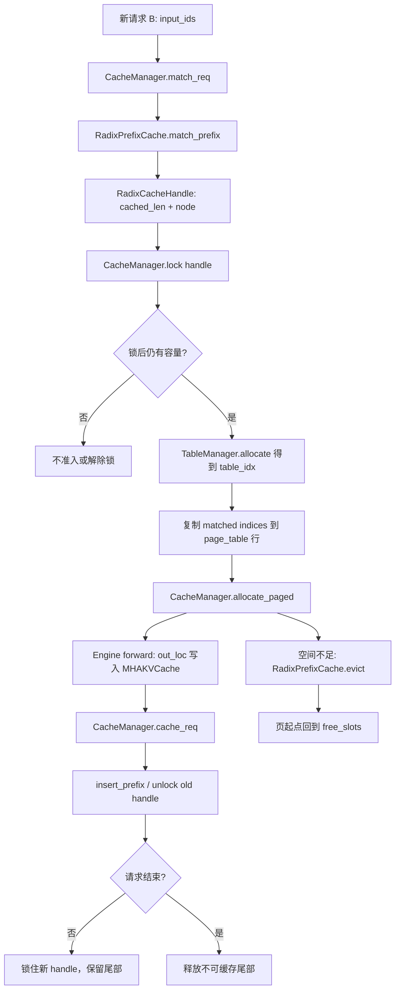

# 第 04 章：KV Cache、Radix 复用与内存

## 本章目标与先修知识

本章解释 mini-sglang 如何为正在生成的 token 保存、定位、共享与回收 KV cache。

读完后，你应能沿一个请求说明：逻辑 token 位置如何映射到物理 KV 槽位。

你还应能说明：两个请求共享前缀时，为什么既能少算 prompt，又不能无条件复用内存。

本章面向刚接触 LLM serving 的工程师，而不是假定你已经写过 CUDA kernel。

先修知识是 Transformer attention 的基本事实：每层都会为历史 token 保存 Key 和 Value。

你需要知道 token 是整数 id，序列位置从零开始，GPU 张量有自己的存储地址。

你还需要会阅读 Python 类、方法调用和简单的张量切片。

不要求有可用 GPU。

本章的导读实验只运行 CPU 单元测试或阅读代码。

本文中的“代码事实”仅描述当前仓库可见实现。

标为“建议实验”或“推演”的内容是学习活动，不是仓库承诺的 API 或生产建议。

## 具体问题：为什么生成会被内存卡住

对一个自回归模型，生成第 `t` 个 token 时 attention 需要读取前面 `0..t-1` 的 K/V。

如果每一步都从头计算所有历史 K/V，decode 的重复计算会很快压过真正的新 token 计算。

因此服务通常把已计算的 K/V 留在显存中，这就是 KV cache。

但“留在显存”不是免费的。

每个活跃请求、每层、每个 token、每个 KV head 和每个 head 维度都会占用空间。

并发请求的 prompt 长度不同，输出长度也不可预知。

服务不能为每个请求提前分配一整条最大长度的连续缓冲区，否则内部碎片和峰值显存会很差。

同时，大量聊天请求往往带着完全相同的 system prompt、工具说明或文档前缀。

若两个请求都重新做这段 prompt 的 prefill，既浪费计算，也复制相同的 KV。

于是系统需要同时解决三个问题。

第一，如何把有限的物理 KV 槽位分配给长度不一的请求。

第二，如何让相同 token 前缀共享已有槽位，而不把不相同的尾部误当成可共享数据。

第三，空间不足时如何释放不再需要的前缀，同时保证正在执行的 attention 不会读到被复用的槽位。

mini-sglang 用 paged KV pool、请求 `page_table` 和 radix prefix cache 分工解决它们。

理解这三个对象的边界，比记住某一个方法更重要。

## 一个贯穿全章的请求故事

假设页大小 `page_size=4`。

请求 A 的 prompt token 是 `[10, 11, 12, 13, 14, 15]`。

请求 A 先到达，调度器为它执行 prefill。

前四个 token 正好构成一页，因而它们可作为完整页粒度的前缀缓存候选。

后两个 token 是尾部，不足一整页。

在 forward 中，每层新算出的 K/V 被写进 A 对应逻辑位置映射到的物理槽位。

随后 A 的已缓存部分被插入 radix 树，完整页对应的 token 序列和物理 location 被登记起来。

现在请求 B 到达，prompt 是 `[10, 11, 12, 13, 99]`。

B 可以匹配到 `[10, 11, 12, 13]`，即一整页，而不是“字符串看上去相似”的任意部分。

调度器会把那四个物理 location 写入 B 的 `page_table` 行。

B 的第五个 token 则需要分配新页中的位置并做计算。

这样 B 不必再计算前四个 token 的 K/V。

不过，在 B 真正复制匹配的物理 location 前，它必须锁住匹配得到的 handle。

否则别的分配请求可能触发 eviction，把刚匹配到的树节点及其物理页回收到 free list。

若 B 锁住该路径，这些页从“可逐出”变为“受保护”。

可用容量随之变小，所以调度器要重新检查 B 是否仍可准入。

当 A 或 B 继续生成时，未满页的尾部会继续保留给该活跃请求。

当请求结束，完整且可缓存的部分可留在 radix 树供未来复用，不能插入的尾部则应归还。

这个故事已经包含了本章的两条主线：节省计算的复用，和不发生地址失效的所有权管理。

## 核心心智模型：三层映射而不是一个“缓存”

把 KV cache 想成单一字典很容易出错。

更准确的模型有三层。

第一层是逻辑序列位置。

它回答“这是请求的第几个 token”，例如 A 的位置 `0`、`1`、`2`。

第二层是请求表行，也就是该请求在共享 `page_table` 中占有的 `table_idx`。

它回答“去哪个请求的映射表查地址”。

第三层是物理 token location。

它回答“该逻辑位置的 K/V 在全局 KV pool 哪个扁平槽位”。

当前实现的 `page_table[table_idx, logical_position]` 存的正是第三层的 raw token location。

它不是 page id。

若页大小为 4，某物理页的起点可以是 `8`，那么这页四个扁平 token location 是 `8, 9, 10, 11`。

一个 page id 只会是该页的编号；两者不能混用。

`free_slots` 也采用 token location 单位，但其中每个元素刻意是页对齐的起点。

这样分配器可把页起点扩成连续 token location，而逐出结果也能以同一单位接回 free list。

radix 树则把 token id 前缀映射到一串物理 token location。

它不拥有新的 KV 数据副本。

它记录哪些物理位置可由哪些已完成的 token 前缀复用，并借由锁计数控制其能否逐出。

## 术语表

**KV cache**：每层 attention 为历史 token 保存的 Key/Value 张量。

**prefill**：处理 prompt 的阶段，通常一次推进多个 token。

**decode**：逐个生成新 token 的阶段。

**page**：固定数量 `page_size` 个连续物理 KV token 槽位的分配单位。

**raw token location**：在展平 KV 存储中的 token 索引，如 `page_start + in_page_offset`。

**`page_table`**：从请求的逻辑位置到 raw token location 的 GPU 映射表。

**`table_idx`**：请求占用的 `page_table` 行号；它不是物理页号。

**`token_pool`**：与页表同形状的 token id 缓冲，用于调度器收集 forward 输入。

**前缀命中**：新请求 token 序列的开头与缓存中一条序列相同。

**radix tree**：压缩 trie；节点保存一段 token key 及其物理 location value。

**handle**：一次 match 或 insert 返回的能力对象，包含 `cached_len` 和节点路径。

**lock**：提高路径节点引用计数，使关联页不能被 eviction 回收。

**evictable**：当前没有锁、可以被逐出的缓存 token 数。

**protected**：被一个或多个活跃 handle 保护、不可逐出的缓存 token 数。

**尾部（tail）**：长度未对齐到 page size 的最后一段 token。

**dummy page**：额外保留、不进入正常 free list 的页，用于 CUDA Graph padding 的安全读写。

## 架构与执行图

下面的图把 B 命中 A 的整页前缀与后续分配串起来。



图中 `page_table` 是地址翻译表，`MHAKVCache` 是实际 K/V 数据的物理池。

图中 radix 树不是 attention 的输入张量本身，而是复用这些地址的索引结构。

锁发生在“得到地址”和“使用地址”之间，这是正确性的关键因果链。

## 物理 KV 存储：`MHAKVCache`

从 `python/minisgl/kvcache/mha_pool.py:MHAKVCache.__init__` 开始读。

构造器分配 `_kv_buffer`，逻辑形状为 `[2, num_layers, num_pages, page_size, local_kv_heads, head_dim]`。

第 0 维长度为 2，用来分开 K 和 V。

`self._k_buffer = self._kv_buffer[0]`，`self._v_buffer = self._kv_buffer[1]`。

第 1 维是 layer，因此每层有自己的 K/V 区域。

第 2 与第 3 维组成分页的 token 空间。

`local_kv_heads` 由 `div_even(..., allow_replicate=True)` 结合 tensor parallel 信息得到。

这说明此处存的是当前 rank 所需的 KV head 布局，而不是在本章假定所有 rank 都有相同副本。

`MHAKVCache.k_cache(index)` 和 `v_cache(index)` 返回给定层的页状视图。

`MHAKVCache.store_kv(k, v, out_loc, layer_id)` 是写入入口。

它把给定层的页状存储 view 成 `_storage_shape`，即 `(num_pages * page_size, local_kv_heads, head_dim)`。

于是 `out_loc` 可以直接作为扁平 token 索引写入。

实际 scatter 写交给 `minisgl.kernel.store_cache`。

因此，raw token location 不是解释用的比喻，而是 `store_kv` 的实际索引单位。

不要把这份 MHA 布局推广成仓库所有未来 cache 变体的合同。

工厂 `python/minisgl/kvcache/__init__.py:create_kvcache_pool` 旁明确留有其他变体（如 MLA）的 TODO。

## 页表、请求表行与 dummy 资源

打开 `python/minisgl/engine/engine.py:Engine.__init__` 的 KV 初始化部分。

引擎先决定普通可分配的 `self.num_pages`。

创建 KV pool 时传入的是 `num_pages=self.num_pages + 1`。

多出的最后一页是 dummy page。

随后引擎创建 `page_table`，形状为 `(config.max_running_req + 1, aligned_max_seq_len)`。

额外一行是 dummy request 使用的行。

源码注释明确说明这个表存 raw locations 而非 pages。

`aligned_max_seq_len` 经 `_align_up_32` 对齐，服务于表的内存布局要求。

引擎构造 `self.dummy_req` 时使用 `table_idx=config.max_running_req`。

随后 `self.page_table[self.dummy_req.table_idx].fill_(num_tokens)`，令 dummy 行指向 dummy page 的起点。

普通 `CacheManager.free_slots` 只从 `torch.arange(num_pages) * page_size` 创建。

这里的 `num_pages` 没包含额外 dummy page。

所以 dummy page 不会被普通请求分配、释放或 radix eviction 拿走。

这是 graph padding 可以使用安全 scratch 位置的前提。

再读 `python/minisgl/scheduler/table.py:TableManager`。

它管理的是可用请求行 `_free_slots`，`allocate()` 返回 `table_idx`，`free()` 归还行号。

它不是物理页分配器。

`TableManager.token_pool` 以 `torch.zeros_like(page_table, dtype=torch.int32)` 创建。

注释说明 dummy request 也会从该池获取 token id，因此初始值 0 必须有效。

请求行的生命期与物理页的生命期有关联，却不是同一种资源。

请求结束时可能归还 `table_idx`，而完整前缀的物理页仍留在 radix cache 中等待复用。

## 从匹配到准入：为什么一定要 lock

`python/minisgl/kvcache/base.py:BasePrefixCache` 给出前缀缓存的抽象合同。

`match_prefix(input_ids)` 只做匹配，返回 `MatchResult`。

当前 `MatchResult` 的可见字段是 `cuda_handle`。

`BaseCacheHandle` 有 `cached_len` 与 `get_matched_indices()`。

最容易漏掉的契约写在 `lock_handle` 和 `match_prefix` 的 docstring 中。

由 `match_prefix` 返回的 indices 只有在对应 handle 已锁住时才安全使用。

原因不是 Python 对象会消失。

原因是这个对象所指向的物理 KV 页可以在另一个分配动作中被逐出并复用。

`CacheManager.match_req` 在 `python/minisgl/scheduler/cache.py` 中匹配 `req.input_ids[:input_len - 1]`。

它刻意排除了最后一个输入 token。

最后一个 token 的 K/V 会在当前 step 产生，不能被当成“早已存在”的前缀。

`python/minisgl/scheduler/prefill.py:PrefillAdder._try_allocate_one` 展示了正确时序。

它先调用 `cache_manager.match_req(req).cuda_handle` 取得 handle。

它据此计算 `cached_len`、`extend_len` 和保守的 `estimated_len`。

它第一次用 `cache_manager.available_size` 做准入检查。

如果容量看似足够，它调用 `cache_manager.lock(handle)`。

锁会把路径上的节点从 `evictable_size` 转入 `protected_size`。

所以锁后可逐出的容量可能下降。

代码随即再次比较 `estimated_len + reserved_size` 和 `available_size`。

第二次失败时会 `unlock(handle)` 并放弃该请求。

这不是多余的防御式编码，而是锁的副作用导致的必需重检。

第二次成功后，`TableManager.allocate()` 才分配请求表行。

若 `cached_len > 0`，代码把 token id 拷到 `token_pool` 的前缀位置。

同时把 `handle.get_matched_indices()` 拷到该行的 `page_table` 前缀位置。

此后 B 的 attention 可以经自己的请求行访问 A 已写好的物理 K/V。

## 分页分配：只为未缓存区间申请新页

核心方法是 `python/minisgl/scheduler/cache.py:CacheManager.allocate_paged`。

对每个 `Req`，它计算 `first_page = div_ceil(req.cached_len, page_size)`。

它还计算 `last_page = div_ceil(req.device_len, page_size)`。

其中 `cached_len` 是已经由 prefix cache 地址覆盖的前缀长度。

其中 `device_len` 是本轮要在设备上有效的序列长度。

两者之间的页范围才需要新分配。

页数为 `last_page - first_page`，仅当它为正时才加入 allocation 信息。

这避免为已命中的完整前缀再分配物理页。

`CacheManager._allocate(needed_pages)` 先看 free list 是否足够。

若够，它取前 `needed_pages` 个页起点并从 `free_slots` 移除。

若不够，它向 `prefix_cache.evict` 请求差额乘以 `page_size` 的 token 数。

逐出返回的是一串 token location。

`evicted[::page_size]` 取出每页起点，再接回 `free_slots`。

这里依赖一个不变量：被逐出的 value 是页对齐、连续的页粒度区间。

`_page_to_token` 把每个起点扩成该页的连续 token location。

例如页大小 4 时，`[8, 20]` 变成 `[8, 9, 10, 11, 20, 21, 22, 23]`。

`_write_page_table` 将这些 location scatter 到请求表的逻辑位置。

该函数在 pinned host memory 中组装行号和 position，再以 `non_blocking=True` 转至 `page_table.device`。

这是现有代码的异步传输路径。

不要仅凭这一点声称已经测得某个吞吐收益；性能收益需要独立 profiling 证据。

## Radix 树：共享 token 前缀的地址索引

`python/minisgl/kvcache/radix_cache.py:RadixPrefixCache` 是默认的可复用前缀实现之一。

它不是普通逐 token trie，而是压缩 radix tree。

`RadixTreeNode` 保存 `_key`（token ids）和 `_value`（对应物理 token locations）。

`RadixTreeNode.set_key_value` 断言 key 与 value 长度相同。

这个断言把“语义前缀”和“物理地址序列”绑成一一对应关系。

节点的 `children` 用 `key_fn` 的结果索引。

`_get_key_fn(page_size)` 表明页大小为 1 时用第一个 token，其他情况用前一页 token 的 tuple。

这使树的边界与页粒度相容。

`RadixPrefixCache._tree_walk` 是查找和插入共用的核心遍历。

它从 root 沿可能的 child 走下去。

每个节点调用 `get_match_len`，后者最终使用 `minisgl.kernel.fast_compare_key` 比较 token key。

得到的匹配长度经 `align_down(match_len, page_size)` 向下对齐。

因此不满一页的共同尾部不会作为可共享 cache 前缀。

若只匹配节点的一部分，`RadixTreeNode.split_at(pos)` 将节点切分。

共同的前段成为新父节点，剩余部分成为其子节点。

这允许 `[A,B,C,D,E]` 与 `[A,B,C,D,F]` 共享页对齐的 `[A,B,C,D]`，再向不同分支延伸。

完整匹配节点时，遍历更新 `timestamp`。

这个时间戳随后服务于逐出的 LRU 次序。

`RadixCacheHandle.get_matched_indices()` 从当前节点一路走到 root，收集 value 后反转并拼接。

所以 handle 的物理索引代表整条已匹配路径，而不是仅最后一个节点。

## 锁、引用计数与容量变化

`RadixPrefixCache.lock_handle(handle, unlock=False)` 沿 handle 节点到 root 的路径更新 `ref_count`。

锁定时，如果节点原来的引用计数是 0，该节点长度从 `evictable_size` 移到 `protected_size`。

之后增加 `ref_count`。

解锁则反向操作。

只有引用计数从 1 降到 0 时，该节点长度才从 protected 回到 evictable。

多个活跃请求可以锁住同一前缀。

因此其中一个请求结束并解锁，不能让仍被另一个请求使用的页恢复可逐出。

root 的 `ref_count` 在构造时设为 1。

根因此始终受保护，也不会被逐出。

`SizeInfo` 同时报告 `evictable_size` 和 `protected_size`。

`total_size` 是两者相加。

`CacheManager.available_size` 则是可逐出 token 数加 free list 的 token 容量。

它故意不把 protected 的缓存算成可立即拿来分配的空间。

这是“热点前缀提升复用率”与“热点前缀降低短期可用容量”的直接权衡。

缓存并不总是让内存更充裕。

当大量并发请求锁住长共同前缀时，命中很好，但可逐出空间可能变小，新的长请求更容易被准入预算拒绝或等待。

## 插入、重复地址与请求结束

forward 完成后，调度器需要把请求目前可复用的 KV 和 radix 树对齐。

这件事由 `python/minisgl/scheduler/cache.py:CacheManager.cache_req` 完成。

它取 `insert_ids = req.input_ids[:req.cached_len]`。

它还从 `page_table[req.table_idx, :req.cached_len]` 取 `page_indices`。

注意：插入长度是当前有效缓存长度，而不是随意取整个最大表行。

调用 `prefix_cache.insert_prefix(insert_ids, page_indices)` 后得到旧有 `cached_len` 和 `new_handle`。

`RadixPrefixCache.insert_prefix` 自己也会将长度向下对齐到 `page_size`。

它对新节点保存 `indices[prefix_len:].clone()`。

clone 很重要。

radix 树需要持有稳定的物理地址序列，而不是一个未来可能被请求表覆盖或重用的临时 view。

然后 `cache_req` 解锁旧 handle。

它释放区间 `[old_handle.cached_len, cached_len)`。

该区间表示本请求曾分配、但在插入时发现已经被另一请求缓存的重复页。

若不释放它们，重复物理页会泄漏。

对于 `[cached_len, new_handle.cached_len)`，本次插入的新完整页由 radix 树持有。

若请求还会继续 decode，代码把 `req.cache_handle` 换成 `new_handle` 并重新锁住。

这样下一轮仍能安全使用其缓存路径。

若请求已完成，`cache_req(..., finished=True)` 释放 `page_indices[new_handle.cached_len:]`。

这通常是无法按整页插入的尾部，或不再需要由活跃请求持有的部分。

调度器中的 `python/minisgl/scheduler/scheduler.py:_free_req_resources` 先归还 `table_idx`，再调用 `cache_req(req, finished=True)`。

这解释了为什么“请求结束”不等价于“所有 KV 都立即释放”。

完整前缀可以留下成为可逐出缓存；尾部和重复分配才应回到 free list。

## 逐出：按叶节点 LRU 回收，而非精确切片

`RadixPrefixCache.evict(size)` 在真正缺页时被 `CacheManager._allocate` 调用。

这使逐出是 demand-driven 的，而不是每次插入都主动清理。

`evict(0)` 是安全 no-op。

对正数大小，代码先断言请求量不大于 `evictable_size`。

`_collect_leave_nodes_for_evict` 收集引用计数为 0 的叶节点。

这些候选节点按 `timestamp` 放进最小堆。

最早使用的叶节点先出堆，因此是叶子级的 LRU 策略。

逐出循环会一直删节点，直到 `evicted_size >= size`。

它可能多释放，因为节点是整体移除，不能任意从压缩节点中切一个精确请求量。

这叫 oversupply。

正确性要求是“至少释放所需的页”，不是“恰好释放所需 token”。

在删除一个叶节点后，若其父节点变为无引用的叶子，父节点也可加入候选堆。

这让树在子节点移除后能继续回收上层独有前缀。

被锁的节点不会成为候选叶。

这再次连接到前述因果：lock 保护地址有效性，同时限制 eviction。

## 延迟释放与重叠执行

mini-sglang 的调度可能让 GPU 执行和 CPU 侧结果处理重叠。

这意味着“逻辑上已结束”的页不必在同一瞬间立刻进入可分配 free list。

`CacheManager.lazy_free_region()` 是一个 context manager。

在其作用域内，它临时把 `_free` 换成收集页起点的 `lazy_free`。

退出作用域时，收集到的页起点才与原来的 `free_slots` 拼接。

`finally` 中删除临时 `_free`，恢复类方法查找。

其目的是把释放集中到安全的批处理边界，避免过早把仍可能被 in-flight 工作读取的槽位交给新分配。

这里应把它理解为本仓库的生命周期协调机制。

不要仅依据名称断言它证明了所有 CUDA stream 时序都正确。

完整时序正确性仍需结合 scheduler 的 event、stream 和真实并发测试审查。

## 不变量：用它们检查脑中的模型

不变量一：普通 `free_slots` 中的每个元素都是 page-aligned token 起点。

原因是初始化为 `arange(num_pages) * page_size`，回收和逐出也每隔 `page_size` 取一个元素。

不变量二：一个新分配页扩展后必须是 `page_size` 个连续 raw token location。

原因是 `_page_to_token` 按 `torch.arange(page_size)` 加到每个页起点。

不变量三：`page_table` 的行号和物理页号没有可互换关系。

原因是 `TableManager` 只管理请求行，`CacheManager` 才管理 `free_slots`。

不变量四：使用 `match_prefix` 返回的物理 indices 前必须锁住对应 handle。

原因是 `BasePrefixCache` 的接口合同允许未锁命中被 eviction 失效。

不变量五：缓存可插入长度是页大小的整数倍。

原因是 `RadixPrefixCache.insert_prefix` 与 `_tree_walk` 都使用 page 对齐。

不变量六：dummy page 不属于普通 allocator。

原因是 KV pool 有 `+1` 页，而 free list 只覆盖普通 `num_pages`。

不变量七：空闲/可检查状态下，`free_pages + cache_pages == num_pages`。

对应代码为 `CacheManager.check_integrity` 的计数检查。

其中 `cache_pages = prefix_cache.size_info.total_size // page_size`。

这个式子是页数量账本检查，不是所有请求、节点链接和 GPU 时序的完全证明。

## 常见故障模式及其因果

**把 raw token location 当 page id。**

后果是 attention 或写入位置的除法、切片解释会错位，尤其当 `page_size > 1`。

排查时先确认值是否可能为 `0,1,2,3` 这样的同页 offset，而不是只打印“页号”。

**先 match，后在未知时机使用 indices。**

后果是另一个请求可在中间触发 eviction，导致地址指向已释放或已重分配的 KV 槽位。

修复方向是遵守 `match → lock → copy/use → unlock or re-lock` 的协议，而不是复制更多 Python 引用。

**只做 lock 前容量检查。**

后果是锁把节点从 evictable 移到 protected 后，原本的容量估计失真。

当前 `PrefillAdder._try_allocate_one` 已做第二次检查和回滚解锁。

**把未满页尾部放进 radix cache。**

后果是页级分配、逐出和地址连续性的约定不再一致。

当前实现以 `align_down` 明确放弃将此尾部作为可复用前缀插入。

**忘记释放重复分配区间。**

后果是两个请求在竞合插入同一前缀时留下无主物理页，逐步造成显存泄漏式耗尽。

`cache_req` 用 `old_handle.cached_len` 与插入返回的 `cached_len` 划出这段重复区间。

**以为 LRU 按 token 精确逐出。**

后果是调用方错误假定释放量恰好等于请求量。

当前 eviction 删除完整叶节点，所以可能 oversupply。

**把 `check_integrity()` 当成 radix 树完整验证。**

后果是测试覆盖产生虚假的安全感。

当前 `RadixPrefixCache.check_integrity` 的函数体是 `pass`。

## 常见误解

“KV cache 只是在每个请求里保存一个 list。”

不是；这里有共享物理池、共享页表和跨请求 radix 地址复用。

“前缀命中意味着整个 prompt 不需要 prefill。”

不一定；只命中的、页对齐的前缀可跳过，其余后缀仍需要计算。

“共享前缀时 B 把 A 的 K/V 复制了一份。”

不是；B 的页表行复制的是同一组物理 location。

“`cached_len` 只是字符串长度。”

不是；它是以 token 计的缓存前缀长度，并参与页对齐和分配边界计算。

“`TableManager.allocate()` 分配显存页。”

不是；它只给出 `page_table` 行号。

“锁会增加缓存内容。”

不会；锁只改变节点引用计数和 `SizeInfo` 中的保护/可逐出记账。

“Naive cache 只是性能较差的 radix。”

更准确地说，`NaivePrefixCache` 的 match 长度恒为 0，`size_info` 也没有可逐出内容。

对非零请求调用其 `evict` 会抛 `NotImplementedError`，不要假定它能承担 radix 的逐出路径。

“dummy page 是多余内存。”

它是 CUDA Graph padding 的隔离资源，避免 padding 落入普通请求可分配页。

## 引导实验：无需 GPU 验证页对齐逐出

本节是可运行的现有测试，不要求 CUDA 硬件。

它不执行模型 forward，也不测吞吐。

它只检验 `CacheManager._allocate`、radix eviction 与页对齐 free list 的一个关键不变量。

在仓库根目录执行：

```bash
pytest -q tests/core/test_cache_allocate.py
```

若你的环境没有安装项目依赖，先不要伪造结果。

你仍可以打开 `tests/core/test_cache_allocate.py`，按下面步骤静态检查。

第一步，阅读 `_make_cache_manager`。

它用 CPU 上的 `torch.empty((1,))` 构造 `CacheManager`，并把全局 `Context(page_size=page_size)` 设好。

这说明测试的目标是 allocator 和树的逻辑，不依赖 GPU KV buffer。

第二步，阅读 `test_allocate_after_evict_returns_page_aligned`。

它设 `page_size=4`、`num_pages=4`，先耗尽四个 free page。

接着插入两页 token location `[0..7]` 到 radix cache，使它们成为 evictable。

最后申请一页，迫使 `_allocate(1)` 调用 eviction。

期望是分配结果和剩余 `free_slots` 都是 4 的倍数。

第三步，阅读 `test_consecutive_allocations_after_evict_no_overlap`。

它连续取两页，再把页起点展开为 token 范围检查没有重叠。

这验证“free list 存页起点”没有因为 eviction 返回 token indices 而混入非页起点。

第四步，阅读 `test_page_to_token_expansion_correct_after_evict`。

它检查每个页起点扩展成恰好 `page_size` 个连续值。

第五步，阅读 `test_check_integrity_passes_after_evict_cycle`。

它先把已分配页作为可逐出前缀插入，再耗尽 free list 并触发逐出，最后调用 `check_integrity()`。

预期推理不是“所有内存都为空”，而是普通 free 页与 radix cache 持有页的账本之和仍等于 `num_pages`。

若测试失败，先按失败名称定位不变量，再读 `_allocate`、`_page_to_token`、`_free` 与 `evict`。

不要从这个 CPU 测试推出 GPU stream、attention 输出或端到端前缀命中性能已经被验证。

## 建议的纸上推演

以下推演是教学建议，不是要改动仓库。

设 `page_size=4`，普通物理页起点为 `[0,4,8,12]`。

请求 A 的 token 为 `[1,2,3,4,5,6]`，先占用 location `[0,1,2,3,4,5,6,7]`。

请先写出 A 可插入 radix cache 的最大长度。

预期答案是 4，因为插入会向下对齐到完整页。

接着令请求 B 的 token 为 `[1,2,3,4,9]`。

请写出 B 命中后应复制到其 `page_table` 行的 location。

预期答案是 `[0,1,2,3]`，而不是 `[0]`。

请再问：B 在读取这串 location 前少了什么操作？

预期答案是锁住 match 返回的 handle。

最后假设 A 和 B 都持有该前缀。

若 A 完成并解锁，是否可以逐出这一页？

预期答案是否，因为 B 的锁仍使路径节点引用计数非零。

## 练习与预期推理

### 练习 1：区分四个数字

某请求 `table_idx=7`，逻辑位置为 5，页大小为 4，`page_table[7,5]=13`。

问：`7`、`5`、`13` 和 `13 // 4` 分别是什么？

预期推理：7 是请求表行；5 是逻辑 token position；13 是 raw token location；3 是包含该 location 的物理页编号。

不要把 13 直接称为页号。

### 练习 2：解释两阶段准入

有一条长公共前缀当前是 evictable，新请求 match 到它。

问：为什么第一次容量检查通过后，lock 之后仍可能失败？

预期推理：lock 把命中路径的 token 从 evictable 转为 protected，因此 `available_size` 降低；必须重新估算并在失败时解锁回滚。

### 练习 3：解释页对齐尾部

页大小为 4，某请求当前 `cached_len=6` 且结束。

问：为何不能简单宣称全部 6 个 token 都成为共享 radix 前缀？

预期推理：`insert_prefix` 只保存向下对齐的完整页；最后 2 个 token 不符合页粒度，完成时由 `cache_req` 的尾部释放路径处理。

### 练习 4：解释重复分配

两个请求几乎同时 miss 同一前缀并各自分配页，随后先后插入。

问：后插入者为什么要释放一段自己的 `page_indices`？

预期推理：前插入者已让那段前缀有了规范的 cache 地址；后插入者发现 `cached_len` 增长，自己为这段准备的页变成重复占用，必须归还。

### 练习 5：解释逐出 oversupply

allocator 缺 4 个 token，但 LRU 叶节点长 8 个 token。

问：为什么释放 8 个 token 在当前设计中是允许的？

预期推理：逐出以完整 radix 叶节点为单位；调用方只要求至少补足页，`_allocate` 之后会把多余页继续留在 free list。

### 练习 6：找出证据边界

问：能否从 `CacheManager.check_integrity()` 成功推出 radix 父子链接、ref count 和 CUDA 并发访问全都正确？

预期推理：不能；它只检查 prefix size 与 free page 数及页对齐，且 `RadixPrefixCache.check_integrity()` 当前是空实现。

## 本章小结

KV cache 是 LLM serving 的主要显存账本之一，因为每个历史 token 都会在每层留下 K/V。

mini-sglang 的 `MHAKVCache` 用一个分页 GPU 张量存 K/V，并以扁平 token location 作为实际写入索引。

`page_table` 将每个请求的逻辑位置翻译到这个物理 location。

`TableManager` 管请求表行，`CacheManager` 管物理页，两者不能混淆。

radix prefix cache 把 token 前缀映射到已经写好 KV 的物理 location，从而避免重复 prefill。

复用只在页对齐的前缀上建立，未满页尾部不被随意共享。

match 得到的 indices 不是永久地址；必须经 handle lock 保护后才可使用。

锁提高内存安全性，却将可逐出内容转为受保护内容，因此准入需要在 lock 后再检查。

空间不足时，allocator 触发基于叶子 LRU 的 demand-driven eviction。

逐出可以 oversupply，但应保持页起点对齐和无重叠。

请求结束时，完整前缀可留作缓存，重复页和不可缓存尾部应被归还。

这些规则共同解释了“前缀复用更快”为什么必须与“地址有效、所有权清晰、页账本守恒”一起成立。

## 源码锚点附录

下面列出本章所有代码事实的直接阅读锚点。

| 路径与符号 | 读它来确认什么 |
| --- | --- |
| `python/minisgl/kvcache/base.py:BaseKVCachePool` | 物理 KV pool 的 K/V view 与 `store_kv` 接口。 |
| `python/minisgl/kvcache/base.py:BaseCacheHandle` | `cached_len` 与 matched indices 的能力对象。 |
| `python/minisgl/kvcache/base.py:BasePrefixCache.lock_handle` | match 后必须 lock 才能安全使用 indices 的合同。 |
| `python/minisgl/kvcache/base.py:SizeInfo` | evictable、protected 与 total 的记账定义。 |
| `python/minisgl/kvcache/mha_pool.py:MHAKVCache.__init__` | `[2, layers, pages, page_size, heads, dim]` 的底层分配。 |
| `python/minisgl/kvcache/mha_pool.py:MHAKVCache.store_kv` | 将页状存储展平后按 `out_loc` 写入。 |
| `python/minisgl/kvcache/__init__.py:create_kvcache_pool` | 当前工厂走 `MHAKVCache`，其他变体仍是 TODO。 |
| `python/minisgl/kvcache/__init__.py:SUPPORTED_CACHE_MANAGER` | `naive` 与 `radix` 前缀策略注册。 |
| `python/minisgl/kvcache/naive_cache.py:NaivePrefixCache` | 零长度 match 与非零 eviction 未实现的边界。 |
| `python/minisgl/kvcache/radix_cache.py:RadixTreeNode` | key/value、压缩节点、子节点和 timestamp。 |
| `python/minisgl/kvcache/radix_cache.py:RadixTreeNode.split_at` | 部分匹配时的节点切分。 |
| `python/minisgl/kvcache/radix_cache.py:RadixCacheHandle.get_matched_indices` | 从节点回溯到 root 拼接整条前缀地址。 |
| `python/minisgl/kvcache/radix_cache.py:RadixPrefixCache.lock_handle` | 路径 ref count 及 evictable/protected 转换。 |
| `python/minisgl/kvcache/radix_cache.py:RadixPrefixCache.insert_prefix` | 页对齐插入和地址 `clone()`。 |
| `python/minisgl/kvcache/radix_cache.py:RadixPrefixCache.evict` | 叶节点 LRU、至少释放请求量的行为。 |
| `python/minisgl/kvcache/radix_cache.py:RadixPrefixCache._tree_walk` | page 对齐最长前缀匹配和访问时间更新。 |
| `python/minisgl/scheduler/table.py:TableManager` | 请求表行与 `token_pool` 的所有权。 |
| `python/minisgl/scheduler/cache.py:CacheManager.match_req` | 排除最后一个输入 token 的匹配边界。 |
| `python/minisgl/scheduler/cache.py:CacheManager.available_size` | free slot 与可逐出前缀构成的容量。 |
| `python/minisgl/scheduler/cache.py:CacheManager.allocate_paged` | 从 cached/device 长度计算需要的新页。 |
| `python/minisgl/scheduler/cache.py:CacheManager.cache_req` | 插入、解锁、重复区间和尾部的归还。 |
| `python/minisgl/scheduler/cache.py:CacheManager.lazy_free_region` | 批边界延迟把页还回 free list。 |
| `python/minisgl/scheduler/cache.py:CacheManager.check_integrity` | 页账本与页对齐检查的范围。 |
| `python/minisgl/scheduler/cache.py:_write_page_table` | pinned host metadata 和非阻塞复制。 |
| `python/minisgl/scheduler/prefill.py:PrefillAdder._try_allocate_one` | match、两阶段容量检查、lock 与页表前缀复制。 |
| `python/minisgl/scheduler/scheduler.py:_prepare_batch` | graph padding、分页分配、`out_loc` 建立的调用顺序。 |
| `python/minisgl/scheduler/scheduler.py:_free_req_resources` | 结束请求归还表行并执行 finished cache reconciliation。 |
| `python/minisgl/engine/engine.py:Engine.__init__` | page table、dummy request 与 dummy page 的创建。 |
| `tests/core/test_cache_allocate.py:TestAllocateEvictPageAlignment` | 可在 CPU 上检查页对齐、无重叠与逐出后账本。 |

## 局限与未覆盖内容

本章只解释当前可见的 GPU-resident prefix cache 接口。

`MatchResult` 中有“TODO: support HiCache”的注释，不能据此推断 host cache、offload 或多层缓存已经实现。

本章描述的物理布局针对 `MHAKVCache` 当前路径，不是所有 attention 或模型结构的通用 ABI。

本章没有测量不同 `page_size`、命中率、并发度或模型规模下的端到端性能。

页更大可能降低管理开销却增加尾部浪费；页更小可能提升细粒度却增加表和管理成本，这是一般性推演，需以实际 workload profiling 验证。

本章没有声称 `non_blocking` 复制自动消除了所有同步问题。

stream、event、overlap 的完整正确性需要结合调度章节和 GPU 实验审查。

`RadixPrefixCache.check_integrity()` 当前为 `pass`，不提供树结构的完备自检。

`RadixPrefixCache.reset()` 会抛出 `NotImplementedError`，不能把它描述为可在线热重置的组件。

`NaivePrefixCache.evict` 对非零大小未实现，因此不能把 naive 策略泛化为可在内存压力下等价工作的 radix 替代。

本章也没有讨论跨进程、跨节点或跨租户的缓存隔离与安全策略。

这些是把教学型 mini-sglang 延伸到完整生产服务时需要单独设计和验证的主题。
