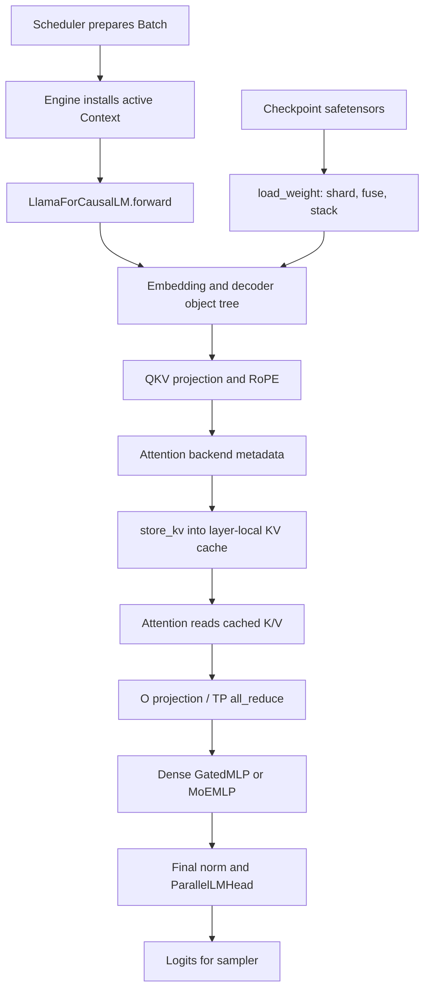

# 第 05 章：模型、层、Attention、MoE 与 Kernel

> 面向第一次阅读 LLM serving 推理代码的工程师。
>
> 本章以当前 `mini-sglang` 源码为准。
>
> 文中“代码事实”可由给出的路径与符号核验。
>
> 文中“实验建议”不是仓库已有功能，也不构成性能承诺。

## 章节目标与先修知识

完成本章后，你应能沿着一次模型计算说清：

1. 配置中的模型 architecture 怎样变成一个可装权重的对象树。
2. 调度器准备的 token、位置和表项怎样进入 decoder layer。
3. 新 token 的 K/V 为什么必须先写入 KV cache，attention 才能读取它。
4. 为什么张量并行（TP）不是“多卡各算各的”，而要在特定层归约。
5. MoE 怎样把 dense MLP 换成路由、expert 计算和汇总。
6. kernel、Triton 和外部库分别处在什么边界，哪些 shape 条件是正确性前提。

先修假设是：你了解 token、query/key/value、矩阵乘法和 GPU 的基本含义。

你不需要预先掌握 CUDA Graph、NCCL、FlashInfer 或 Triton。

如果你还没有读过调度和 KV cache，建议先读第 02 与第 04 章。

本章不会解释 HTTP、队列、逐 token 调度或 radix 驱逐算法的完整实现。

这里的起点是：这些上游部分已经组好了一个 `Batch`。

## 具体问题：调度元数据如何成为下一 token

把 `model.forward()` 包进服务并不能自动成为 LLM serving。

调度器知道哪些请求在 prefill，哪些请求在 decode。

它还知道每个请求的 `device_len`、`cached_len`、输出位置与 page table 行。

但这些数字本身不会产生 logits。

模型侧必须把它们解释为一套严格的执行契约。

对每一层而言，契约至少包括四件事：

- 本轮新 token 的 Q、K、V 从哪里来；
- 这些 K、V 应写到 KV pool 的哪些物理位置；
- attention 应以什么元数据查看历史与本轮 K/V；
- TP rank 的局部结果何时合成为完整 hidden state。

任何一项错位，都可能得到看似正常、实则语义错误的 token。

例如，把 `store_kv` 放到 attention kernel 之后，当前 token 就看不到自己的 K/V。

又如，在 column-parallel 层后忘记在对应 row-parallel 层归约，每张卡仍会算出张量，但它只是全量结果的一部分。

因此，本章的中心问题不是“attention 的公式是什么”。

中心问题是：在有缓存、批处理和多卡约束的运行时，公式的各个张量如何被正确地组织和执行。

## 一个激励性的请求故事

假设用户请求：“用三句话解释分页 KV cache。”

前端和 tokenizer 已把文本变为 `input_ids`。

调度器先把整段 prompt 放进一次或多次 prefill batch。

随后，请求通常进入 decode：每轮只延长一个 token。

现在关注其中一轮 decode。

`Batch` 中的每个请求带着一个新输入 token，以及指向既有 KV 的位置记录。

引擎把 batch 交给模型。

Llama 风格的模型先查 embedding，得到每个 token 的 hidden state。

每个 decoder layer 先做 fused RMSNorm，再算融合的 QKV 投影。

RoPE 按位置旋转 Q 与 K。

attention backend 先将本轮 K、V 写入该层的 KV cache。

它再用 Q、page table 和 sequence metadata，从缓存中读完整上下文进行 causal attention。

attention 输出经过 O projection，必要时在 TP rank 间 `all_reduce`。

随后进入 dense Gated MLP，或在 MoE 模型中进入 router 和少数 expert。

层层完成后，`ParallelLMHead` 将最终 hidden state 映射为 logits。

采样器从 logits 选出下一个 token id。

这个 id 还不是用户已看到的文本；第 06 章会解释 detokenize 与 SSE。

这个故事有一个关键因果链：

`请求长度/表项` 决定 metadata，metadata 决定 cache view，cache view 决定 attention 读什么，attention 和 MLP 的结果才决定 logits。

所以模型代码并不独立于 serving runtime。

## 核心心智模型：一棵对象树消费一份批次上下文

可以把 mini-sglang 的模型部分想成两层结构。

第一层是长期存在的“参数与算子对象树”。

它包含 embedding、每一层 decoder、norm、线性权重和 expert 权重。

第二层是每轮变化的“全局批次上下文”。

它包含 `batch.input_ids`、位置、attention metadata、KV cache 与后端对象。

模型对象不需要把所有运行时数据作为每一级函数参数逐层传递。

相反，若需要 batch 运行时状态，代码会通过 `get_global_ctx()` 获取。

这不是“没有输入”；它是把输入的一部分放在由引擎设置的上下文中。

因此，阅读时应把参数树和运行时上下文分开追踪。

参数树回答“权重在哪里、如何装载、怎样分片”。

批次上下文回答“这轮哪些 token、哪些位置、哪些 cache 槽位参与计算”。

下图给出一条 dense decoder token 的概念执行线。

```text
Scheduler / Engine 已准备 Batch
        │
        │ input_ids, positions, out_loc, page_table, request lengths
        ▼
LlamaForCausalLM.forward()
        │
        ▼
VocabParallelEmbedding ──(TP 时 all_reduce)──► hidden state
        │
        ▼
每个 LlamaDecoderLayer
        │
        ├─ RMSNormFused
        ├─ LinearQKVMerged
        ├─ RoPE(q, k, positions)
        ├─ AttentionLayer
        │      │
        │      └─ backend: prepare_metadata 的结果
        │             ├─ store_kv(k, v, out_loc, layer_id)
        │             └─ read K/V cache + causal attention
        ├─ LinearOProj ──(TP 时 all_reduce)──► 完整 attention 输出
        ├─ RMSNormFused
        └─ GatedMLP 或 MoEMLP ──(row/MoE TP 时 all_reduce)
        │
        ▼
终端 RMSNormFused → ParallelLMHead → logits → 采样器
```

图中 `store_kv` 在 attention 读取之前不是偶然的编码风格。

它是当前轮生成位置可参与 causal attention 的数据依赖。

图中的 `all_reduce` 也不是每层都需要。

它只出现在局部线性结果必须合并回完整 hidden 维度的边界。

## 术语表

| 术语 | 本章中的含义 | 不应误解为 |
|---|---|---|
| architecture | HuggingFace 配置中的模型结构名称 | 已加载完成的模型实例 |
| `ModelConfig` | 从 HF 配置规范化出的冻结 dataclass | 原始 HF config 的逐字段镜像 |
| `BaseOP` | 用普通 Python 对象组成的算子/参数树 | `torch.nn.Module` 的别名 |
| state dict | `BaseOP` 递归遍历得到的参数名到 Tensor 的映射 | PyTorch 自动注册的 module 参数表 |
| TP | 将部分权重或张量按 rank 切分的并行方式 | 把同一模型完整复制到每张卡 |
| column parallel | 权重输出维被切分，局部输出可先独立产生 | 已得到完整线性层输出 |
| row parallel | 权重输入维被切分，局部乘积需要求和 | 无通信的独立层 |
| QKV fused | Q、K、V 投影在运行时合为一个参数/线性算子 | checkpoint 中一定原生只有一个 QKV tensor |
| RoPE | 对 Q、K 施加位置相关旋转 | 对 V 或 logits 的位置编码 |
| KV cache | 按 layer 保存已计算 K/V 的存储 | 只供下一轮而不供当前轮使用的缓冲 |
| page table | 从请求逻辑位置到 cache 位置的映射信息 | 所有后端都相同格式的 page id 数组 |
| metadata | 某 attention backend 所需的长度、索引、wrapper 等描述 | 可忽略的性能提示 |
| prefill | 为多 token prompt 扩展 cache 的阶段 | 必然没有 KV 命中的阶段 |
| decode | 常见情况下每请求延长一 token 的阶段 | 绝对只能有 batch size 1 的阶段 |
| MoE | 用 router 选择少数 expert 的 MLP 变体 | 每个 token 运行所有 expert |
| fused kernel | 合并多个计算或调用路径的实现 | 自动更快且对任意 shape 可用 |

## 从模型名称到对象树

### 注册是选择，不是加载

代码事实：`python/minisgl/models/__init__.py:create_model` 取 `model_config.architectures[0]`。

它把这个字符串与 `ModelConfig` 交给 `python/minisgl/models/register.py:get_model_class`。

`_MODEL_REGISTRY` 映射当前支持的 Llama、Qwen2、Qwen3、Qwen3 MoE 和 Mistral architecture 名称。

`get_model_class` 使用 `importlib.import_module` 延迟导入对应模块，并实例化类。

未知 architecture 会在这里抛出 `ValueError`。

这一步的结果是带有空权重占位 tensor 的对象，不是已经完成的 checkpoint。

把“注册成功”和“权重兼容”混为一谈，是读 serving 代码时很常见的误会。

### 配置是一个适配层

代码事实：`python/minisgl/models/config.py:ModelConfig.from_hf` 将 HF `PretrainedConfig` 转为 `ModelConfig`。

若原始配置含 `text_config`，它会下沉到文本子配置，并补回 architecture 与 RoPE 相关字段。

`num_kv_heads` 在缺失时回退到 `num_attention_heads`。

`head_dim` 在缺失时由 `hidden_size // num_attention_heads` 得到。

MoE 相关的 expert 数、每 token top-k 与中间维度也在此读取。

`ModelConfig.is_moe` 的当前实现是检查 `model_type` 是否包含字符串 `"moe"`。

这是当前仓库的选择逻辑，不是所有模型格式通用的 MoE 判定法。

### `BaseOP` 是参数树的规则

代码事实：`python/minisgl/layers/base.py:BaseOP.state_dict` 遍历 `self.__dict__`。

属性名以下划线开头时被跳过。

Tensor 属性成为 state dict 叶子。

子 `BaseOP` 则递归，并以点号拼接路径。

`BaseOP.load_state_dict` 对每个叶子检查 shape 和 dtype，再用传入 tensor 替换属性。

最外层调用结束时若还有未消费的 key，会抛出 `RuntimeError`。

`OPList` 则把 decoder 层写成数字索引，例如 `layers.0...`。

因此，不要按 `nn.Module.named_parameters()` 的直觉寻找参数注册。

这里的参数可见性由对象属性、`BaseOP` 递归和命名约定共同决定。

### 权重装载如何接上这棵树

代码事实：`python/minisgl/models/weight.py:load_weight` 是生成器。

它读取 safetensors，按 TP rank 分片，并逐个 yield `(name, tensor)`。

Q、K、V checkpoint 权重会按输出维切片，再合并成 `.qkv_proj`。

gate 与 up 权重也会合并成 `.gate_up_proj`。

O projection 与 down projection 在输入维分片。

当 KV head 少于 TP size 时，K/V 权重可按 head 复制式选择分片。

当 `config.is_moe` 为真，逐 expert checkpoint tensor 会被暂存并 stack 成 `[E, ...]`。

所有 merge group 或 expert group 未完成时，函数末尾的断言会失败。

这是一条很重要的正确性边界：对象树中的属性名、权重 loader 的改名/融合规则和 checkpoint key 必须一致。

## 逐步源码走读：以 Llama 的 dense token 为例

下面的顺序适合第一次读代码。

每一步先回答“输入输出是什么”，再回答“为什么它在这里”。

### 第 1 步：从全局 batch 取得 token

阅读 `python/minisgl/models/llama.py:LlamaForCausalLM.forward`。

它调用 `self.model.forward(get_global_ctx().batch.input_ids)`。

这说明 `LlamaForCausalLM.forward` 的 Python 形参为空，但它依赖活动的全局 context。

这也说明模型不能脱离正确设置的 `Context.forward_batch` 任意调用。

输入是当前 batch 的 token id 张量。

输出是 logits。

### 第 2 步：embedding 与 decoder 骨架

阅读 `python/minisgl/models/llama.py:LlamaModel.forward`。

`self.embed_tokens.forward(input_ids)` 先产生 hidden state。

之后它遍历 `self.layers.op_list`。

每层携带并更新 `residual`。

最后 `self.norm.forward(x, residual)[0]` 得到终端归一化输出。

`LlamaModel.__init__` 中的 `OPList` 决定层数来自 `config.num_layers`。

这给出一个可迁移的阅读框架：embedding → 多层 decoder → final norm。

Qwen 与 Mistral 也有相近的装配骨架，但具体 attention 选项或 MLP 类型可能不同。

不要把“骨架相近”误写成“所有模型逐行相同”。

### 第 3 步：decoder layer 的 residual 顺序

阅读 `python/minisgl/models/llama.py:LlamaDecoderLayer.forward`。

它先调用 `input_layernorm.forward(x, residual)`。

接着执行 `self_attn.forward(x)`。

再调用 `post_attention_layernorm.forward(x, residual)`。

最后执行 `mlp.forward(x)` 并返回新的 `(x, residual)`。

`RMSNormFused` 的具体实现位于 `python/minisgl/layers/norm.py`，并调用 FlashInfer 的 fused add/RMSNorm 路径。

这里的 residual threading 意味着：不要在纸上随意把每个 add 都改写为独立普通算子，再假设和代码无关。

数值语义要等价，内存生命周期和 kernel 调用序也要匹配。

### 第 4 步：QKV、RoPE、attention、O projection

阅读 `python/minisgl/models/utils.py:RopeAttn`。

构造函数装配 `LinearQKVMerged`、可选 `q_norm`/`k_norm`、`AttentionLayer` 和 `LinearOProj`。

`RopeAttn.forward` 的调用顺序是 QKV 投影、attention、O projection。

阅读 `python/minisgl/layers/attention.py:AttentionLayer.forward` 时，可继续追 QKV 的 reshape、RoPE 与 backend 调用。

`AttentionLayer` 在构造时还检查 `num_qo_heads % num_kv_heads == 0`。

这不是性能建议，而是该 attention head 关系的结构性要求。

`python/minisgl/layers/rotary.py:RotaryEmbedding` 会缓存 cos/sin 表，并原地作用于 query 与 key。

它断言 `rotary_dim == head_size`。

它还断言 head size 位于 `[64, 128, 256, 512]`。

这些断言把外部 RoPE kernel 的支持范围变成了模型构造期的可见约束。

### 第 5 步：dense Gated MLP

阅读 `python/minisgl/models/utils.py:GatedMLP`。

`gate_up_proj` 是 `LinearColParallelMerged`。

它一次线性计算同时生成 gate 与 up 两段局部输出。

`silu_and_mul` 或 `gelu_and_mul` 将两段组合。

`down_proj` 是 `LinearRowParallel`。

所以 dense MLP 的典型 TP 配对是：先 column-parallel 扩张，再 row-parallel 收缩并归约。

从这一点可以预测：若 TP 大于 1，最终 MLP 输出必须跨 rank 汇总。

### 第 6 步：LM head 与 logits

阅读 `python/minisgl/layers/embedding.py:ParallelLMHead`。

它负责将最后 hidden state 映射为 vocab logits。

它支持 tied embedding；这会影响 state dict 装载与保存的处理。

在 prefill 时，它会通过 `batch.attn_metadata.get_last_indices(bs)` 只选取每个序列的最后 token 位置来算 logits。

这避免为 prompt 中不需要采样的位置保留无用 logits。

这是基于 serving 需求的计算裁剪，不是改变模型的自回归语义。

## Attention：metadata、写缓存与后端调用的合约

attention 的数学核心可以简化为“Q 对所有允许的 K 做加权，再汇总 V”。

在 serving 中，困难在于 K/V 不再都是一个新建的连续张量。

它们大部分已经在分页 KV cache 中。

当前 batch 只提供本轮新算出的 K/V，以及“该写入哪里、该读取哪些位置”的元数据。

因此可以把 attention backend 看成下列四步的合约：

1. 根据 batch 的请求长度和 table 行准备 metadata。
2. 将本轮 K/V 写到 `batch.out_loc` 指定的 cache 位置。
3. 取得该 layer 的 K/V cache view。
4. 把 Q、cache view 和 metadata 交给具体实现。

这个顺序可直接在后端 `forward` 中核验。

### `fa` 路径的可读样本

阅读 `python/minisgl/attention/fa.py:FlashAttentionBackend.prepare_metadata`。

它从 `batch.padded_reqs` 收集 `extend_len`、`device_len` 与 `cached_len`。

它构造 `cache_seqlens`、`cu_seqlens_k` 与 `cu_seqlens_q`。

当最大 query 长度为 1 时，`cu_seqlens_q` 是 decode 需要的递增边界。

若 prefill 且没有 cache 命中，query 边界可直接使用 K 边界。

有部分命中时，它为真正扩展段单独构造 query 边界。

它还从全局 `page_table` 取每个请求的行。

注释明确说明全局 page table 以 `page_size=1` 视角处理。

若实际 `page_size > 1`，该后端会切片后以整除方式转换表项。

这说明 page table 的具体表示是 backend 合约的一部分。

阅读同文件 `python/minisgl/attention/fa.py:FlashAttentionBackend.forward`。

它先断言 metadata 是 `FAMetadata`。

然后调用 `self.kvcache.store_kv(k, v, batch.out_loc, layer_id)`。

随后才取得 `k_cache(layer_id)` 和 `v_cache(layer_id)` 并调用 `_fa_sgl_impl`。

这正是“先写、再读”的源码证据。

`_fa_sgl_impl` 通过 `sgl_kernel.flash_attn.flash_attn_with_kvcache` 进入外部实现。

若该包不可导入，代码会抛出安装相关的 `ImportError`。

因此这条路径不是纯 Python 或纯自有 CUDA kernel。

### `fi` 路径的硬约束

阅读 `python/minisgl/attention/fi.py:FIMetadata.__post_init__`。

它声明 `page_size: Literal[1]`。

它显式断言 `page_size == 1`。

它还检查哪些 metadata tensor 必须在 CPU，哪些必须在 CUDA device。

所以若配置是 `page_size=8`，不能仅因为 backend 名称是 `fi` 就认为可运行。

在构造 metadata 时该断言会成为直接失败点。

这类限制影响可用性和正确性，不只是速度差异。

`FlashInferBackend` 会创建 prefill 与 decode wrapper，以及 workspace。

它对规划阶段的 pinned host staging buffer 用 event 做同步保护。

这说明 backend 内部也有异步操作和资源复用的时序边界。

不要因为 Python 代码是顺序书写的，就假定所有 GPU/host 数据已经同步完成。

### 后端选择不是一个自由字符串

阅读 `python/minisgl/attention/__init__.py:create_attention_backend`。

当前注册的单后端名称是 `trtllm`、`fi` 和 `fa`。

该函数也接受只有一个逗号的混合规格，例如 `"fa,fi"`。

不同的前半和后半会构造 `HybridBackend`。

阅读 `python/minisgl/attention/base.py:HybridBackend.forward`。

它对 `batch.is_prefill` 选择 prefill backend，否则选择 decode backend。

它对 CUDA Graph 的初始化与 replay 委托给 decode backend。

因此，混合后端意味着同一模型的 prefill 与 decode 可使用不同 metadata/库路径。

它不意味着所有组合都绕过各自的 shape、page size、workspace 或依赖约束。

## 张量并行：局部矩阵乘法何时才成为完整结果

先看单卡的线性层：`y = xW^T`。

TP 把 `W` 的某个维度切到不同 rank。

这减少单卡权重和局部计算量，但让局部输出的含义发生变化。

### column-parallel：先独立扩张

阅读 `python/minisgl/layers/linear.py:LinearColParallelMerged`。

它将每个 output size 用 `div_even(size, tp_info.size)` 切开。

输入维不切，输出维变成本 rank 的局部大小。

因此每张卡都可用完整输入独立计算其输出通道片段。

它的 `forward` 继承 `_LinearTPImpl.forward`，只是 `F.linear`，没有立即归约。

`LinearQKVMerged` 也是输出侧切分，但 Q head 必须均匀切分。

K/V head 使用 `allow_replicate=True` 的 `div_even`。

这处理 TP size 大于 KV head 数的情况，但不是任意 head 组合都可接受。

### row-parallel：把局部贡献求和

阅读 `python/minisgl/layers/linear.py:LinearOProj.forward`。

它以切分后的输入维执行 `F.linear`。

当 `self._tp_size > 1` 时调用 `self._comm.all_reduce(y)`。

`LinearRowParallel.forward` 采用同样模式。

原因是：每张卡持有输入通道的一段，它们各自算出的 `y` 是同一个完整输出的部分和。

只有求和后，下一层看到的 hidden state 才与未切分线性层一致。

于是 attention 的 `qkv_proj → o_proj` 与 MLP 的 `gate_up_proj → down_proj` 都形成 column-to-row 配对。

一个实用的读码问题是：“这个张量目前是通道切片，还是完整 hidden state？”

若答错，`all_reduce` 是否必须出现就会判断错误。

### embedding 也需要特殊对待

`python/minisgl/layers/embedding.py:VocabParallelEmbedding` 将 vocab 范围按 `div_ceil` 切分。

每个 rank 只对本地 vocab 行贡献 embedding，其他 token 位置由索引路径屏蔽。

TP 大于 1 时，它也要归约各 rank 的贡献。

`ParallelLMHead` 则需要汇集 vocab shard 才能给采样器一个完整 vocab 视图。

这提醒我们：TP 的通信不只在 decoder 最末尾发生。

## MoE：作为受约束的 MLP 替代

dense MLP 对每个 token 使用同一组 gate/up/down 权重。

MoE 将它替换为多个 expert，并让 router 为每个 token 选择 top-k expert。

这降低了单 token 实际激活的 expert 数，但引入路由、排序、padding 和汇总的条件。

### 模型装配层的 MoE

阅读 `python/minisgl/models/utils.py:MoEMLP`。

它创建一个 `MoELayer` 和一个 `LinearReplicated` gate。

gate 对 hidden state 生成 `router_logits`。

`MoELayer.forward` 接收 hidden state 和 router logits，并返回与 hidden size 相同形状的结果。

gate 使用 replicated 权重，意味着每个 TP rank 都有完整 router 权重。

这有助于每个 rank 对同一输入得到一致的路由候选。

不过一致性仍依赖前序 hidden state 和复制权重本身确实一致。

“router 没有 all-reduce”并不自动证明整个 MoE 在多卡下正确。

### expert 权重与 TP

阅读 `python/minisgl/layers/moe.py:MoELayer.__init__`。

它将 `intermediate_size` 按 TP size 用 `div_even` 切分。

`gate_up_proj` 的形状以 expert 维开头，概念上是 `[E, 2 * local_intermediate, hidden]`。

`down_proj` 也是 expert 堆叠张量。

阅读 `MoELayer.forward`。

它把计算交给 `ctx.moe_backend.forward`。

如果 TP size 大于 1，它对最终 expert 输出执行 `all_reduce`。

原因和 dense row-parallel 相同：每 rank 只贡献中间维的一段。

### fused backend 的三段计算

阅读 `python/minisgl/moe/fused.py:FusedMoe.forward`。

它先调用 `fused_topk`，得到 `topk_weights` 与 `topk_ids`。

接着调用 `fused_experts_impl`。

`fused_experts_impl` 先断言 hidden size、top-k shape、contiguous 和 dtype 条件。

它调用 `moe_align_block_size` 按 expert 排序 token，并把每 expert 的工作补齐到 block size 的倍数。

随后第一次 `fused_moe_kernel_triton` 计算 expert 的 gate/up 路径。

激活函数将其变为中间张量。

第二次 `fused_moe_kernel_triton` 计算 down 路径。

最后 `moe_sum_reduce_triton` 汇总每 token 的 top-k expert 贡献。

这不是“所有 token 逐一调用一个普通 `Linear`”的实现。

排序与 block padding 是为了形成 kernel 可消费的批块。

padding token 是内部调度对象，不能被误当作真实用户 token 或真实 cache 位置。

## Kernel 责任地图：先问边界，再谈优化

`kernel/` 目录不是“所有内容都是手写 CUDA kernel”的同义词。

对一个调用点，应先区分它是 Python wrapper、JIT/AOT 编译入口、Triton 实现，还是外部库调用。

| 路径/符号 | 角色 | 读码时要核验的条件 |
|---|---|---|
| `kernel/index.py:indexing` | 自有 JIT CUDA wrapper | 根据元素字节数选择 split 数 |
| `kernel/store.py:store_cache` | 自有 JIT CUDA wrapper | cache view、indices、K/V shape 与 element size |
| `kernel/radix.py:fast_compare_key` | 自有 AOT C++ wrapper | 输入是两个 1-D CPU int tensor |
| `kernel/triton/fused_moe.py` | Triton MoE kernel 实现 | block 配置、排序 token、expert id 与 dtype |
| `moe/fused.py:fused_topk` | 调用 `sgl_kernel` 的外部边界 | token 数匹配、top-k 输出 layout |
| `attention/fa.py:_fa_sgl_impl` | 调用 `sgl_kernel` attention | paged cache、表项、长度 metadata |
| `layers/norm.py:RMSNormFused` | 调用 FlashInfer | 输入、residual 与 norm weight 的兼容性 |
| `layers/rotary.py:RotaryEmbedding` | 调用 FlashInfer RoPE | 支持的 head size 与位置缓存 |

代码事实：`python/minisgl/kernel/index.py:indexing` 以 `weights.shape[1] * element_size` 计算行的字节数。

它按是否整除 2048 或 1024 选择 `num_splits`。

这说明字节对齐相关的分支已经影响实现选择。

代码事实：`python/minisgl/kernel/store.py:store_cache` 将 cache reshape 成二维后，按元素字节数加载 JIT 模块。

这条路径实际承担“把新 K/V 放入正确槽位”的写入工作。

代码事实：`python/minisgl/kernel/radix.py:fast_compare_key` 是 `radix.cpp` 的 AOT wrapper。

它处理 CPU 上的一维 int tensor 比较，不应被误称为 GPU attention kernel。

讨论 kernel 时最安全的顺序是：先确认设备、dtype、shape、contiguous、对齐与依赖安装；再测量性能。

源码中的某个 heuristic 或注释不能替代特定 GPU、CUDA 和库版本下的基准。

## 架构图：数据与所有权的交接



箭头 `M → N → D` 是模型加载期的数据流。

箭头 `A → L` 是每个 batch 的运行期数据流。

KV cache 属于运行期状态，而不是 checkpoint 权重的一部分。

`BaseOP` 对象树拥有或引用模型参数。

active `Context` 提供当前 batch、KV cache、attention backend 与 MoE backend。

将这两类所有权混在一起，是排查“权重已加载但运行失败”问题时的常见根源。

## 引导实验：不用 GPU 也能核验的后端与顺序审计

本实验是静态阅读实验。

它不下载模型，不初始化 CUDA，也不声称测得性能。

目标是验证三条可从源码得到的结论：

1. `fi` 对 `page_size==1` 有明确约束。
2. `fa` 的 `forward` 先 `store_kv`，后调用 attention 实现。
3. TP 的 row-parallel 线性层在 `tp_size>1` 时 `all_reduce`。

### 实验准备

从仓库根目录执行以下只读命令：

```bash
rg -n -A 12 'def __post_init__|page_size == 1' python/minisgl/attention/fi.py
rg -n -A 20 'def forward\(' python/minisgl/attention/fa.py
rg -n -A 22 'class LinearOProj|class LinearRowParallel' python/minisgl/layers/linear.py
```

这些命令只显示文本；没有依赖 GPU 或已安装 checkpoint。

### 观察 A：能否选择 `fi`

在 `FIMetadata.__post_init__` 中找到 `assert self.page_size == 1`。

预期推理是：给定 `page_size=1` 时，这一项约束满足，但仍需检查 FlashInfer 等其他运行条件。

给定 `page_size=8` 时，不能宣称 `fi` 可直接运行。

失败会在构造该 metadata 时由断言暴露，而不是一个可忽略的性能降级。

### 观察 B：本轮 K/V 的可见顺序

在 `FlashAttentionBackend.forward` 中标记三行概念操作：

1. 取出并检查 `FAMetadata`。
2. 调用 `self.kvcache.store_kv(k, v, batch.out_loc, layer_id)`。
3. 传入该 layer 的 `k_cache`/`v_cache` 调用 `_fa_sgl_impl`。

预期推理是：第 2 步必须在第 3 步前，才能使本轮 token 的 K/V 落在被 attention 读取的 cache view 中。

这只证明代码调用顺序。

它不测量 FlashAttention 的延迟，也不证明所有硬件组合上的数值性能。

### 观察 C：TP 归约的位置

在 `LinearOProj.forward` 与 `LinearRowParallel.forward` 中找到：

```python
if self._tp_size > 1:
    y = self._comm.all_reduce(y)
```

预期推理是：这些层输入维被分片，本地 `F.linear` 只产生部分和。

归约后才成为下一层所需的完整输出。

相对地，`LinearColParallelMerged` 的构造切输出维，而其继承的 `forward` 不立刻归约。

### 可选的代码导航挑战

不用运行 kernel，继续执行：

```bash
rg -n 'is_contiguous|Hidden size mismatch|topk shape mismatch|moe_align_block_size' python/minisgl/moe/fused.py
rg -n 'load_jit|cuda_files|load_aot|cpp_files' python/minisgl/kernel/{index,store,radix}.py
```

写下三个 MoE 前置条件，以及三个 kernel wrapper 的责任差异。

若你要把它扩展成 GPU 实验，必须另行固定 GPU、驱动、CUDA、PyTorch、FlashInfer、sgl-kernel、模型和命令。

这属于实验建议，不是当前仓库已经提供的端到端性能测试结论。

## 正确性与性能不变量、以及失败模式

下面把“必须成立”和“若不成立会怎样”放在一起。

| 不变量或前提 | 代码锚点 | 违反时的直接风险 |
|---|---|---|
| architecture 位于当前 registry | `models/register.py:get_model_class` | `ValueError`，无法构造模型 |
| state dict key、shape、dtype 与对象树一致 | `layers/base.py:BaseOP.load_state_dict` | key 遗留、shape/dtype 断言或装载错误 |
| QKV/gate-up 融合组完整 | `models/weight.py:load_weight` | 末尾 merge buffer 断言失败 |
| 每个 MoE expert 权重组完整 | `models/weight.py:load_weight` | expert buffer 断言失败 |
| `num_qo_heads % num_kv_heads == 0` | `layers/attention.py:AttentionLayer.__init__` | attention 结构断言失败 |
| RoPE head size 在实现支持集合内 | `layers/rotary.py:RotaryEmbedding` | 构造期断言失败 |
| `fi` 的 page size 是 1 | `attention/fi.py:FIMetadata.__post_init__` | metadata 构造期断言失败 |
| 先写 K/V，再执行 attention | `attention/fa.py:FlashAttentionBackend.forward` | 当前轮上下文可见性被破坏 |
| row-parallel 在 TP>1 时归约 | `layers/linear.py` | hidden state 只保留局部贡献 |
| MoE 输入/权重 contiguous 且 dtype 受支持 | `moe/fused.py:fused_experts_impl` | assertion 或 kernel 不可用 |
| padding token 只留在内部 MoE 分块 | `moe/fused.py:moe_align_block_size` | 将内部补齐误混入真实语义/状态 |

性能相关的条件也常是正确性门槛。

例如，`div_even` 不是一个“尽量均匀”的建议；它会对不满足分片条件的尺寸报错。

例如，`is_contiguous()` 断言不是让你“以后优化”；它是 fused MoE kernel 进入条件。

例如，attention metadata 的 CPU/GPU 驻留检查不只是内存布局偏好；错误设备会让 wrapper 的调用约定失效。

下面列出典型失败模式与排查顺序。

### 失败模式：模型名支持，但 checkpoint 装不进去

先确认 `architectures[0]` 是否在 `_MODEL_REGISTRY`。

再确认 `ModelConfig.from_hf` 读到的 fields 与目标模型匹配。

最后沿 `load_weight` 的分片、融合和 expert stack 规则，对照 `BaseOP.state_dict()` 的 key。

不要先怀疑 attention kernel；在权重 key/shape 未对齐时，运行期还没有可信模型。

### 失败模式：切换 attention backend 后立刻断言

先读所选 backend 的 metadata 构造与 `__post_init__`。

检查 `page_size`、head 数、device、dtype、wrapper 依赖与 capture 相关条件。

不要把 `fa` 的 page table 转换逻辑假定为 `fi` 的通用逻辑。

更不要用“另一个系统支持”来推断本仓库当前版本支持。

### 失败模式：TP 下能跑但输出异常

沿着每个线性层问三个问题：权重切的是输入还是输出维？

当前张量是局部通道还是完整 hidden state？

如果是局部部分和，是否在正确边界完成了 `all_reduce`？

还要确认所有 rank 得到相同的 batch/请求顺序；这由上游调度协议保证，不在本章的层代码中自动修复。

### 失败模式：MoE 路径在特定 batch 或 dtype 上失败

先检查 `hidden_states.shape[1] == w1.shape[2]`。

再检查 `topk_weights.shape == topk_ids.shape`。

然后检查输入、`w1`、`w2` 是否 contiguous，dtype 是否为允许集合之一。

最后检查 block padding、排序索引与 expert 权重 layout 的来源。

不要直接修改 block size 来“试试看”；那会改变 kernel 消费的布局契约。

## 常见误解

### 误解 1：“模型必然继承 `torch.nn.Module`”

不适用于此实现。

`BaseOP` 通过普通对象的 `__dict__` 递归建立参数树。

这不意味着 PyTorch 无关；权重仍是 `torch.Tensor`，线性层仍使用 `F.linear`。

差别在于参数登记、state dict 和装载的组织方式。

### 误解 2：“注册模型就说明权重已经可用”

注册只决定 architecture 字符串映射到哪个类。

权重能否可用还取决于配置适配、TP 分片、融合、expert 堆叠、名称和 shape。

### 误解 3：“attention backend 只影响快慢”

不成立。

`fi` 的 page size 断言、metadata 的设备位置、page table 格式和外部依赖都会影响能否运行。

性能比较必须在固定环境和正确工作负载上实测。

### 误解 4：“本轮 attention 只读历史 KV，所以稍后写 K/V 即可”

不成立。

因果 attention 对当前位置应可见的 K/V 包含本轮刚算出的项。

`fa` 后端的 `store_kv` 调用顺序就是这个约束的直接证据。

### 误解 5：“TP 只在模型结尾通信”

不成立。

embedding、attention 的 O projection、dense MLP 的 down projection 与 MoE 输出都可能处在通信边界。

通信位置由张量分片语义决定，而非“最后再汇总”的习惯。

### 误解 6：“MoE 就是把 token 分发给所有 expert”

当前 fused 路径先做 top-k，再按 expert 排序并 block padding。

每 token 激活的 expert 数受 `top_k` 控制。

最终还要按路由权重汇总 expert 输出。

### 误解 7：“`kernel/` 中的代码都是同一种实现”

不成立。

其中既有 JIT CUDA wrapper、AOT C++ wrapper、Triton 路径，也有 FlashInfer 与 `sgl_kernel` 的外部调用边界。

排查依赖或性能时必须先定位真实执行层。

## 练习与预期推理

### 练习 1：从名称到类

给定 `architectures=["Qwen3MoeForCausalLM"]`，写出类选择的第一站。

预期推理：从 `models/__init__.py:create_model` 到 `models/register.py:get_model_class`，在 `_MODEL_REGISTRY` 找 Qwen3 MoE 映射，再延迟导入并实例化。

不应回答“直接由 PyTorch 自动发现”。

### 练习 2：解释 QKV 融合的两种时间

为什么 checkpoint 里可有 `.q_proj/.k_proj/.v_proj`，运行时却有 `.qkv_proj`？

预期推理：`models/weight.py:_get_merge_info` 将 checkpoint 名称映射到融合目标，并在三个 slot 齐全时 `torch.cat(..., dim=0)`；`models/utils.py:RopeAttn` 使用 `LinearQKVMerged`。

### 练习 3：判断一个 `fi` 配置

给定 `backend="fi"` 和 `page_size=16`，最先应阅读哪个符号？

预期推理：`attention/fi.py:FIMetadata.__post_init__`，因为它断言 `page_size == 1`。

不应直接声称“FlashInfer 通常支持分页，所以可以”。

### 练习 4：解释 K/V 顺序

在 `fa` backend 中，如果把 `store_kv` 移到 `_fa_sgl_impl` 之后，直接风险是什么？

预期推理：attention 读取 cache 时看不到本轮位置写入的 K/V，破坏当前步的 causal 上下文可见性。

这不是关于是否更快的回答。

### 练习 5：画出 TP 配对

假设 `tp_size=2`，画出 dense MLP 的 gate-up 与 down 路径。

预期推理：`LinearColParallelMerged` 在输出维产生各 rank 的局部 gate/up；激活后 `LinearRowParallel` 在输入维消化局部片段，并通过 `all_reduce` 合并完整输出。

### 练习 6：MoE 的最小安全检查

在调用 `fused_experts_impl` 前列出三个源码可见条件。

预期推理：hidden size 与 `w1` 匹配、top-k weights/ids shape 相同、输入/权重 contiguous、dtype 属于允许集合，任取其中三个并给出符号锚点。

### 练习 7：区分代码事实和实验结论

“`fa` 一定比 `fi` 快”为什么不是本章能得出的结论？

预期推理：源码只显示不同的 wrapper、metadata 与约束；没有在固定硬件/模型/版本/负载上运行基准。

## 章节总结

mini-sglang 的模型计算从来不是孤立的 `forward`。

模型对象树提供权重和算子组合。

运行时 context 提供本轮 batch、位置、KV cache 和后端。

模型注册将 architecture 字符串映射到具体对象树。

权重 loader 负责 TP 分片、QKV/gate-up 融合和 MoE expert 堆叠。

`BaseOP` 不走普通 `nn.Module` 注册路径，而是按对象属性递归 state dict。

一条 dense decoder token 的主线是 embedding、norm、QKV、RoPE、先写 KV、attention 读 cache、O projection、MLP、final norm 和 LM head。

TP 的核心是区分局部切片与完整结果。

column-parallel 便于独立生成输出片段。

row-parallel 必须在层边界对部分和做 `all_reduce`。

MoE 用 router、top-k、expert 排序、padding、两段计算和汇总代替 dense MLP。

kernel 优化的前提是正确的 device、dtype、shape、对齐、layout 与依赖。

下章应接着追踪：logits 经采样得到 token id 后，怎样安全变成用户可见的流式文本。

## 源码锚点附录

下表不是 API 文档。

它是为了让你回到当前工作区逐项复核本章的代码事实。

| 想回答的问题 | 首选路径与符号 | 可核验事实 |
|---|---|---|
| 哪个模型类会被创建？ | `python/minisgl/models/__init__.py:create_model` | 取 `architectures[0]` 并交给注册器 |
| 支持哪些 architecture？ | `python/minisgl/models/register.py:_MODEL_REGISTRY` | 当前映射表与延迟 import |
| HF 配置如何规范化？ | `python/minisgl/models/config.py:ModelConfig.from_hf` | text config、head/MoE/RoPE 字段来源 |
| 参数树怎样遍历？ | `python/minisgl/layers/base.py:BaseOP.state_dict` | `__dict__`、Tensor、子 `BaseOP` 和下划线跳过规则 |
| 权重怎样装回对象？ | `python/minisgl/layers/base.py:BaseOP.load_state_dict` | key pop、shape/dtype 检查、剩余 key 报错 |
| checkpoint 怎样融合/分片？ | `python/minisgl/models/weight.py:load_weight` | TP shard、QKV/gate-up merge、expert stack |
| Llama 的完整骨架在哪？ | `python/minisgl/models/llama.py:LlamaForCausalLM`, `LlamaModel`, `LlamaDecoderLayer` | embedding、decoder、norm、LM head 和 residual 次序 |
| dense MLP 怎样装配？ | `python/minisgl/models/utils.py:GatedMLP` | column gate-up、激活、row down |
| attention 怎样装配？ | `python/minisgl/models/utils.py:RopeAttn` | QKV、可选 q/k norm、attention、O projection |
| head 分片怎样约束？ | `python/minisgl/layers/linear.py:LinearQKVMerged` | Q 均分、KV 可复制式切分 |
| 哪些层做 TP 归约？ | `python/minisgl/layers/linear.py:LinearOProj.forward`, `LinearRowParallel.forward` | `tp_size > 1` 时 `all_reduce` |
| RoPE 有何限制？ | `python/minisgl/layers/rotary.py:RotaryEmbedding` | rotary/head size 断言与外部实现调用 |
| 可选 attention backend 在哪？ | `python/minisgl/attention/__init__.py:create_attention_backend` | `trtllm`、`fi`、`fa` 与 hybrid 解析 |
| `fa` 怎样准备 metadata？ | `python/minisgl/attention/fa.py:FlashAttentionBackend.prepare_metadata` | 长度数组和 page table 转换 |
| K/V 写入在何处发生？ | `python/minisgl/attention/fa.py:FlashAttentionBackend.forward` | `store_kv` 在 attention 调用之前 |
| `fi` 的 page size 限制在哪？ | `python/minisgl/attention/fi.py:FIMetadata.__post_init__` | 断言 `page_size == 1` |
| MoE router/专家在哪装配？ | `python/minisgl/models/utils.py:MoEMLP`, `layers/moe.py:MoELayer` | replicated gate、expert 张量和最终归约 |
| fused MoE 路径怎样走？ | `python/minisgl/moe/fused.py:FusedMoe.forward`, `fused_experts_impl` | top-k、对齐、两次 kernel 与 sum reduce |
| 索引与 cache 写入是什么实现层？ | `python/minisgl/kernel/index.py:indexing`, `kernel/store.py:store_cache` | JIT CUDA wrapper 的装载和 launch |
| radix 比较是什么实现层？ | `python/minisgl/kernel/radix.py:fast_compare_key` | AOT C++ wrapper，CPU 1-D int tensor 比较 |

## 局限性

本章基于静态源码阅读和可在无 GPU 环境执行的文本审计。

本章没有下载 checkpoint，也没有执行 CUDA、TP、MoE 或 attention backend。

因此，本章不提供任何模型、GPU、CUDA、FlashInfer、sgl-kernel 或驱动版本组合的性能结论。

本章也不证明不同 backend 的数值等价性。

当前注册表列出的后端只是此工作区当前版本的选项，不是行业中所有 attention 方案的全集。

当前 `ModelConfig.is_moe` 的字符串判断是实现细节，不应推广为通用分类标准。

MoE 的 block 配置、GQA tensor-core heuristic 与库内部选择都可能随硬件和依赖版本变化。

如果要把本章变成部署指南，下一步应在明确环境中运行正确性测试和基准，并记录版本、命令、batch 形状、上下文长度与测量方法。

在那之前，最可靠的结论是本章给出的代码路径、调用顺序、断言和所有权边界。
