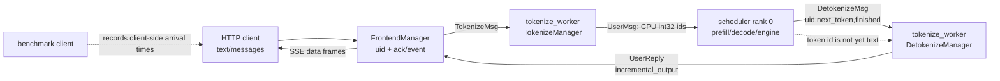

# 第 06 章：Tokenizer、服务流与基准测试

> 本章面向刚接触 LLM serving 的工程师。
>
> 本章的“代码事实”均以当前仓库源码为准。
>
> 标为“实验”的段落是可验证建议，不表示仓库已经替你完成了部署或测量。

## 1. 章节目标与先修知识

读完本章，你应能沿着一条在线请求解释文本如何变成 token，又如何变成 SSE 文本流。

你应能区分 tokenizer、scheduler、detokenizer 与 HTTP 前端的责任。

你应能解释为什么 sampled token id 不能直接当作用户可见字符串。

你应能解释 TTFT、TPOT、E2E 分别在回答什么体验问题。

你也应能指出本仓库的在线 benchmark 到底测到了什么，没测到什么。

本章不要求你已经会写 CUDA kernel。

但你需要会读 Python 函数、dataclass、异步生成器和基本进程通信。

你还需要知道 Transformer 生成通常是“每一步采样一个 token”。

若你读过前面章节，请把 scheduler 看作生成 token 的上游。

本章从 scheduler 已经给出 `next_token` 的地方开始。

若你没有读过前文，也可以把 scheduler 暂时理解为“负责选择并运行 GPU batch 的组件”。

请先接受一个关键前提：token 是模型内部的整数单位，不是稳定的字符单位。

## 2. 要解决的具体问题

用户发送的是一段文本或一组 chat messages。

模型计算需要的是 token id 序列。

模型每一步产生的也是一个 token id。

用户却希望尽快看到自然语言文本，并且希望连接断开时不再浪费资源。

这看上去像三次简单转换：文本到 id、id 到文本、文本到 HTTP。

实际困难在于这些转换跨越了不同进程、不同缓冲区和不同时间边界。

一个 token 可能只是一个词的一部分。

一个 token 也可能让 Unicode 解码暂时呈现替换字符 `�`。

因此“每拿到一个 id 就立即 decode 并发送”可能让用户看到会被后续 token 改写的半个词。

反过来，若永远等待完整句子，首字符又会无谓地变慢。

服务需要在可见性与稳定性之间选择一个规则。

mini-sglang 的规则由 `DetokenizeManager` 中的状态和启发式决定。

第二个困难是身份对应。

许多请求可同时流动，回复必须回到正确的 HTTP 连接。

所以消息携带 `uid`，前端按 `uid` 维护等待队列和事件。

第三个困难是性能解释。

客户端看到的第一帧受排队、tokenize、prefill、网络与 SSE 解析共同影响。

它不是纯 GPU forward 时间。

如果不先写清测量边界，“吞吐量”这个数字很容易被误读。

## 3. 一个驱动全章的请求故事

假设 Ada 向 `POST /v1/chat/completions` 发送一个流式请求。

她的 `messages` 是 system 和 user 消息的列表。

她希望助手逐步回答中文和英文混合的问题。

前端先为请求分配 `uid`，再发送 `TokenizeMsg`。

tokenizer worker 将 chat messages 应用模型自己的 chat template。

接着它将模板文本编码成 CPU 上的一维 `torch.int32` token tensor。

scheduler 接到 `UserMsg` 后，在适当的 prefill 或 decode batch 中运行模型。

每一步 decode 采样出 `next_token` 后，scheduler 将 `DetokenizeMsg(uid, next_token, finished)` 送回去。

detokenizer 不承诺每次都会产生非空字符串。

如果此刻文本仍是半个英文词、未决的替换字符边界，返回的增量可以是空字符串。

等到后续 token 使片段安全可见时，它会一次交付更多字符。

前端监听到 `UserReply`，用同一个 `uid` 唤醒 Ada 的流式生成器。

若她使用 chat endpoint，前端把文本包装进 SSE `data: ...` 帧。

如果 Ada 在等待期间断开，前端安排一个 `AbortMsg`。

这是一种尽力而为的取消。

它可以阻止尚未调度的后续工作，但不能把已经在 GPU 上运行的 forward 内核从中间切断。

最后，基准客户端可以模仿 Ada 的请求并记录各帧到达时间。

不过它记录的是客户端迭代收到的帧，而不是服务端权威 token 账本。

这就是本章始终要分开的两条线：代码路径与观测路径。

## 4. 核心心智模型

把在线流式服务理解为四个相连的翻译器，加一个观测者。

第一个翻译器将用户意图翻成模型输入 ids。

第二个组件将输入 ids 排进 GPU 计算。

第三个翻译器将模型输出 ids 翻成可安全展示的文本增量。

第四个组件将该文本增量翻成 HTTP SSE 帧。

观测者，也就是 benchmark client，在客户端侧给这些帧打时间戳。

下面的图刻意区分“token 已生成”和“文本已发出”。



图中 `tokenize_worker` 出现两次不是笔误。

代码事实：`python/minisgl/tokenizer/server.py:tokenize_worker` 同时处理 tokenization、detokenization 和 abort 消息。

启动器将同一个函数以不同地址启动成 detokenizer 角色和可选的 tokenizer 角色。

因此“detokenizer 是完全不同的一套 worker”在本仓库中并不准确。

角色由它监听的队列地址和收到的消息类型决定。

在线模式下，rank 0 是 scheduler 与外部 I/O 的边界。

tensor parallel 大于 1 时，非主 rank 不直接向前端发送文本。

它们需要收到一致的输入消息来保持计算顺序一致。

但用户可见回复仍从 rank 0 一侧经 detokenizer 回到前端。

## 5. 术语表

| 术语 | 本章中的意思 | 不要误解为 |
|---|---|---|
| token id | 模型词表中的整数编号 | 一个 Unicode 字符 |
| tokenize | 文本或 chat messages 转为输入 id 序列 | 模型推理本身 |
| detokenize | 维护状态地把输出 ids 转成文本增量 | 对单个 id 调一次 `decode` |
| `uid` | 前端为一次请求分配的整数标识 | 模型 batch 下标 |
| `TokenizeMsg` | 前端到 tokenizer 的文本请求消息 | scheduler 可直接执行的请求 |
| `UserMsg` | tokenizer 到 scheduler 的 tokenized 请求 | SSE 回复 |
| `DetokenizeMsg` | scheduler 到 detokenizer 的 token 结果 | 已经可显示的字符串 |
| `UserReply` | detokenizer 到前端的文本增量 | 一定非空的 token |
| SSE | HTTP 上由 `data:` 帧组成的事件流 | GPU 到 CPU 的传输协议 |
| TTFT | 从客户端开始请求到第一个收到的流事件的时间 | 单独的 prefill kernel 时间 |
| TPOT | 相邻后续流事件的时间间隔统计 | 必然等于每个模型 token 的耗时 |
| E2E | 一个请求从开始到最后事件的总时长 | 全系统在任意负载下的吞吐 |
| output budget | `max_tokens` 指定的上限 | 实际总是生成的 token 数 |
| best-effort abort | 尽量从调度队列移除请求 | 抢占正在执行的 GPU kernel |

## 6. 进程、地址与消息边界

### 6.1 启动时发生什么

从 `python/minisgl/server/launch.py:launch_server` 开始阅读。

`launch_server` 解析 `ServerArgs`，再把启动后端的闭包交给 `run_api_server`。

闭包 `start_subprocess` 显式调用 `mp.set_start_method("spawn", force=True)`。

这意味着 worker 通过新的 Python 进程启动，而不是继承父进程的执行状态。

它为每个 tensor-parallel rank 启动一个 scheduler 进程。

它总会启动一个名为 `minisgl-detokenizer-0` 的 worker。

当 `num_tokenizer > 0` 时，它还启动对应数量的 tokenizer worker。

当 `num_tokenizer == 0` 时，不会额外启动 tokenizer worker。

代码事实：`ServerArgs.share_tokenizer` 在 `python/minisgl/server/args.py` 中定义为 `self.num_tokenizer == 0`。

共享时，`zmq_tokenizer_addr` 直接等于 `zmq_detokenizer_addr`。

所以该单一 worker 同时接收入站 tokenize 和回程 detokenize 消息。

启动器用 ack queue 等待 `num_tokenizers + 2` 个确认。

注释说明其中包括主 scheduler、一个 detokenizer 和额外 tokenizer workers。

这是一道就绪屏障，而不是健康检查系统。

代码中该 `ack_queue.get()` 没有显式 timeout。

因此 worker 在 ack 前失败时，启动可能等待，而不是自动产生一个完备的诊断结论。

### 6.2 地址为什么要区分

`python/minisgl/scheduler/config.py:SchedulerConfig` 以 `_unique_suffix` 为 IPC 地址加后缀。

默认后缀来自进程 pid。

`zmq_backend_addr` 是 tokenizer 向 scheduler 交付 backend 消息的入口。

`zmq_detokenizer_addr` 是 scheduler 向 detokenizer 交付 token 结果的入口。

`ServerArgs.zmq_frontend_addr` 是 detokenizer 向前端回复的位置。

在多 rank 时，`zmq_scheduler_broadcast_addr` 用于 rank 0 向其他 rank 发送原始 backend 消息。

不要把这个 IPC 广播地址与 GPU tensor 通信混为一谈。

`ServerArgs.distributed_addr` 是另一个 TCP 地址，用于 `torch.distributed` 相关通信配置。

地址隔离解决“消息该去哪里”的问题。

`uid` 隔离解决“消息属于哪个请求”的问题。

两者缺一不可。

### 6.3 消息的最小契约

`python/minisgl/message/tokenizer.py` 定义前端与 tokenizer 边界的消息。

`TokenizeMsg` 包含 `uid`、`text` 和 `sampling_params`。

其中 `text` 可以是字符串，也可以是 `List[Dict[str, str]]` 形式的 chat messages。

`DetokenizeMsg` 包含 `uid`、`next_token` 与 `finished`。

`AbortMsg` 只包含 `uid`。

`python/minisgl/message/backend.py:UserMsg` 是 tokenizer 送给 scheduler 的消息。

它包含 CPU 一维 `int32` `input_ids` 和采样参数。

`AbortBackendMsg` 是取消请求在 backend 边界的形式。

`python/minisgl/message/frontend.py:UserReply` 是文本回程消息。

它包含 `incremental_output` 字符串和 `finished` 标志。

多个消息可以分别被 `BatchTokenizerMsg`、`BatchBackendMsg`、`BatchFrontendMsg` 包裹。

批包装是一种通信批处理优化，不改变每条消息自己的 `uid`。

### 6.4 序列化的真实限制

`python/minisgl/message/utils.py:serialize_type` 使用 `__type__` 记录 dataclass 类型名。

ZMQ 包装器传输的是 msgpack 编码的数据结构。

当值是 `torch.Tensor` 时，当前代码断言 `self.dim() == 1`。

它把 tensor 的 NumPy bytes 与 dtype 记录下来。

反序列化使用 `np.frombuffer`，随后用 `.copy()` 再交给 `torch.from_numpy`。

这里的复制避免直接引用只读 buffer。

这解释了为什么 `UserMsg.input_ids` 的“一维 CPU tensor”不是偶然的注释细节。

若你扩展消息以携带二维或 GPU tensor，不能假设此序列化器会自动正确工作。

那是一个应单独设计与测试的接口变更，不是本章建议你直接做的改动。

## 7. 源码逐步走读：文本如何进入系统

### 步骤 1：HTTP 路由创建前端状态

先读 `python/minisgl/server/api_server.py:FrontendManager.new_user`。

它返回当前 `uid_counter`，然后递增计数器。

它还创建 `ack_map[uid] = []` 与 `event_map[uid] = asyncio.Event()`。

这两张表是前端把异步回复重新关联给请求的本地状态。

然后读路由 `generate`。

它接收 `GenerateRequest`，分配 uid，并发送 `TokenizeMsg`。

它将 `ignore_eos` 和 `max_tokens` 放入 `SamplingParams`。

该路由总是返回 `StreamingResponse`。

再读 `v1_completions`，其 HTTP 路径是 `/v1/chat/completions`。

当 `req.messages` 存在时，代码对每个 `Message` 调用 `model_dump()`。

当没有 messages 时，它断言 `req.prompt is not None` 并使用 prompt。

随后也创建 `TokenizeMsg`。

代码事实：这里实际传入 `SamplingParams` 的字段是 `ignore_eos`、`max_tokens`、`temperature`、`top_k` 和 `top_p`。

请求模型虽声明 `n`、`stop`、`presence_penalty`、`frequency_penalty`，这段 handler 没有把它们传给 `SamplingParams`。

所以“字段能被 Pydantic 接受”不等于“字段改变了采样行为”。

当 `req.stream` 为真，路由使用 `stream_chat_completions`。

当它为假，路由聚合所有 `ack.incremental_output` 后返回单个 JSON。

非流式返回中的 `usage` 三个计数目前写为零。

不要把它当成服务端真实 token accounting。

### 步骤 2：前端将消息放进异步队列

读 `FrontendManager.send_one`。

在首次发送前，它调用 `_create_listener_once()`。

这个函数创建后台协程 `listen()`，并用 `initialized` 防止重复创建。

之后 `send_one` 将消息放入 `send_tokenizer`。

`run_api_server` 构造的 `send_tokenizer` 是 `ZmqAsyncPushQueue`。

因此 FastAPI event loop 不直接调用 tokenizer 或 scheduler。

这层边界让 HTTP 处理与 CPU tokenization、GPU scheduling 解耦。

代价是要额外处理排队、序列化、worker 就绪和消息丢失等运行时问题。

### 步骤 3：`TokenizeManager` 形成输入 ids

读 `python/minisgl/tokenizer/tokenize.py:TokenizeManager.tokenize`。

函数接受的是 `List[TokenizeMsg]`，返回的是 `List[torch.Tensor]`。

当前实现按消息逐个循环。

源代码有 `# TODO: batch tokenization` 注释。

这意味着 worker 可以批量收消息，却没有在此函数中调用 tokenizer 的批量编码接口。

对 chat messages，代码调用 `self.tokenizer.apply_chat_template`。

调用参数是 `tokenize=False` 和 `add_generation_prompt=True`。

前者要求该调用先返回字符串 prompt。

后者要求模板追加模型开始回答所需的 generation prompt。

这正是 chat 格式不能由前端随意拼接字符串的原因。

不同模型 tokenizer 的 chat template 可以不同。

对纯字符串，函数直接把 `msg.text` 当作 prompt。

然后代码调用 `self.tokenizer.encode(prompt, return_tensors="pt")`。

返回 tensor 以 `.view(-1).to(torch.int32)` 压平成一维并转换为 `int32`。

这就是 scheduler 收到的输入 token 表示。

请注意：本节描述的是代码控制流。

它不保证任意 Hugging Face tokenizer 或任意模板都能接受任意消息内容。

### 步骤 4：同一 worker 按消息类型分流

读 `python/minisgl/tokenizer/server.py:tokenize_worker`。

worker 创建两个输出队列：`send_backend` 和 `send_frontend`。

它在 `recv_listener.get()` 上阻塞等待输入。

随后在队列尚有内容且未达到 `local_bs` 时继续收集消息。

代码断言收集到的消息只能全部归入 detokenize、tokenize、abort 三类之一。

这是一个有用的类型边界：未知消息不会悄悄穿过这个 worker。

对 `TokenizeMsg`，它调用刚才的 `TokenizeManager.tokenize`。

每个返回 tensor 被封装成 `UserMsg(uid, input_ids, sampling_params)`。

多个 `UserMsg` 组成 `BatchBackendMsg`。

只有一条时代码拆掉批外壳，直接发送该消息。

对 `DetokenizeMsg`，它调用 `DetokenizeManager.detokenize`。

它将每个字符串结果变成 `UserReply` 后发往 frontend。

对 `AbortMsg`，它创建对应的 `AbortBackendMsg` 发往 scheduler。

所以 abort 不会在前端本地就“神奇地停止模型”。

它与正常请求一样需要经过消息通道才能影响 scheduler 状态。

### 步骤 5：scheduler 边界只在 rank 0 发回结果

读 `python/minisgl/scheduler/io.py:SchedulerIOMixin.__init__`。

在线且 primary rank 时，scheduler 创建从 `zmq_backend_addr` 接收的 `ZmqPullQueue`。

它也创建向 `zmq_detokenizer_addr` 发送的 `ZmqPushQueue`。

单 rank 时，`receive_msg` 指向 `_recv_msg_single_rank`。

多 rank 时，rank 0 使用 `_recv_msg_multi_rank0`。

该函数将原始消息发给 PUB 队列，并通过 CPU process group 广播待收消息数。

非主 rank 的 `_recv_msg_multi_rank1` 接收该数量，再从 SUB 队列取得相同数量消息。

这使各 rank 的调度输入保持同一顺序。

回复方向不同。

`_reply_tokenizer_rank0` 把 `DetokenizeMsg` 发送到 detokenizer。

`_reply_tokenizer_rank1` 对回复什么也不做。

这就是“所有 rank 都参与一致计算，但只有 rank 0 负责外部回复”的代码证据。

### 步骤 6：结果从 scheduler 进入 detokenizer

请回看前章的 `python/minisgl/scheduler/scheduler.py:_process_last_data`。

该处在安全地处理上一次 forward 结果后，为非 chunked 请求形成 `DetokenizeMsg`。

`next_token` 是模型采样的整数结果。

`finished` 与请求能否继续 decode、以及 `ignore_eos` / eos 条件有关。

本章不重讲 GPU 到主机的事件同步细节。

但要保留其因果关系：host 只有在前一阶段复制完成后才能可靠读取 token 结果。

然后 token 结果才有资格被送去 detokenize。

因此一个 SSE chunk 的延迟不只取决于 detokenize。

它还依赖 scheduler 何时可读到上次 GPU 结果。

## 8. 增量 detokenize：为什么空字符串也可能正确

### 8.1 每个请求都有独立状态

读 `python/minisgl/tokenizer/detokenize.py:DecodeStatus`。

它含有 `decoded_ids`、`decoded_str`、`read_offset`、`surr_offset` 与 `sent_offset`。

`DetokenizeManager.decode_map` 以 `uid` 为键保存这些状态。

这意味着两个请求的 token 不能共享一个“上次 decode 到哪里”的游标。

若共享游标，交错到达的请求会相互污染文本。

收到一个新 uid 时，`detokenize` 创建空的 `DecodeStatus`。

一般情况下，它把 `msg.next_token` 追加到 `decoded_ids`。

特殊情况是该消息既 `finished`，又等于 `eos_token_id`。

此时代码不把这个 eos id 加进可 decode 的文本序列。

这避免 eos special token 的字面表示泄漏到输出文本。

### 8.2 两段 decode 的作用

`DetokenizeManager.detokenize` 构造 `read_ids` 和 `surr_ids` 两组列表。

`read_ids` 从 `surr_offset` 开始到当前所有已生成 ids。

`surr_ids` 从 `surr_offset` 到先前的 `read_offset`。

随后它对两组调用 tokenizer 的 `batch_decode`。

`new_text = read_str[len(surr_str):]` 计算新增字符。

这不是简单地只 decode 最新一个 id。

它重新观察一个窗口，借此处理 token 边界重新组合出的文本。

这也是流式 detokenization 往往比“token id 到字符串字典查找”复杂的原因。

### 8.3 提交安全文本还是继续缓冲

如果 `new_text` 非空并且不以 `�` 结尾，代码将其提交。

提交时，`decoded_str` 增加新文本。

它还将 `surr_offset` 置为旧 `read_offset`，并把 `read_offset` 更新到完整 ids 长度。

如果新文本为空或以 `�` 结尾，代码不直接提交这个窗口。

它转而调用 `find_printable_text(new_text)`。

该函数在文本以换行结束时直接允许输出。

当末尾是 CJK code point 时，它允许输出到当前位置。

当倒数第二个字符是 CJK 时，它保留最后一个字符等待更多上下文。

否则它只输出到最后一个空格为止。

这是一个启发式，不是 Unicode 完整性证明。

它的意图是避免在西文中输出会继续增长的半个词，同时让常见 CJK 文本不用总等空格。

### 8.4 `sent_offset` 与“已经发过”的不变量

无论走提交还是缓冲分支，函数都会计算 `incremental_output = output_str[s.sent_offset:]`。

之后立即令 `s.sent_offset = len(output_str)`。

因此一个稳定的设计不变量是：同一个 `uid` 已经交给前端的字符不会在后续消息中再次交付。

这个不变量针对的是该 manager 的状态机。

它不等于网络层 exactly-once delivery 保证。

网络断开、进程失败或客户端重连属于更高一层的可靠性问题。

如果 `msg.finished` 为真，函数在生成该次增量后删除 `decode_map[msg.uid]`。

这将 detokenizer 的状态内存限制在进行中的请求集合内。

### 8.5 一个纸上例子

设某 tokenizer 的输出 ids 逐步对应于一个英文单词的片段。

第一次 decode 得到没有空格的片段时，`find_printable_text` 可能返回空字符串。

第二次仍未形成可提交边界时，仍可能为空。

当后续 token 产生空格、换行或足够的稳定内容时，detokenizer 才交付累积片段。

用户没有看到“每个 token 一个字符块”，但看到的文本更稳定。

对 CJK 末尾字符，代码采用不同分支，因此常可更快刷出字符。

不要把这个例子反推为所有 tokenizer 一定以相同位置切分。

tokenizer 的词表和 decode 规则仍是模型相关的。

## 9. 源码逐步走读：从 `UserReply` 到 SSE

### 步骤 7：前端监听回程消息

读 `python/minisgl/server/api_server.py:FrontendManager.listen`。

它无限循环等待 `recv_tokenizer.get()`。

`_unwrap_msg` 将单个 `UserReply` 或 `BatchFrontendMsg` 统一成回复列表。

对每个回复，若 uid 已不在 `ack_map`，代码直接跳过。

若 uid 仍被追踪，它追加到 `ack_map[uid]` 并对对应 event 调用 `set()`。

这给出了一个很实用的取消后果。

前端删除 uid 后仍可能收到在路上的回复。

这些回复不会重新创建请求状态，而是被丢弃。

### 步骤 8：生成器按事件批量取走回复

读 `FrontendManager.wait_for_ack`。

它取得该 uid 的 `asyncio.Event`。

每轮先 `await event.wait()`，再清除 event。

它取出当前 `ack_map[uid]` 的 pending 列表，并马上替换成新的空列表。

之后依次 `yield` 每个 ack。

如果最后处理到的 ack 标记 `finished`，生成器结束。

结束后，它删除此 uid 的 `ack_map` 与 `event_map`。

这里的关键不是“一个 event 等于一个 token”。

一个 event 被唤醒时，pending 列表可能包含多个 `UserReply`。

反之，一条 `UserReply` 的 `incremental_output` 也可能是空字符串。

所以 event、reply、model token 与可见文本这四个数量不应强行画成一一对应。

### 步骤 9：`/generate` 的原始流

`FrontendManager.stream_generate` 遍历 `wait_for_ack(uid)`。

它为每个 ack 产出形如 `data: {ack.incremental_output}\n` 的 bytes。

遇到 `ack.finished` 后跳出，并发送 `data: [DONE]\n`。

这是较简单的原始文本流。

它没有给每一帧包装 JSON。

若增量为空，代码仍会形成对应的 `data:` 帧。

客户端不能仅把“收到一个帧”当作“收到一个非空文本 token”。

### 步骤 10：chat endpoint 的 SSE 形状

`FrontendManager.stream_chat_completions` 使用 JSON chunk。

第一个 ack 对应的 chunk 会设置 `delta["role"] = "assistant"`。

如果 ack 的 `incremental_output` 非空，chunk 还设置 `delta["content"]`。

该 chunk 的 `object` 是 `text_completion.chunk`。

每个 choice 的 `index` 为 0，初始 `finish_reason` 为 `None`。

完成时，函数再发送一个 `delta` 为空、`finish_reason` 为 `"stop"` 的末尾 chunk。

随后发送 `data: [DONE]\n\n`。

这是部分 OpenAI 风格的协议行为，不应被描述成完整兼容性承诺。

特别是空增量 ack 仍可能产生只有 role 或空 `delta` 的 chunk。

严格客户端对这种 chunk 的容忍度需要实际互操作测试，而不是靠 endpoint 名称假设。

### 步骤 11：断连后的 abort

`FrontendManager.stream_with_cancellation` 在每个将要产出的 chunk 前调用 `request.is_disconnected()`。

若检测到断连，函数抛出 `asyncio.CancelledError`。

异常处理以 `asyncio.create_task(self.abort_user(uid))` 安排异步 abort。

`abort_user` 先 `await asyncio.sleep(0.1)`。

随后它删除该 uid 的 `ack_map` 和 `event_map`，再通过 `send_one` 发送 `AbortMsg`。

tokenizer worker 把它改写为 `AbortBackendMsg`。

scheduler 收到后才有机会从 prefill 或 decode 管理器中终止该请求并释放资源。

因果顺序说明为什么这不是同步撤销。

断连发生时已经完成采样的 token，仍可能抵达 detokenizer。

但 `listen` 发现前端不再有 uid 后会跳过该 `UserReply`。

正在运行的 GPU forward 同样不能被这个 Python 消息即时中断。

## 10. 一次可检查的导读实验

### 实验目标

本实验不要求 GPU、模型权重、网络下载或启动完整服务。

它让你检查“消息类型和流式缓冲的关键分支确实存在”。

这是一项源码检查实验，不是性能实验。

请在仓库根目录运行下列命令。

```bash
rg -n "class (TokenizeMsg|DetokenizeMsg|AbortMsg|UserMsg|UserReply)|def (tokenize|detokenize|wait_for_ack|stream_chat_completions|benchmark_one|process_benchmark_results)" \
  python/minisgl/message python/minisgl/tokenizer python/minisgl/server/api_server.py python/minisgl/benchmark/client.py

rg -n "TODO: batch tokenization|new_text.endswith\(\"�\"\)|find_printable_text|input_length_override|usage.*0" \
  python/minisgl/tokenizer python/minisgl/server/api_server.py python/minisgl/benchmark/client.py
```

### 预期观察与推理

第一条命令应定位到消息 dataclass、tokenize/detokenize 函数、前端生成器和 benchmark 函数。

这证明本章的责任划分有明确源码入口。

第二条命令应显示 batch tokenization 仍是 TODO。

它也应显示 detokenizer 对 `�` 的检查与 `find_printable_text` 的调用。

这支持“有 token 时也可能先不输出文本”的解释。

你应看到 `benchmark_one` 构造 `input_length_override` 作为 `extra_body` 的内容。

同时，API request model 中没有这个同名字段。

由此得到的正确结论是：需要端到端实验验证该 workload intent 是否真的影响 server。

正确结论不是“它一定生效”，也不是“它一定被丢弃”。

你还应看到非流式 API 返回体中的 usage 计数为零。

因此不能用这个响应的 usage 做精确 token 吞吐核算。

### 可选的纯 Python 检查

如果本地已安装项目依赖和 `transformers`，可以再写一个极小的临时脚本读取任意本地 tokenizer。

脚本应逐个构造 `DetokenizeMsg` 并调用 `DetokenizeManager.detokenize`。

请只把观察到的字符串与返回列表记录下来。

不要预设某个具体模型一定产生空字符串或一定在同一 token 边界输出中文。

这是因为 tokenization 和 decode 行为依赖所选 tokenizer。

本仓库没有在本章范围内提供一个不下载模型即可运行的固定 tokenizer fixture。

## 11. 基准测试：先定义数字，再解释数字

### 11.1 在线 benchmark 的工作方式

读 `python/minisgl/benchmark/client.py:benchmark_one`。

它使用 `AsyncOpenAI` client 调用 `client.chat.completions.create`。

调用固定使用 `stream=True`。

它发送一条 user message、`max_tokens=output_length` 和 `temperature=0.0`。

默认额外字段包括 `ignore_eos=True` 与 `top_k=1`。

这让请求意图更接近固定长度的贪心生成负载。

但“请求意图”仍不等于“服务端实际逐 token 生成了正好 output_length 个 token”。

客户端在请求创建之后立刻记录第一个 `time.perf_counter()`。

它每从流响应迭代到一个对象，就再记录一次时间。

这些时间戳组成 `RawResult.tics`。

因此第一个间隔包含从请求开始到客户端收到第一个流对象的所有可见延迟。

它可能包括连接、HTTP、排队、tokenization、prefill、首次 detokenize、SSE 传输和客户端解析。

它不隔离其中任一子阶段。

### 11.2 TTFT、TPOT、E2E 的代码定义

读 `python/minisgl/benchmark/client.py:process_benchmark_results`。

对每个请求的 `tics`，函数先计算相邻时间戳差值 `deltas`。

第一个 delta 被加入 `first_times`。

后续 delta 被汇总到 `accum_times`。

本章将前者称为 TTFT 的客户端侧近似。

本章将后者称为 TPOT 的客户端侧样本。

每条请求的 E2E 是 `tics[-1] - tics[0]`。

函数对这些数组排序并报告平均、p50、p90、p99、最大值。

分位数很重要，因为排队和批处理常使尾部延迟比平均值更能反映用户体验。

但请精确使用名称。

该代码的 TTFT 是到“第一个客户端流迭代事件”的时间。

若第一事件只有 role、空 delta 或其他无文本内容，它不一定是第一个可见字符。

该代码的 TPOT 样本来自相邻事件，而不保证每个事件恰对应一个模型 token。

原因之一正是 detokenizer 可以输出空字符串，而 SSE 仍可有 chunk。

因此报告中的 `token/s` 分子更应被读作基于 `tics` 数量的代理，而不是服务端严格生成 token 数。

### 11.3 吞吐计算的边界

`process_benchmark_results` 取所有请求最早与最晚时间戳之差作为 `dur`。

然后它计算 `num_tokens = sum(len(tic) for tic in results)`。

注意这里计的是每条 `tics` 列表的长度。

列表还包括请求开始时的初始时间戳。

它不是从 `UserReply` 的内容重新 tokenize 得到的数量。

它也不是服务端 scheduler 的 sampled token counter。

所以当服务协议产生空 chunk 或额外结束 chunk 时，该代理与实际输出 ids 的关系会改变。

这不让 benchmark 失去价值。

它仍能比较在相同 client、server、协议与工作负载下的端到端变化。

但比较时必须保持这些边界条件一致。

### 11.4 并发批与 trace 回放

`benchmark_one_batch` 为每个 prompt 创建一个 `benchmark_one` task。

它使用 `asyncio.gather` 并发等待它们。

`Console` 分别显示 requests、完成请求、prefill 和 decode 的进度条。

这些进度条是客户端的进度观测，不是 scheduler 内部 batch trace。

`benchmark_trace` 接受 `BenchmarkTrace` 列表。

每个 trace 有 timestamp、message、output_length 与可选 input_length。

它以共同的 start time 加上 trace timestamp 计算目标发起时刻。

然后用 `asyncio.sleep(max(0, ...))` 实现近似回放。

若系统已经落后，sleep 为零，后续请求会尽快发出。

这符合“到点即发”的回放近似，但不等于严格的原始生产流量复现。

### 11.5 `input_length_override` 为什么要谨慎

`benchmark_one` 的 `input_length` 参数不为空时，会向 `kwargs` 写入 `input_length_override`。

这些 kwargs 通过 OpenAI client 的 `extra_body` 发送。

本仓库的 `OpenAICompletionRequest` 没有 `input_length_override` 字段。

仅靠静态阅读，无法把中间框架对未知字段的处理断言成某一种最终结果。

因此应将其标作待验证的负载注入意图。

如果该字段没有真正影响 prompt，那么 trace 的“输入长度”可能只存在于 benchmark 记录中。

正确的验证方式是同时记录 client 请求、server 实际 tokenizer 输入长度或 scheduler 接收长度。

这是一项建议实验，不是本章声称已经完成的测试。

## 12. 离线基准、在线基准与微基准不可互换

### 12.1 离线 `LLM` 基准

读 `benchmark/offline/bench.py`。

它直接构造 `LLM`，并调用 `llm.generate`。

它随机生成 token ids 作为 prompt，也构造随机的 `SamplingParams`。

它先运行一次 warmup，再用 `time.time()` 包住一次批量 `llm.generate`。

它用所有 `max_tokens` 预算之和除以耗时，打印 throughput。

这里的分子是预算，而不是逐请求返回结果实际 token 长度。

并且设置 `ignore_eos=True` 会影响到“预算是否更接近实际生成长度”的解释。

它绕开 HTTP、ZMQ、tokenize 和 SSE。

所以它更适合观察离线调度与 GPU 推理组合的总效果。

它不能直接回答在线用户的 TTFT 或协议开销。

### 12.2 WildChat 离线脚本

读 `benchmark/offline/bench_wildchat.py`。

该脚本在本地没有 shard 时下载 WildChat parquet。

它筛选第一个 user turn 的文本，并只保留 English 与 Chinese。

它用 tokenizer 的 `apply_chat_template(..., tokenize=True, add_generation_prompt=True)` 产生输入 ids。

它在最终统计中从 `llm.generate` 返回的 `token_ids` 得到实际输出长度。

这比只累计 output budget 更接近“实际生成 token”定义。

不过它仍是离线路径，且数据筛选、下载内容、模型与环境均会影响结果。

不能将其数字直接同 HTTP benchmark 的 TTFT/TPOT 放在同一列比较后宣布谁更快。

### 12.3 在线合成脚本

读 `benchmark/online/bench_simple.py`。

脚本设置随机种子，并用 `generate_prompt` 生成近似目标 token 长度的 prompt。

它连接到 `http://127.0.0.1:1919/v1`。

它先发一个短请求检查连接，再对 `TEST_BS = [64]` 的批量任务运行在线 benchmark。

`MAX_INPUT = 8192` 与 output length 的随机范围是脚本里硬编码的工作负载选择。

它们不是框架默认容量，也不是通用推荐配置。

### 12.4 在线 trace 脚本

读 `benchmark/online/bench_qwen.py`。

它定义一个 Qwen trace 下载 URL，并在文件不存在时下载。

它读取前 `N = 1000` 条，使用若干时间缩放因子回放。

脚本选择 `dummy=True`，这会用合成 prompt 填充到 trace 所需长度，而不是重放原始文本内容。

因此它更接近长度和到达节奏的实验，而不是语义内容复现实验。

网络可用性、下载版本、tokenizer 和当前模型都会改变可观测结果。

### 12.5 CUDA 微基准

`python/minisgl/benchmark/perf.py:perf_cuda` 属于另一类测量。

它用 CUDA events 和 CUDA stream 计时一个 callable。

可选地，它在 CUDA Graph 中重复捕获 callable，再 replay 多次。

这有助于比较单个 kernel 或实现的 GPU 侧延迟、带宽。

它没有 HTTP client，也没有请求排队与 tokenizer。

所以微基准可用于定位内核差异，却不能替代服务级 benchmark。

相反，服务级 benchmark 若变慢，也不能仅据此断言某一个 kernel 变慢。

## 13. 正确性与性能不变量

### 13.1 身份不变量

每条在途请求从 `TokenizeMsg` 到 `UserReply` 保持同一个 `uid`。

前端的 `ack_map` 与 `event_map` 必须对同一个 uid 成对存在，直到正常完成或 abort 清理。

detokenizer 的 `decode_map` 也必须在 finished 后删除该 uid。

违反这组不变量可能表现为串流到错误客户端、状态泄漏或已完成请求持续占内存。

### 13.2 顺序不变量

对于一个 uid，detokenizer 必须按 scheduler 产生的输出 token 顺序更新 `decoded_ids`。

`sent_offset` 只能前进，不能回退。

这保证已发送字符串不会重复。

对于 tensor parallel，多 rank 必须收取相同数目和顺序的 backend 消息。

`SchedulerIOMixin` 的 count 广播与 PUB/SUB 原始 payload 共同维护这一前提。

### 13.3 文本可见性不变量

“scheduler 已采样 id”不蕴含“用户应立即看到字符”。

“`UserReply` 到达”也不蕴含“`incremental_output` 非空”。

前端和 benchmark client 必须容忍空增量。

客户端若将空 delta 当成协议错误，可能在正确的 detokenize 缓冲下失败。

### 13.4 生命周期不变量

正常结束时，`finished` 使 detokenizer 删除 decode 状态，`wait_for_ack` 删除前端状态。

取消时，前端先删除自己的 uid 状态，再将 abort 向后端传播。

后续迟到的回复应被前端跳过，而不是重新创建状态。

这使取消后的可见输出停止，但不声称已经撤销了所有在途计算。

### 13.5 测量不变量

比较两个在线结果时，至少保持模型、tokenizer、server 参数、并发模式、prompt 构造、输出预算、client 版本和统计口径一致。

若这些条件改变，TTFT 或 throughput 的变化无法被单独归因给某项实现。

报告应写明 token 数是预算、客户端流事件代理，还是服务端实际 ids。

报告也应写明是否包含 warmup。

## 14. 常见失败模式与诊断方向

### 14.1 启动一直等待

现象是 API server 的启动阶段没有进入可服务状态。

代码线索是 `launch.py` 对 ack queue 的循环等待。

先检查 scheduler、detokenizer、tokenizer 子进程是否启动并输出错误。

不要只反复请求 HTTP endpoint，因为启动器可能还没有开始 uvicorn。

源码显示该等待没有 timeout，因此应在外部部署层补充超时与日志收集策略。

这是运维建议，不是仓库中已经实现的恢复机制。

### 14.2 输出偶尔停顿或空帧

先区分“没有收到 `UserReply`”和“收到的 `incremental_output` 为空”。

后者可来自 `DetokenizeManager` 的边界缓冲，是预期路径之一。

检查 `finished` 是否最终到达。

若只在特定语言或 tokenizer 上发生，检查 tokenizer 的 batch decode 输出与 CJK/替换字符分支。

不要通过强制每个 id 立刻输出字符来修复，因为那会改变文本稳定性保证。

### 14.3 请求断开后 GPU 仍忙

这不自动证明 abort 失效。

`AbortMsg` 需要经过前端、tokenizer 与 scheduler。

已经启动的 GPU forward 不会被该路径抢占。

应检查 abort 到达时请求位于等待 prefill、decode 队列，还是正在 forward。

不同位置对应不同的可取消时机。

### 14.4 OpenAI client 报协议兼容问题

先检查使用的是 `/v1/chat/completions` 而不是未实现的 legacy `/v1/completions`。

再检查 client 是否能接受 `text_completion.chunk`、空 delta 与 `[DONE]` 的组合。

不要仅因 URL 包含 `/v1` 就推断 embeddings、tool calling、stop sequences 或 `n` 已完整支持。

本仓库实现了 `GET /v1/models` 和 `/v1` health-style 路由，但接口范围有限。

### 14.5 benchmark 数字看起来异常高或低

先确认实际请求是否到达预期 server 与 model。

再确认 warmup 是否包含在统计中。

检查流事件数量，而不是假设等于 output token 数。

检查 `input_length_override` 是否真正被服务端消费。

将 offline budget throughput、online event-derived throughput 和 CUDA event latency 分开报告。

这些数字回答的是不同问题。

## 15. 常见误解

误解：“一个 token 就是一个字符。”

更准确的说法：tokenizer 的词表单位可以跨字符、词片段或特殊符号边界。

误解：“detokenizer 就是 `tokenizer.decode([next_token])`。”

更准确的说法：当前实现按 uid 累积 ids、比较 decode 窗口并维护多个 offset。

误解：“空 SSE chunk 一定是 bug。”

更准确的说法：它可能来自为稳定文本而进行的缓冲，但兼容性仍需要客户端测试。

误解：“共享 tokenizer 意味着没有 detokenizer。”

更准确的说法：`num_tokenizer == 0` 时同一 worker 同时承担两个角色。

误解：“断开浏览器就立即取消 GPU 工作。”

更准确的说法：前端发送 best-effort abort；已运行 forward 与迟到消息仍可能存在。

误解：“`n`、`stop`、penalty 出现在请求模型就表示支持。”

更准确的说法：必须追踪 handler 是否把字段传给 `SamplingParams` 或其他执行路径。

误解：“TTFT 就是 prefill 耗时。”

更准确的说法：当前在线 client 的首个间隔包含客户端到首个流事件的整个路径。

误解：“TPOT 一定对应每个生成 token。”

更准确的说法：这里采样的是相邻流事件间隔，而事件与可见文本或 token 不是严格一一对应。

误解：“离线吞吐超过在线吞吐，说明 HTTP 很慢。”

更准确的说法：两类脚本的输入、输出计数、调度、warmup 与协议边界都不同，不能只凭两个总数归因。

## 16. 练习与预期推理

### 练习 1：画回程箭头

题目：从 scheduler rank 0 开始，画出一个 sampled `next_token` 到浏览器 SSE 的所有组件。

预期推理：`DetokenizeMsg` 先到 `zmq_detokenizer_addr` 的 worker。

该 worker 通过 `DetokenizeManager.detokenize` 形成 `UserReply`。

然后 `zmq_frontend_addr` 的前端 listener 按 uid 入 `ack_map`，再由流式生成器写 SSE。

答案不应把 scheduler 直接连接到 HTTP handler。

### 练习 2：解释一次空增量

题目：scheduler 已经连续产生两个 token，但客户端第一次收到空 content、第二次收到几个字符，这是否必然丢 token？

预期推理：不必然。

detokenizer 可以因为 `�` 或可打印文本边界先缓冲 ids。

第二次返回的是截至安全边界的累计新文本。

要判断是否真正丢失，需检查 `decoded_ids`、offset 前进与最终文本，而不是只数第一帧字符。

### 练习 3：解释取消的边界

题目：客户端在一个 SSE chunk 后断开。为什么服务端可能仍然短暂地继续工作？

预期推理：断连检测发生在前端生成器；abort 以异步 task 发送并跨 worker 到 scheduler。

已运行的 forward 不可由该 Python 消息中途停止。

前端删除 uid 后会丢弃迟到回复，因此“用户看不到更多文本”与“GPU 立即停止”是不同性质的结论。

### 练习 4：判断字段是否生效

题目：在线 client 设置 `input_length_override=4096`。你能否只凭该 client 代码断言服务使用了 4096 token 输入？

预期推理：不能。

client 将字段放到 `extra_body`，而 API request model 没有同名字段。

应提出端到端观测：记录 tokenizer 产生的 ids 长度或 scheduler 接收的 `UserMsg.input_ids` 长度。

实验结果，而非字段名称，才决定结论。

### 练习 5：选择正确的指标

题目：产品团队说“首字太慢”，内核团队说“某 attention kernel 的带宽变差”。分别先看什么？

预期推理：产品问题先在受控在线负载下看 TTFT 分布与排队条件。

内核问题先看 CUDA event 微基准或更窄的 GPU 侧剖析。

两者可能有关，但一个服务级数字不能单独证明内核归因。

### 练习 6：比较两份离线结果

题目：`bench.py` 报告的 throughput 与 `bench_wildchat.py` 报告的 throughput 能直接比较吗？

预期推理：要非常谨慎。

前者以 `max_tokens` 预算求和，后者统计返回结果的实际 output token ids。

二者还使用不同 prompt 来源、设置和初始化配置。

应先统一模型、环境、输入集、输出定义和 warmup 后再比较。

## 17. 本章总结

LLM serving 的输出路径不以“模型产生 id”为终点。

它还要通过按 uid 的 detokenize 状态机，才能成为稳定的文本增量。

mini-sglang 用 `TokenizeMsg`、`UserMsg`、`DetokenizeMsg` 与 `UserReply` 把不同进程的职责显式化。

`tokenize_worker` 在不同地址和消息类型下同时承担 tokenizer 与 detokenizer 角色。

`FrontendManager` 用 uid、ack 列表和 asyncio event 将回程消息重新交给正确连接。

SSE 帧、`UserReply`、可见字符和模型 token 的数量关系不是一一对应。

这个事实既解释空增量，也限制了基于 SSE 事件数的 token/s 解释。

取消是前端触发、经消息链传播的尽力而为操作。

它可以阻止后续调度，却不能追溯性撤销已开始的 GPU forward。

在线 benchmark、离线 `LLM` benchmark 与 CUDA 微基准各自有价值。

但它们测量的边界不同，不能交换使用或过度归因。

面对流式输出问题，先问“状态在哪个 uid 上、消息在哪个边界、时间戳测的是什么”。

这比只盯住模型 `forward()` 更接近真实 serving 系统的诊断方法。

## 18. 源码锚点附录

| 问题 | 路径与符号 | 可核验的代码事实 |
|---|---|---|
| 服务如何启动 worker？ | `python/minisgl/server/launch.py:launch_server`、`start_subprocess` | 使用 `spawn`，启动 scheduler、detokenizer 与可选 tokenizer，并等待 ack。 |
| 共享 tokenizer 如何定义？ | `python/minisgl/server/args.py:ServerArgs.share_tokenizer`、`zmq_tokenizer_addr` | `num_tokenizer == 0` 时 tokenizer 地址复用 detokenizer 地址。 |
| 请求如何取得 uid？ | `python/minisgl/server/api_server.py:FrontendManager.new_user` | 创建 `ack_map` 和 `event_map` 条目。 |
| chat 参数哪些真正转入采样？ | `python/minisgl/server/api_server.py:v1_completions` | 传入 `ignore_eos`、`max_tokens`、`temperature`、`top_k`、`top_p`。 |
| 文本如何编码？ | `python/minisgl/tokenizer/tokenize.py:TokenizeManager.tokenize` | chat 先应用 template；ids 被压平并转为 `int32`。 |
| 一个 worker 如何处理三类消息？ | `python/minisgl/tokenizer/server.py:tokenize_worker` | 分流 `TokenizeMsg`、`DetokenizeMsg`、`AbortMsg`。 |
| id 如何变成安全增量？ | `python/minisgl/tokenizer/detokenize.py:DetokenizeManager.detokenize`、`find_printable_text` | 用 per-uid offsets、`�` 检查与 CJK/空格启发式。 |
| tensor 消息有什么限制？ | `python/minisgl/message/utils.py:serialize_type` | 只断言支持一维 tensor，并在反序列化时复制 buffer。 |
| 多 rank 输入如何同步？ | `python/minisgl/scheduler/io.py:_recv_msg_multi_rank0`、`_recv_msg_multi_rank1` | rank 0 广播 count 与原始消息；非主 rank 不回复 detokenizer。 |
| SSE 如何形成？ | `python/minisgl/server/api_server.py:stream_generate`、`stream_chat_completions` | raw `/generate` 与 JSON chat chunks 都最终发送 `[DONE]`。 |
| 断连如何处理？ | `python/minisgl/server/api_server.py:stream_with_cancellation`、`abort_user` | 检测 disconnect 后安排 `AbortMsg`，并先清理前端 uid 状态。 |
| 在线时间如何记录？ | `python/minisgl/benchmark/client.py:benchmark_one`、`process_benchmark_results` | client 记录流迭代时刻，并由首/后续间隔构造统计。 |
| 离线吞吐的分子是什么？ | `benchmark/offline/bench.py:main` | 使用 `max_tokens` 预算之和。 |
| WildChat 脚本统计什么？ | `benchmark/offline/bench_wildchat.py:main` | 从返回结果 `token_ids` 统计实际输出长度。 |
| GPU 微基准如何计时？ | `python/minisgl/benchmark/perf.py:perf_cuda` | 用 CUDA events 和可选 graph replay。 |

## 19. 局限与后续问题

本章是当前源码的教学性导读，不是生产部署指南。

本章没有实际启动模型服务，也没有下载 trace 或 WildChat 数据集。

因此任何具体 TPS、TTFT、显存或协议兼容性结论都必须由目标环境重新测量。

不同 tokenizer 的 chat template、词表和 Unicode decode 行为会影响可见流式文本。

`find_printable_text` 是已有启发式，不是对所有语言的完整分词或显示正确性规范。

本仓库的 OpenAI 风格接口只实现了本章列出的部分行为。

不要将请求模型中尚未转发的字段包装成已支持特性。

启动 ack barrier 没有 timeout，异常退出和 IPC 清理等生命周期可靠性需要额外运行验证。

`input_length_override` 的端到端行为仍应通过观测验证。

在线 benchmark 的事件计数与实际模型 token 计数也应分开报告。

后续可深入的工程课题包括：为服务端增加权威 token 计数、为 abort 增加状态观测、记录每阶段时延，以及为 SSE 兼容性建立集成测试。

这些是改进方向，不表示本章或当前仓库已经实现它们。
